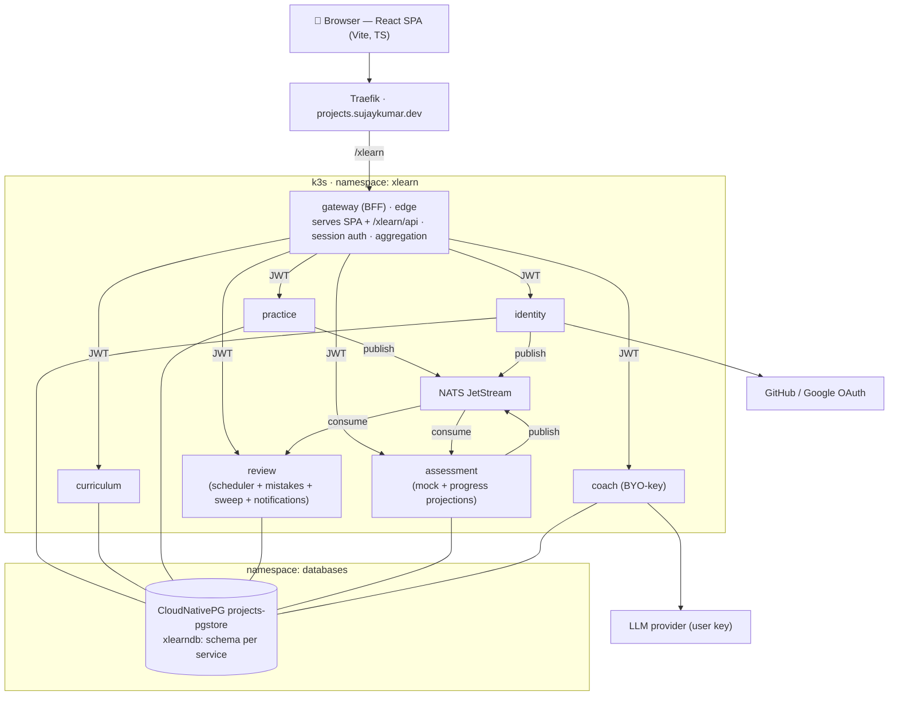

# C4 L2 — Containers

- **Edge:** only `gateway` has a Traefik route (`/xlearn`); everything else is ClusterIP.
- **Sync:** gateway → services over HTTP/JSON with a propagated JWT.
- **Async:** producers (`practice`, `identity`, `assessment`) → NATS; consumers (`review`,
  `assessment`) react. See [`../events.md`](../events.md).
- **Data:** every service binds the shared `xlearndb` but only its own schema.
