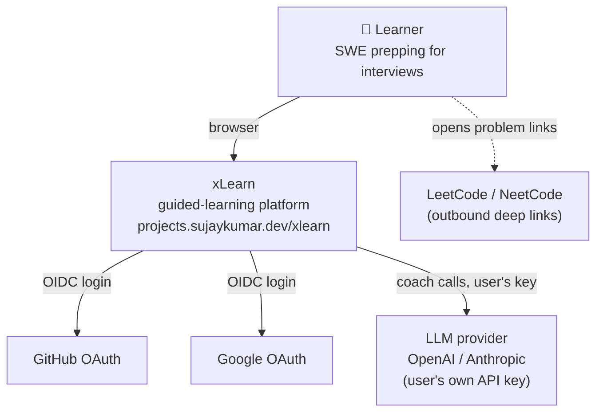

# C4 L1 — System context

- xLearn owns the **method** (gating, spaced repetition, mistakes, mocks); it links out to problem
  hosts rather than embedding them.
- The only outbound integrations are **OAuth** (login) and the **LLM provider** (coach, with the
  user's own key — xLearn never provides inference).
