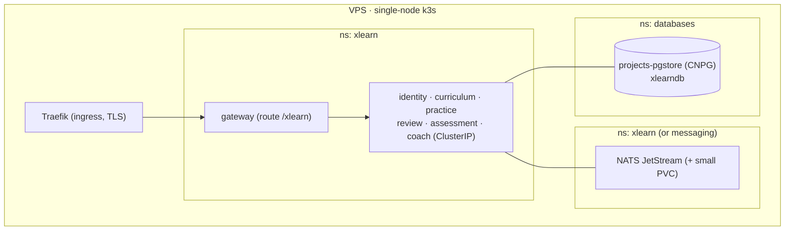

# Deployment — GitOps flow & runtime

Mirrors the platform in `github.com/sujaykumarsuman/infra` ([ADR-0009](../../adr/0009-deployment-and-gitops.md)).
Pull-based: the cluster is never exposed to CI.

## Delivery pipeline

```mermaid
graph LR
    dev["push to main<br/>(xlearn monorepo)"]
    ci["GitHub Actions<br/>ci.yml + deploy.yml<br/>(path-filtered per service)"]
    ghcr["ghcr.io/sujaykumarsuman/<br/>xlearn-&lt;service&gt;:0.&lt;run&gt;.x"]
    flux_img["Flux image-automation<br/>(sees new tag)"]
    infra["infra repo<br/>apps/xlearn-&lt;service&gt;.yaml<br/>(tag bumped + committed)"]
    flux_helm["Flux helm-controller<br/>upgrades HelmRelease"]
    k3s["k3s · namespace xlearn<br/>rollout"]

    dev --> ci -->|build-push.yml| ghcr
    ghcr --> flux_img -->|commit setter| infra
    infra -->|source-controller pulls| flux_helm --> k3s
```

- Build-semver auto-deploy from `main` in v1 (like `projects-hub`/`landscape`); release tags at 1.0.
- One image per changed service (reusable `sujaykumarsuman/.github/.github/workflows/build-push.yml@main`).
- Secrets are SOPS/age, decrypted **in-cluster** by Flux; the age key lives only in `flux-system`.

## Runtime placement (single node)

## infra repo changes (see ADR-0009 for the file list)

- `apps/xlearn-<service>.yaml` — one `HelmRelease` per service (from `charts/project`); only gateway routed.
- `apps/image-automation.yaml` — `ImageRepository` + `ImagePolicy` per `xlearn-<service>`.
- `infrastructure/messaging/` — NATS JetStream HelmRelease + namespace.
- `infrastructure/database/cluster/` — `xlearn` managed role + `xlearndb` `Database` CR + SOPS password.
- `apps/secrets/` — `xlearn-db`, `xlearn-jwt`, `xlearn-coach`, `xlearn-oauth` (SOPS/age).
