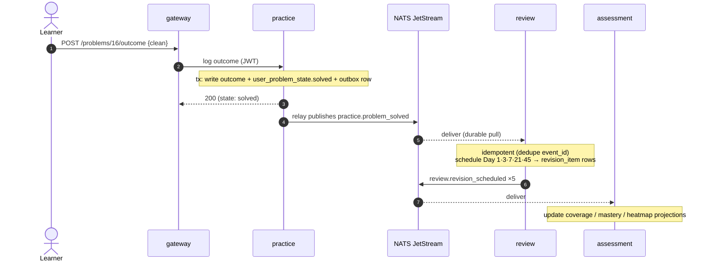
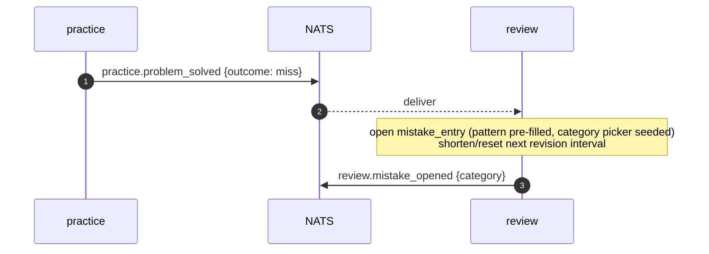

# Events (async flows)

Domain events on **NATS JetStream**, published via the **transactional outbox** and consumed by
**idempotent** durable consumers ([ADR-0004](../adr/0004-inter-service-comms-and-events.md)).

## Conventions

- **Subject:** `xlearn.<context>.<event>` — one JetStream **stream per producing context**
  (`XLEARN_PRACTICE`, `XLEARN_REVIEW`, `XLEARN_IDENTITY`, `XLEARN_ASSESSMENT`).
- **Envelope:** `{ event_id (uuid), subject, occurred_at (UTC), version (int), account_id, data {…} }`.
- **Delivery:** at-least-once. Consumers **dedupe on `event_id`** (an `inbox`/offset table) → effectively
  once. Producers write the domain row **and** the `outbox` row in one transaction; a relay publishes.
- **Compatibility:** events are **facts**, **additive-only**. Never repurpose a field; add `version` +
  new fields. Consumers ignore unknown fields.

## Catalogue

| Subject | Producer | Payload (`data`) | Consumers → reaction |
|---------|----------|------------------|----------------------|
| `xlearn.identity.account_created` | identity | `provider`, `display_name` | *(reserved: seed defaults / welcome)* |
| `xlearn.practice.attempt_logged` | practice | `problem_id`, `stage_reached`, `duration_s` | **assessment** → outcome-mix / coverage projections |
| `xlearn.practice.solution_revealed_early` | practice | `problem_id` | **review** → schedule the "owed attempt in 3 days" ([R-PF2](../prd/xlearn-prd.md#61-guided-problem-flow-gated-stages)) |
| `xlearn.practice.problem_solved` | practice | `problem_id`, `outcome`, `first_solve` (bool) | **review** → schedule Day 1·3·7·21·45 (on first clean solve); open a mistake if below-clean · **assessment** → coverage/mastery projections |
| `xlearn.review.revision_scheduled` | review | `problem_id`, `touch_level`, `due_date` | **assessment** → heatmap projection |
| `xlearn.review.revision_due` | review (sweep) | `problem_id`, `touch_level` | **notifications** (in review) → reminder |
| `xlearn.review.mistake_opened` | review | `problem_id`, `category` | **assessment** → outcome-mix / weak-area projection |
| `xlearn.review.mistake_closed` | review | `mistake_id`, `problem_id` | **assessment** → projections |
| `xlearn.assessment.mock_completed` | assessment | `mock_id`, `total_35`, `rubric` | *(reserved: coach nudges / trend snapshots)* |

## Flow 1 — attempt logged → revision scheduled (the core loop)



## Flow 2 — below-clean outcome → mistake opened



## Flow 3 — five-touch review, auto-scored (advance or reset)

```mermaid
sequenceDiagram
    autonumber
    actor U as Learner
    participant GW as gateway
    participant R as review
    participant N as NATS
    U->>GW: POST /revision/{id}/score {namedPatternSecs, solvedInTimer, statedComplexity}
    GW->>R: submit re-solve
    alt pass (pattern<2m ∧ in-timer ∧ complexity stated)
        Note over R: touch_result.auto_pass=true → advance touch_level; next due_date
        R->>N: review.revision_scheduled {next touch}
    else fail
        Note over R: reset to Day 1 · open mistake · re-open closed entry if applicable
        R->>N: review.mistake_opened
    end
```

## Flow 4 — periodic due sweep → reminders

```mermaid
sequenceDiagram
    autonumber
    participant S as review sweep (cron ~15m)
    participant DB as review schema
    participant N as NATS
    S->>DB: SELECT revision_item WHERE due_date<=now AND surfaced_at IS NULL
    Note over S,DB: idempotent; mark surfaced_at
    S->>N: review.revision_due (per item)
    Note over S: notifications worker → reminder rows (in-app, v1)
```

## Reliability notes

- **Outbox relay** runs in each producing service; unsent rows are retried with backoff; `sent_at`
  marks success. A crash between DB-commit and publish is safe — the row is still unsent and re-relayed.
- **Consumers** persist `event_id` in an `inbox` (or JetStream durable + offset) and no-op on duplicates.
- **Ordering** is per-subject best-effort; handlers must not assume global order (e.g. a
  `revision_scheduled` may arrive before its `problem_solved` projection is applied — handlers upsert).
- **Replay:** JetStream retains the streams, so a new/rebuilt projection (assessment) can be
  re-derived by replaying from the start.
