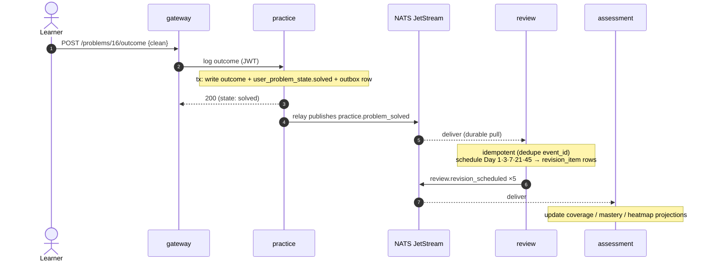
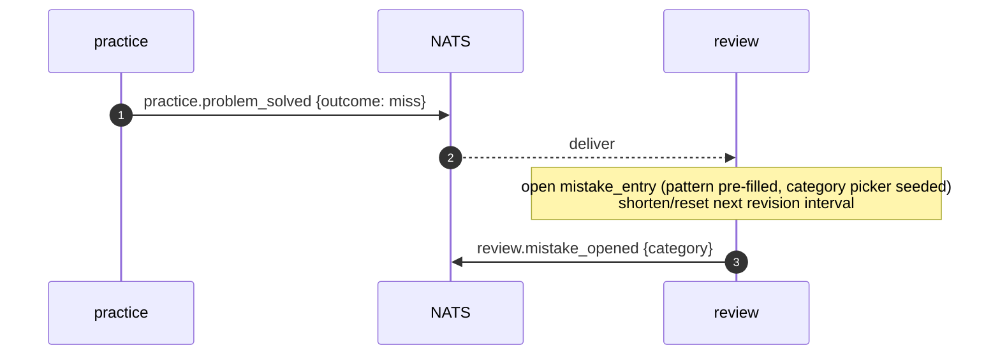

# Events (async flows)

Domain events on **NATS JetStream**, published via the **transactional outbox** and consumed by
**idempotent** durable consumers ([ADR-0004](../adr/0004-inter-service-comms-and-events.md)).

## Conventions

- **Subject:** `xlearn.<context>.<event>` — one JetStream **stream per producing context**
  (`XLEARN_PRACTICE`, `XLEARN_REVIEW`, `XLEARN_IDENTITY`, `XLEARN_ASSESSMENT`; declared for v2:
  `XLEARN_JUDGE`, `XLEARN_COACH`).
- **Topology:** [`internal/platform/events/topology.go`](../../internal/platform/events/topology.go)
  is the **single source of truth** for streams (owner, subjects, the subjects the owner `Emits`,
  limits) and live durable consumers (stream, name, filter, service, `Handles`/`Ignores`). The
  publisher builds its stream config from it; `Subscribe` refuses an undeclared (stream, durable,
  filter); the NATS ACL is rendered from it (see [Topology, limits and auth](#topology-limits-and-auth-mi-05-n0)).
- **Envelope:** `{ event_id (uuid), subject, occurred_at (UTC), version (int), account_id, data {…} }`
  (v1); v2 appends `path_slug` — see [Envelope v2](#envelope-v2-m1-02) for the decode rule.
- **Delivery:** at-least-once. Consumers **dedupe on `event_id`** (an `inbox`/offset table) → effectively
  once. Producers write the domain row **and** the `outbox` row in one transaction; a relay publishes.
- **Compatibility:** events are **facts**, **additive-only**. Never repurpose a field; add `version` +
  new fields. Consumers ignore unknown fields.

### Envelope v2 (m1-02)

`internal/platform/events/envelope.go` ([ADR-0026 §3](../adr/0026-per-course-extensibility-model.md),
[ADR-0034 §3](../adr/0034-v2-release-labelling-gating-and-rollback.md)):
`Envelope{EventID, Subject, OccurredAt, Version, AccountID, PathSlug, Data}`, with
`path_slug,omitempty`. The envelope is **append-only** and every decoder reads v1 **and** v2
**forever**. **Consumers before producers:** in `v1.6.0` every consumer decodes both (review's practice
consumer and notifications worker, assessment's projection consumer — all through `DecodeEnvelope`)
while every producer still emits v1; producers switch to `NewEnvelope(EnvelopeV2, …)` one tag later
(m1-03, `v1.7.0`): from `v1.7.0` **every producer emits v2** — practice, review and assessment with the
row's `path_slug` (every writer sets it explicitly), identity's account-scoped `account_created` without
one. The rollback floor after `v1.7.0` is `1.6.0` (v2 envelopes are in the log).

**Decode rule** (`DecodeEnvelope`):

| Envelope | Result |
|---|---|
| `version` 1, or no `version` | v1: `PathSlug = "dsa"` (v1 is DSA-only), whatever the payload holds |
| `version` ≥ 2, course-scoped subject, `path_slug` set | read the known fields; unknown fields (a v3's extras) ignored |
| `version` ≥ 2, **course-scoped** subject, no `path_slug` | `ErrInvalidEnvelope` → the consumer **dead-letters it on its first delivery** (`event_dead_letter` row + ERROR log; D34, no alert) |
| `version` ≥ 2, account-scoped subject (`identity.*`) | no `path_slug` expected |
| malformed JSON, negative `version`, v2+ without `subject` | `ErrInvalidEnvelope` (dead-lettered at once; v1 consumers logged and acked it) |

**Course-scoped** is a flag beside each subject in the registry (`Stream.CourseScoped` in
`topology.go`, `events.CourseScoped`): every `practice.*`, `review.*` and `assessment.mock_completed`
subject is course-scoped; `identity.account_created` is account-scoped. An unregistered subject is
never a decode error — it takes the consumer's unlisted-subject path. `NewEnvelope` refuses a v1
envelope with `path_slug`, a course-scoped v2 without it, and anything over `MaxEnvelopeBytes`. Consumers
carry `PathSlug` into their store calls (review writes it on every `revision_item`, `mistake_entry` and
`reminder` it creates; assessment carries it on `ProjectionEvent` until the M2b projections store it).
Fixtures: `internal/platform/events/testdata/envelope/` (a v1 and v2 twin per subject, v2-without-path,
an unknown v3); each consumer has a v1-vs-v2 twin test.

## Catalogue

| Subject | Producer | Payload (`data`) | Consumers → reaction |
|---------|----------|------------------|----------------------|
| `xlearn.identity.account_created` | identity (→ `XLEARN_IDENTITY` when `NATS_URL` is set; dark in prod until mi-06 N2) | `provider`, `display_name` | *(reserved: seed defaults / welcome)* |
| `xlearn.practice.attempt_logged` | practice | `problem_id`, `stage_reached`, `duration_s` | **assessment** → outcome-mix / coverage projections |
| `xlearn.practice.solution_revealed_early` | practice | `problem_id` | **review** → schedule the "owed attempt in 3 days" ([R-PF2](../prd/xlearn-prd.md#61-guided-problem-flow-gated-stages)) |
| `xlearn.practice.problem_solved` | practice | `problem_id`, `outcome`, `first_solve` (bool), `below_clean` (bool); v2 (m1-07, `v1.7.0`) adds `assist: {hint, coach}` — `hint` = the attempt went past the statement, `coach` = the coach was used on it (D27). With `coach`, a self-reported clean/rough arrives as `outcome: assisted` (the Assisted ceiling is applied before the event). Additive on the existing subject: no new subject or ACL, and `DecodeEnvelope` ignores unknown fields, so the `v1.6.0` consumers accept it (fixture `problem_solved.v2-assist.json`). | **review** → schedule Day 1·3·7·21·45 (on first clean solve); open a mistake if below-clean · **assessment** → coverage/mastery projections |
| `xlearn.review.revision_scheduled` | review | `problem_id`, `touch_level`, `due_date` | **assessment** → heatmap projection |
| `xlearn.review.revision_due` | review (sweep) | `problem_id`, `touch_level` | **notifications** (in review) → reminder |
| `xlearn.review.mistake_opened` | review | `problem_id`, `category` | **assessment** → outcome-mix / weak-area projection |
| `xlearn.review.mistake_closed` | review | `mistake_id`, `problem_id` | **assessment** → projections |
| `xlearn.assessment.mock_completed` | assessment | `mock_id`, `total_35`, `rubric`; v2 (m1-03) adds `rubric_id`, `total`, `max_total`, `scored_by` — `total_35` stays in the payload for a 35-point rubric (append-only; the DB column is dropped separately in M1c) | *(reserved: coach nudges / trend snapshots)* |

## Flow 1 — attempt logged → revision scheduled (the core loop)

```mermaid
sequenceDiagram
    autonumber
    actor U as Learner
    participant GW as gateway
    participant P as practice
    participant N as NATS JetStream
    participant R as review
    participant A as assessment

    U->>GW: POST /problems/16/outcome {clean}
    GW->>P: log outcome (JWT)
    Note over P: tx: write outcome + user_problem_state.solved + outbox row
    P-->>GW: 200 (state: solved)
    P->>N: relay publishes practice.problem_solved
    N-->>R: deliver (durable pull)
    Note over R: idempotent (dedupe event_id)<br/>schedule Day 1·3·7·21·45 → revision_item rows
    R->>N: review.revision_scheduled ×5
    N-->>A: deliver
    Note over A: update coverage / mastery / heatmap projections
```

## Flow 2 — below-clean outcome → mistake opened

```mermaid
sequenceDiagram
    autonumber
    participant P as practice
    participant N as NATS
    participant R as review
    P->>N: practice.problem_solved {outcome: miss}
    N-->>R: deliver
    Note over R: open mistake_entry (pattern pre-filled, category picker seeded)<br/>shorten/reset next revision interval
    R->>N: review.mistake_opened {category}
```

## Flow 3 — five-touch review, auto-scored (advance or reset)

```mermaid
sequenceDiagram
    autonumber
    actor U as Learner
    participant GW as gateway
    participant R as review
    participant N as NATS
    U->>GW: POST /revision/{id}/score {namedPatternSecs, solvedInTimer, statedComplexity}
    GW->>R: submit re-solve
    alt pass (pattern<2m ∧ in-timer ∧ complexity stated)
        Note over R: touch_result.auto_pass=true → advance touch_level; next due_date
        R->>N: review.revision_scheduled {next touch}
    else fail
        Note over R: reset to Day 1 · open mistake · re-open closed entry if applicable
        R->>N: review.mistake_opened
    end
```

## Flow 4 — periodic due sweep → reminders

```mermaid
sequenceDiagram
    autonumber
    participant S as review sweep (cron ~15m)
    participant DB as review schema
    participant N as NATS
    S->>DB: SELECT revision_item WHERE due_date<=now AND surfaced_at IS NULL
    Note over S,DB: idempotent; mark surfaced_at
    S->>N: review.revision_due (per item)
    Note over S: notifications worker → reminder rows (in-app, v1)
```

## Reliability notes

- **Outbox relay** runs in each producing service; unsent rows are retried with backoff; `sent_at`
  marks success. A crash between DB-commit and publish is safe — the row is still unsent and re-relayed.
- **Consumers** persist `event_id` in an `inbox` (or JetStream durable + offset) and no-op on duplicates.
- **Ordering** is per-subject best-effort; handlers must not assume global order (e.g. a
  `revision_scheduled` may arrive before its `problem_solved` projection is applied — handlers upsert).
- **Replay:** JetStream retains the streams, so a new/rebuilt projection (assessment) can be
  re-derived by replaying from the start.
- **Dead letters** (mi-05, [ADR-0035 §1.2](../adr/0035-v2-operations-nats-auth-limits-capacity.md)):
  a failing handler naks with an escalating backoff (`MaxDeliver` 100 ≈ 8 h). On the **last**
  failing delivery the consumer records `<svc>.event_dead_letter` (ids only: `event_id`, `subject`,
  `durable`, `err_class` ∈ timeout/db/decode/other, `stream_seq`, `at`), then `Term()`s the message
  and logs ERROR with the ids only. A sink error still ends in `Term()`. Rows are read on demand
  (`ListDeadLetters`; D34: no alerting) — review and assessment have the table today; practice,
  identity, coach and judge add theirs when they first consume. A handler error wrapping
  `events.ErrInvalidEnvelope` (m1-02: an undecodable or course-scoped-v2-without-`path_slug` envelope)
  dead-letters on its **first** delivery, `err_class` `decode`: no redelivery can fix it.
- **Unlisted subjects:** each consumer's default branch acks a subject its durable lists under
  `Ignores` quietly and logs **ERROR** for anything else — never a silent ack (the subject registry).
- **Envelope cap:** `events.MaxEnvelopeBytes` = 16 KiB (L20). The relay leaves a larger outbox row
  unsent, logs ERROR once per event id, and carries on with the batch; producers can call
  `events.CheckEnvelope`. The measured v1 maximum is 443 B (prod outboxes, 2026-09-28).

## Topology, limits and auth (mi-05, N0)

**Streams** (`topology.go`, [ADR-0035 §1](../adr/0035-v2-operations-nats-auth-limits-capacity.md)).
The dedupe window is 5 min everywhere. `Discard=New` makes a full stream refuse publishes, so the
relay stalls loudly and the rows wait in the outbox (nothing is lost). The owning service's
`CreateOrUpdateStream` applies these limits to the live v1 streams on the v1.6.0 rollout.

| Stream | Owner | `MaxBytes` | `MaxAge` | Discard | Live durables (service) |
|---|---|---|---|---|---|
| `XLEARN_PRACTICE` | practice | 1 GiB | — | New | `review` (review), `assessment` (assessment) |
| `XLEARN_REVIEW` | review | 1.5 GiB | — | New | `notifications` (review), `assessment` (assessment) |
| `XLEARN_ASSESSMENT` | assessment | 128 MiB | — | New | — |
| `XLEARN_JUDGE` | judge | 512 MiB | 14 d | Old | — (declared; producer in m3-05) |
| `XLEARN_IDENTITY` | identity | 128 MiB | — | New | — (erase consumers in l-01) |
| `XLEARN_COACH` | coach | 128 MiB | — | New | — (declared; producer in l-01) |

Σ `MaxBytes` = 3.375 GiB ≤ the 3.75 GiB budget (75% of `max_file_store` 5 Gi), pinned by a test.
The later durables (erase in l-01/m3-05, `evaluation_completed` in m3-08, the analyzer in m4-03)
are listed in `topology.go`'s header and declared by the sprint that adds each `Subscribe`.

**Subject registry.** Each stream lists the subjects its owner `Emits`; each durable lists what it
`Handles` and `Ignores`. Tests require `Emits ∩ Filter ⊆ Handles ∪ Ignores` (disjoint) per durable,
each producer's `Subject*` constants ⊆ its stream's `Emits`, and each consumer to route every
`Handles` subject past its default branch. review's practice durable ignores `attempt_logged`.

**Client options** (all optional env; unset = the v1 anonymous connection). `events.Dial` is shared
by publisher and consumer: connection name `xlearn-<svc>:<stream>:pub|cons` (`/connz` shows the
owner); `NATS_NKEY_SEED_FILE` → nkey auth; `NATS_INBOX_PREFIX` (default `_INBOX_<svc>` once a seed is
set — the only inbox the ACL lets a service subscribe to); an `ErrorHandler` logging permission
violations at ERROR with the subject. With `NATS_URL` set an init error (bad or missing seed) makes
the service **exit** — no log-publisher fallback, which would mark rows sent without delivering
them. identity publishes `account_created` to `XLEARN_IDENTITY` when `NATS_URL` is set (compose);
prod identity has no `NATS_URL` until mi-06's identity N2 PR adds it together with its seed.

**ACL render** ([ADR-0035 §2](../adr/0035-v2-operations-nats-auth-limits-capacity.md)). `acl.go`
renders the `authorization` block from the table: per service, publish `xlearn.<svc>.>`,
`$JS.API.INFO` and `$JS.API.STREAM.{CREATE,UPDATE,INFO}.<own stream>`, and per consumed durable
`$JS.API.CONSUMER.{CREATE,CREATE…>,INFO,MSG.NEXT}.<S>.<d>` + `$JS.ACK.<S>.<d>.>`; subscribe only
`_INBOX_<svc>.>`; deny stream delete/purge/msg-delete. `ops` gets `$JS.API.>` + `_INBOX.>`. The
optional `legacy` user + `no_auth_user` bridges seedless clients: `LEGACY=allow` (N1), `deny` (N3),
`none` (N4). Goldens (placeholder keys, N1):
`internal/platform/events/testdata/nats-authorization.golden.{conf,yaml}` — the `.yaml` is the
`nats` chart's `config.merge` fragment. A stale golden fails CI (`go test … -run Golden -update`
rewrites it). Real keys: `make nats-acl-render NKEYS=<pubkeys.env> LEGACY=allow|deny|none
FORMAT=conf|yaml` (public keys only). `make nats-acl-test` (CI job `nats-acl`) boots `nats:2.14`
with the render and proves the allowed/denied matrix for the 6 services + ops and the three legacy
stages. **Standing rule:** a new stream, durable or subject re-renders the golden, and its infra
ACL PR merges before the consuming service's tag.

## NATS auth (v2, live since mi-06)

Since **N3 (2026-09-29T14:26:46Z)** every connection to NATS authenticates with **its own nkey user** in `$G`
([ADR-0035 §2](../adr/0035-v2-operations-nats-auth-limits-capacity.md#2-nats-auth-nkey-users-fine-acls-server-first)).
Live users are practice, review, assessment and identity, plus the offline `ops` break-glass identity. judge and coach join
with their own ACL PRs (m3-07, l-01).
- **Fine ACLs, rendered, never hand-written.** `infra/infrastructure/messaging/release.yaml` carries the block
  `make nats-acl-render` produces from `topology.go` (see above). The public keys there are plaintext. Each seed is a SOPS
  secret `xlearn-nats-<svc>` mounted at `/var/run/secrets/nats/seed` (`NATS_NKEY_SEED_FILE`, `NATS_INBOX_PREFIX=_INBOX_<svc>`).
- **`legacy`** (the N1 bridge for seedless clients through `no_auth_user`) is **deny `>`** since N3. Its password must stay
  plaintext, because a bcrypt hash breaks `no_auth_user`. N4 ([mi-11](../v2/sprints/sprint-mi-11.md)) removes it. A plain
  `host-verify --cluster` checks the live stage (`PIN_NATS_STAGE`).
- **Standing rule:** a new stream, consumer or subject needs its re-rendered block merged in `infra` **before** the
  consuming service's tag. Otherwise the service gets a permission violation, which its `ErrorHandler` logs at ERROR, and
  the outbox holds the rows.
- **Manual access** goes only through [the break-glass runbook](../v2/runbooks/nats-break-glass.md) (port-forward plus the
  offline ops seed), and every use is logged in `status.md`.
