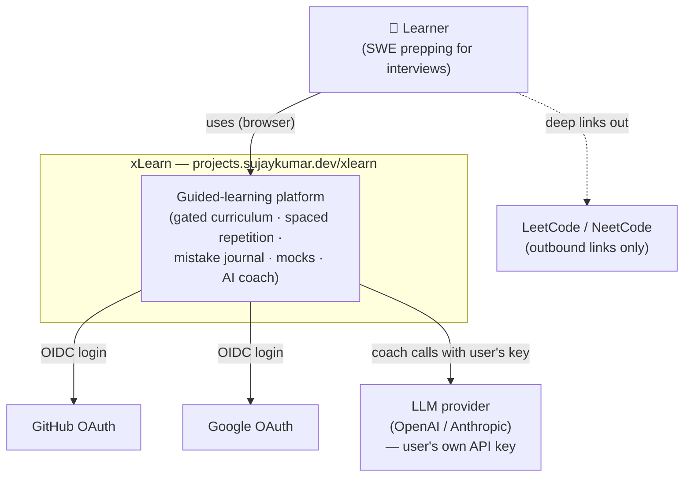
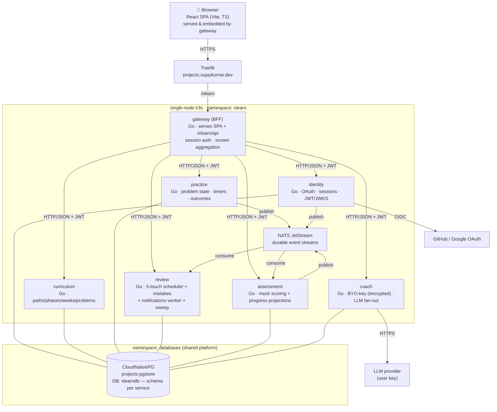

# Architecture overview

Living document. The **why** for each choice is in [`../adr/`](../adr/); this is the **what**.

- **Style:** service-oriented ([ADR-0003](../adr/0003-service-decomposition.md)) in a monorepo
  ([ADR-0002](../adr/0002-monorepo-vs-multi-repo.md)), Go services + a React SPA, on single-node k3s
  via Flux/Helm GitOps ([ADR-0009](../adr/0009-deployment-and-gitops.md)).
- **Sync comms:** HTTP/JSON on ClusterIP. **Async:** NATS JetStream with a transactional outbox
  ([ADR-0004](../adr/0004-inter-service-comms-and-events.md)).
- **Data:** one shared Postgres DB, schema-per-service; `goose` migrations + `sqlc`/`pgx`
  ([ADR-0005](../adr/0005-data-ownership-and-migrations.md)).

## C4 L1 — System context



## C4 L2 — Containers



> Diagrams are duplicated as standalone sources under [`diagrams/`](diagrams/) for editing.

## Cross-cutting concerns

| Concern | Approach | Ref |
|---------|----------|-----|
| **AuthN** | OAuth (GitHub/Google) → HttpOnly session cookie at the gateway. | [ADR-0006](../adr/0006-authn-authz.md) |
| **AuthZ / identity propagation** | Gateway-minted short-TTL RS256 JWT; services verify via JWKS; single `learner` role + ownership. | [ADR-0006](../adr/0006-authn-authz.md) |
| **Secrets** | SOPS/age, Flux-decrypted in-cluster; coach master key + JWT key + OAuth secrets. | [ADR-0007](../adr/0007-ai-coach-byo-key-and-secrets.md), [ADR-0009](../adr/0009-deployment-and-gitops.md) |
| **Data ownership** | Schema-per-service; no cross-schema access; APIs/events for cross-service data. | [ADR-0005](../adr/0005-data-ownership-and-migrations.md) |
| **Reliable events** | Transactional outbox → NATS JetStream; idempotent consumers (dedupe on `event_id`). | [ADR-0004](../adr/0004-inter-service-comms-and-events.md) |
| **Time** | Server-authoritative timers (attempt/hint/revision); client HUD mirrors. UTC everywhere; user timezone for display/reminders. | [PRD R-PF3](../prd/xlearn-prd.md#61-guided-problem-flow-gated-stages) |
| **Config** | Env vars per service (12-factor); non-secret DB coords as plain env, secrets via `envFrom` SOPS secret. | [ADR-0009](../adr/0009-deployment-and-gitops.md) |
| **Logging** | Go `slog` JSON to stdout; request-id propagated gateway→services. | [ADR-0009](../adr/0009-deployment-and-gitops.md) |
| **Health** | `/healthz` (liveness) + `/readyz` (readiness incl. DB) per service; chart `probes.path`. | — |
| **Errors** | Consistent JSON error envelope from the BFF; services return typed errors mapped to HTTP. | [`api.md`](api.md) |
| **Observability (metrics/tracing)** | Deferred in v1 (no platform stack yet) — known gap. | [ADR-0009](../adr/0009-deployment-and-gitops.md) |

## Repository layout

Monorepo ([ADR-0002](../adr/0002-monorepo-vs-multi-repo.md)); **added during the phased build** — not
present yet (this repo is docs + design so far).

```
xlearn/
  cmd/
    gateway/      identity/      curriculum/
    practice/     review/        assessment/     coach/     # one main per service
  internal/
    <service>/    domain · store (sqlc + migrations) · http handlers · events
    platform/     httpx · auth (JWT/JWKS) · events (outbox + NATS) · secrets · slogx · config
  pkg/            # (only if something must be importable outside)
  web/            # React + TS SPA (Vite); built to web/dist, embedded by gateway
  curriculum/     # versioned DSA seed (paths/phases/weeks/problems) consumed by curriculum svc
  deploy/         <service>.Dockerfile ×N
  docs/           # this tree
  Makefile        .github/workflows/{ci,deploy}.yml   go.mod
```

Deploy config (HelmReleases, image-automation, secrets, DB wiring, NATS) lives in the **`infra`**
repo — see [ADR-0009](../adr/0009-deployment-and-gitops.md) for the exact files to add.
