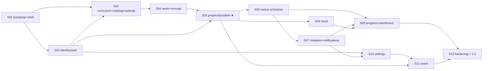

# xLearn v1 — build plan

**Per-version** execution plan. Derives phases from the design system's
[suggested build order](../../design-system/README.md#suggested-build-order-phases) and splits them
into small, dependency-ordered sprints. Global architecture is in [`../architecture/`](../architecture/)
and [`../adr/`](../adr/); live status in [`status.md`](status.md); sprint detail in
[`sprints/`](sprints/).

## Principles

- **Deployable early, deployable often.** Sprint 01 gets a skeleton live at `/xlearn` via Flux so the
  whole GitOps path is proven before feature work.
- **Vertical slices per service.** Each sprint stands up (or extends) one service end-to-end:
  schema + migrations → API → events → the screen(s) it backs.
- **Contracts before consolidation.** Even where services are grouped ([ADR-0003](../adr/0003-service-decomposition.md)),
  event/API contracts are defined when first needed.
- **Small sprints.** Roughly one focused chunk each; cadence is flexible (solo dev). Each has a flat
  `sprints/sprint-NN.md` plan + a self-contained `prompts/prompt-sNN.md` — one prompt, one session.

## Phase → sprint map

Design phases (D1-D6) → sprints (S01-S12). ★ = hero screen.

| Phase (design) | Sprint | Focus | Primary service(s) | Screens | Milestone |
|----------------|--------|-------|--------------------|---------|-----------|
| **D1 Foundation** | **S01** | Repo + platform bootstrap; port `theme.css`; app shell (sidebar/topbar/coach scaffold); routing; deployable skeleton. | gateway, platform, web | shell + routed stubs; Dashboard ★ skeleton | **M0** live at `/xlearn` |
| **D1 Foundation** | **S02** | identity: OAuth (GitHub/Google), sessions, JWT/JWKS; gateway auth; onboarding step 1. | identity, gateway | Auth, onboarding (path step) | **M1** real login |
| **D2 Content** | **S03** | curriculum service + DSA seed; Catalog + Roadmap. | curriculum | Catalog, Roadmap | — |
| **D2 Content** | **S04** | Week + Concept read views; BFF week aggregation (state placeholders). | curriculum, gateway | Week, Concept | **M2** browse curriculum |
| **D3 Guided problem engine** | **S05** | practice: problem state, stage gating, **server timers**, reveal+penalty, outcome logging; NATS + outbox (publish side). | practice, gateway | Problem ★ | **M3** solve the guided flow |
| **D4 Spaced repetition** | **S06** | review: five-touch scheduler (event-driven + sweep), auto-scoring; NATS consumers; Revision queue. | review | Revision | — |
| **D4 Spaced repetition** | **S07** | mistake journal (in review): categories, weekly weak-area, dashboard weak-area; notifications worker. | review | Mistakes | **M4** repetition + mistakes loop |
| **D5 Mock + analytics** | **S08** | assessment (mock): 45-min timed session, phase rail, 7-dim rubric, trend. | assessment | Mock | — |
| **D5 Mock + analytics** | **S09** | assessment (progress projections); finish Dashboard ★ aggregation. | assessment, gateway | Progress, Dashboard ★ | **M5** mock + analytics |
| **D6 Account + coach** | **S10** | Settings (profile/budget/timezone/reminders); onboarding completion. | identity | Settings | — |
| **D6 Account + coach** | **S11** | coach: BYO-key encrypted storage, provider fan-out, coach panel wired across screens. | coach | coach panel (all screens) | **M6** feature-complete v1 |
| **Hardening** | **S12** | Perf pass, error/empty states, a11y, e2e for the core loop, OpenAPI; **cut 1.0** (switch to release tags). | all | polish | **M7** 1.0 |

## Dependency graph

## Milestones

| ID | When | Definition of "done" |
|----|------|----------------------|
| **M0** | end S01 | Skeleton (shell + all 12 routes as stubs) is **live at `projects.sujaykumar.dev/xlearn`**, deployed by Flux from a merge to `main`. GitOps path proven. |
| **M1** | end S02 | OAuth login (GitHub + Google) works end-to-end; authed session; unauth → login redirect. |
| **M2** | end S04 | A user can browse the DSA path: Catalog → Roadmap → Week → Concept, with real seeded content. |
| **M3** | end S05 | A user can take the hero **Problem** flow: gated attempt→hint→solution→re-implement→outcome, with server timers and the reveal penalty. |
| **M4** | end S07 | Solving schedules five-touch reviews; the Revision queue auto-scores; below-clean outcomes open Mistakes; weak-area surfaces. |
| **M5** | end S09 | A 45-min Mock scores on the 7-dim rubric with a trend; Progress + Dashboard aggregate real data. |
| **M6** | end S11 | Settings + BYO-key coach work; coach panel is context-aware on every screen. **v1 feature-complete.** |
| **M7** | S12 | Hardened; core-loop e2e green; **1.0 tagged**, release-semver deploy mode adopted ([ADR-0009](../adr/0009-deployment-and-gitops.md)). |

## Cross-cutting, carried every sprint

- Update progress per the [status protocol](sprints/README.md#status-protocol-way-of-working): the
  sprint's Status table **and** [`status.md`](status.md). Record notable decisions as ADRs.
- Keep `theme.css` parity (tokens/components; difficulty green/amber/red).
- New service checklist: schema + `goose` migrations, `sqlc` queries, `/healthz`+`/readyz`, structured
  logs, outbox (if it emits) + idempotent inbox (if it consumes), a `deploy/<svc>.Dockerfile`, a CI
  path filter, and the `infra` HelmRelease + image-automation entry (+ per-service DB role/schema/secrets).
- Definition of Done (per sprint): CI green, screens match the artboards, acceptance criteria met,
  deployed to prod, statuses updated.

## Where the execution detail lives

This file is the **static plan**. Each sprint is executed from a matched pair:

- **Plan:** [`sprints/sprint-NN.md`](sprints/) — goal, scope, a **task Status table**, acceptance
  criteria, DoD, risks.
- **Prompt:** [`prompts/prompt-sNN.md`](../v1/prompts/) — **one self-contained prompt per sprint**,
  built to run in a single session, ending with an **Update status** step.

All twelve sprints are pre-scaffolded. See the [sprints index](sprints/README.md) and the
[prompts index](prompts/README.md).
