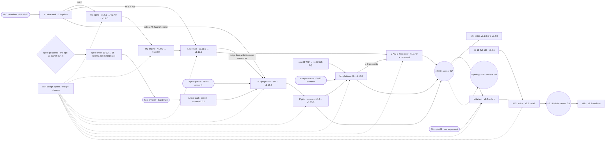
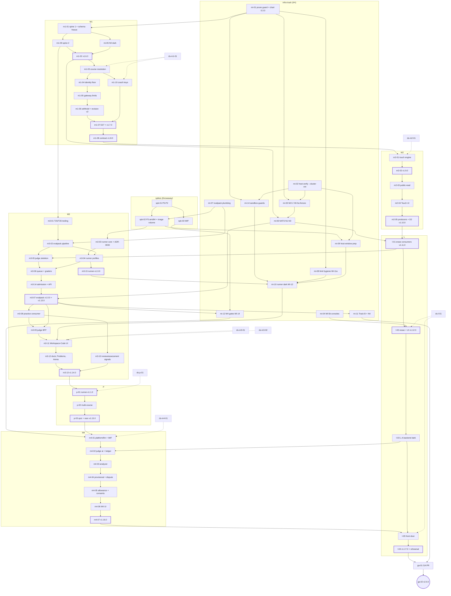

# xLearn v2 — build plan

**Per-version** execution plan for the v2 build. It turns the
[rollout plan](rollout-plan.md) (the source: MI track, milestone map, gates, tag timeline, artboards) into
**89 dependency-ordered sprints**, each a flat plan in [`sprints/`](sprints/) paired with one self-contained
prompt in [`prompts/`](prompts/). Decisions live in the [feasibility log](feasibility.md) (D0–D35, plus D36–D39 = the build-plan session's BP1–BP4 and D40 = the owner's sprint merge directive) and the
ADRs [0026](../adr/0026-per-course-extensibility-model.md)–[0035](../adr/0035-v2-operations-nats-auth-limits-capacity.md);
the product scope is the [v2 PRD](../prd/xlearn-v2-prd.md). Live progress is in [`status.md`](status.md).
**At a glance:** [execution-order.md](execution-order.md) clubs the 89 prompts into 19 workstreams and shows the
run order week by week, with diagrams.
If this file and an ADR disagree, the ADR wins and this file gets fixed.

- **Build line:** v2 · **Live release:** v1.5.2 (signup closed) · **Planned:** 2026-09-24 (build-plan session, owner decisions BP1–BP4) · **Amended:** 2026-09-25 by **D40** (every prompt lands and syncs; launching it is the owner's approval).
- **What ships:** `v2.0.0` = owner-facing GA (MI + M1–M4 + P + L) · `v2.1.0` = interviewer GA (M6a + M6b) · M5 = a later 2.x minor · M6c = v2.2 (outline only).
- **Where codes** (every task names one): **X** this repo · **I** `../infra` (GitOps PR, never `kubectl apply`) · **H** host scripts (`../infra/hack/`, applied by hand over `ssh vps`) · **E** the private `xlearn-evalpack` repo · **O** owner-only action (done **before launch**, listed in the prompt's `## Before you launch (owner)` block; D40).

## Principles

**Carried from v1** ([v1 build plan](../v1/build-plan.md#principles))
- **Deployable often.** Every sprint lands on `main` through a squash-merged PR. Nothing deploys from `main` (release-semver since 1.0); a tag deploys. So a sprint either **ships dark** in a named tag or **is** the tag sprint.
- **Vertical slices per service.** Schema + goose migrations → API → events → the screen, one service boundary at a time ([ADR-0003](../adr/0003-service-decomposition.md), [ADR-0005](../adr/0005-data-ownership-and-migrations.md)).
- **Contracts before consolidation.** Event and API contracts are fixed when first needed; the envelope is append-only and decoders stay forever.
- **Small sprints.** One sprint = one focused session, one flat plan + one self-contained prompt. v1 ran S01–S12 in two days.

**New in v2**
- **Infra first, interleaved, hard-gated before M3.** The MI track (rollout §2) starts now and runs beside product work. No M3 UI sprint starts until the [M3 hard entry checklist](rollout-plan.md#5-m3-hard-entry-checklist) is green; it is copied verbatim into the sprints that open M3 ([m3-11](sprints/sprint-m3-11.md), [m3-13](sprints/sprint-m3-13.md)).
- **Owner-only v2 (D35).** The invite flow and the whole learner gate **L** are built and rehearsed once on production with a tester, then production returns to `SIGNUP_MODE=closed`. Real learners arrive at v3.
- **Rolling tags (ADR-0034).** Every milestone ships as the **next free 1.x minor**; new behaviour lands **dark** (T-2 env, T-3 cohort) and a labelled tag flips the T-1 defaults. From `v2.0.0` on, the minor moves only at a GA flip; everything else is a patch. Runner and evalpack are separate streams (`runner-vX.Y.Z`, evalpack `vX.Y.Z`).
- **Expand → backfill → contract; consumers before producers.** A consumer ships one tag before its producer (or the producer ships dark); a contract tag is rehearsed in compose and preceded by a snapshot.
- **Launching a prompt is the owner's approval; every prompt lands and syncs (D40).** Launching a sprint prompt approves every change it makes: merges and tags (contract, erase and GA included), infra PRs, board freezes, ADR acceptances, owner content the agent drafts, and the production steps the prompt specifies. **No session stops for owner review.** Every prompt ends with `## Ship (land-and-sync — owner approval pre-granted)`; owner-only actions sit in its `## Before you launch (owner)` block. The owner's in-session "hold / don't ship" still wins.
- **Design sprints freeze the boards (BP3, D40).** Agents draft **all** 29 v2 artboards (AB01–AB30 less the dropped AB23, the five heroes ★ included) as static HTML on `design-system/theme.css` under `design-system/screens/v2/` (preview-only, never shipped). A design sprint lands and syncs like any other: its board PR merges on CI green, and **that merge is the freeze**, before that milestone's first UI sprint. The owner may review afterwards; a change to a frozen board is a follow-up design PR. This replaces the rollout plan's hybrid "owner designs the heroes" (rollout §9), and D40 replaces BP3's review gate.
- **Spikes decide before build.** The sandbox spike (P0–P3 + image volume), the WIF spike and S6 are throwaway sprints; only their results land, through a docs PR. Launching a spike prompt is its go-ahead (D23, D40), and the session decides GO/NO-GO against the documented criteria and pre-decided fallbacks (e.g. the nsjail Plan B). A result outside every pre-decided path gets options and a recommendation in the results doc and a ⛔ "needs owner decision" on the dependent gate in status.md, and the results PR still lands. The Proposed ADRs they gate are accepted **by the sprint that consumes the result** (BP2): ADR-0030 in [m3-03](sprints/sprint-m3-03.md) task 1 (the 10-24 host window applies its §5 host block on the spike GO before that, by design), ADR-0031 in [mi-12](sprints/sprint-mi-12.md), ADR-0032 in [ds-m6a-01](sprints/sprint-ds-m6a-01.md).
- **Owner-only actions are calendar events, not sprints (BP4, D40).** A sprint may *prepare* one (runbook, scripts); the owner does it **before launching** the sprint that needs it, and that prompt's `## Before you launch (owner)` block lists it. Nothing waits mid-session: if a prerequisite turns out missing, the session lands what doesn't depend on it and marks the gap ⛔ in status.md.
- **No alerting (D34).** No opscheck, healthchecks.io, Flux `Alert`/`Provider`, host-check timer or push channel anywhere. The MI-8 `host-verify --cluster` extension is the only ops tooling; the owner watches with landscape and kubescope. No backups or object store (D11, D12).

## Milestone map

Rollout §3 numbers against this plan. **Build/release** sprints are comparable with the rollout ranges; **design** and **spike** sprints are additive (BP1).

| MS | Goal | Entry gates | Exit (definition of done) | Rollout size | This plan | Tags | Earliest *(inferred)* |
|----|------|-------------|---------------------------|--------------|-----------|------|------------------------|
| **M0** ✅ | Namespace rule; coach P0 fixes | — | live: v1.5.0, v1.5.1 (+ v1.5.2 stopgaps) | done | done | v1.5.0–v1.5.2 | done |
| **MI** | Cluster safe for untrusted code | MI-0 (H0) | Track A green; runner acceptance suite passes dark; `host-verify --cluster` (extended) green | 6–8 | 13 (12 infra + [mi-05](sprints/sprint-mi-05.md) N0 code) + 3 spikes (+ [mi-13](sprints/sprint-mi-13.md) in v2.1) | infra PRs; runner-v1.0.0 (m3-15) | Sep 25 → Nov |
| **M1** | Spine, no behaviour change, + security floor | MI-2; MI-2a live ✅; `ds-m1-01` merged (AB01–AB03 frozen) before M1b | golden = v1; every v1 e2e green; events replay; only visible changes: D27 confirm, D31, 429s | 6–7 | 10 + 1 design | v1.6.0 → v1.7.0 → v1.8.0 | October |
| **M2** | Attempt engine, projections, D2, `public-read` | M1 shipped; `ds-m2-01` merged (AB04–AB06, AB22 frozen) | replay equal; below-clean items get a ladder; public route `public-read`-only | 4–5 | 5 + 1 design | v1.9.0 → v1.10.0 | late October |
| **L** | Learner gate, built and exercised by owner + testers (∥ M3/M4) | M1a columns + M1b CLI; **MI-5b before the first tester**; MI-5 + MI-7 N3 (L-E); MI-5a; M4 (L-C); `ds-l-01` merged (AB19–AB21 frozen) before L-E | invite round-trip rehearsed on production with a tester, then `SIGNUP_MODE=closed` again | 3–4 | 5 + 1 design | v1.11.0 → v1.12.0 → v1.17.0 | Nov → Dec |
| **M3** | Judge + code grader (Go, C++, Python) | **the hard checklist (rollout §5)** | packed items execution-graded with provenance (cohort); kill switch tested; denylist test green | 13–16 | 15 + 2 design | runner-v1.0.0 · evalpack v1.0.0 · v1.13.0 → v1.14.0 | November |
| **P** | Pilot course (go-concurrency) | M3; P3 TSAN result; PRD Q5 confirmed (before launch of ds-p-01); `ds-p-01` merged (AB14–AB15 frozen) | manifest + content with widget/profile code only; manifest `preview` | 3–4 | 3 + 1 design | runner-v1.1.0 · v1.15.0 | December |
| **M4** | Platform AI (owner cohort) | MI-14; acceptance set labelled; `ds-m4-01` merged (AB16–AB18 frozen) | pre-fill within caps; exhaustion → manual; ledger within ±5% of the Console | 6–8 | 7 + 1 design | v1.16.0 | December |
| **GA** | `v2.0.0`: owner-facing default flip | MI + M1–M4 + P + L complete; the GA checklist (rollout §4) | judge + platform AI on, pilot `active`, for every account; `SIGNUP_MODE` stays `closed`; no dogfood gate | — | 2 | v2.0.0 | ≈ Dec 2026–Jan 2027 |
| **M6a** | Text interviewer + failsafes | S6 (spk-04) before the design freeze; M3 `mock` context; twin fairness gate; `ds-m6a-01` + `ds-m6a-02` merged (AB13, AB24–AB28 frozen) | a 45-minute text mock survives pause and resume and scores once | 5–7 | 6 + 2 design + 1 spike (S6) | v2.0.x patch (dark) | Q1 2027 |
| **M6b** | Voice, one shell | S6 result; MI-16; `account.region`; `ds-m6b-01` merged (AB29–AB30 frozen) | a voice mock on the learner's key, no media on the node | 4–5 | 4 + 1 design (+ mi-13) | v2.0.x patches → **v2.1.0** | Q1 2027 |
| **M5** | DSA evaluator-only | every live DSA item packed | no self path left in DSA | 1 | 1 | rides v2.1.0, or next minor ≥ v2.2.0 | ≈ H2 2027 |
| M6c | Interviewer extras | M6b | — (outline) | 3+ | 3 outline cards | v2.2 | v2.2 |
| **Opening (v3)** | Real learners by invite | [rollout §11](rollout-plan.md#11-opening-gates-v3); the owner's call | first real invitee | — | not in v2 | — | v3 |

**Totals.** v2.0 = **60 build/release sprints** (MI 13, M1 10, M2 5, L 5, M3 15, P 3, M4 7, GA 2) + **7 design** + **3 spike** = 70 sessions. v2.1 = **11** (M6a 6, M6b 4, mi-13) + 3 design + 1 spike (S6) = 15. Then M5 (1) and M6c (3 outline cards). **89 sprints, 86 prompts.**

**Where this plan exceeds the rollout ranges, and why.** Engineering is not the long pole (rollout §6), so slices were cut for one-session size and independent merge rather than to hit a count:
- **MI 13 vs 6–8.** Most MI sprints are one or two small infra PRs, split so each merges on its own float: MI-4 has its own sprint ([mi-14](sprints/sprint-mi-14.md)) so a VAP stall never blocks N3; [mi-05](sprints/sprint-mi-05.md) is xlearn code (N0) riding v1.6.0; [mi-12](sprints/sprint-mi-12.md) is the MI-14 M4 gate.
- **M1 10 vs 6–7.** m1-01 and m1-07 were each split into single-session slices ([m1-09](sprints/sprint-m1-09.md), [m1-10](sprints/sprint-m1-10.md)).
- **L 5 vs 3–4.** The owner-visible L-A/L-C front door ([l-05](sprints/sprint-l-05.md)) is its own sprint, held to v1.17.0.
- **GA 2 (new).** The GA PR ([ga-01](sprints/sprint-ga-01.md), merged on CI green, D40) and the cut ([ga-02](sprints/sprint-ga-02.md)) are separate sessions.
- M2, M3, P, M4, M6a and M6b sit inside their ranges; v2.1's 11 build sprints sit inside 9–12.

## Sprint table (recommended order)

`#` is the global recommended execution order, sequenced by the BP4 calendar (the fixed-date spike week and host
window sit in their week). **Tracks run in parallel:** `infra` (I/H PRs), `design` (board PRs; each merge is a
freeze), `content` (authoring tooling), `spike` (throwaway) and `product` interleave; only the **Prereqs** bind.
**When:** W1 = Sep 25 → Oct 2 · W2 = Oct 5 → 9 · W3 = Oct 12 → 16 (spike week) · W4 = Oct 17 → 23 · W5 = Oct 24 → 30
(host window Sat Oct 24); later windows are *(inferred)*. **Release** in bold = a tag or a stream release.
Sprint ids are milestone-scoped: `mi-NN` sprint ids are **not** rollout step ids `MI-NN` (map in
[status.md → MI track](status.md#mi-track-rollout-2)).

| # | Sprint | Focus | MS | Track | When | Release | Prereqs |
|---|--------|-------|----|-------|------|---------|---------|
| 1 | [mi-01](sprints/sprint-mi-01.md) | Prune guards + chart 0.3.0 knob union (MI-2, MI-3) | MI | infra | W1 | infra PRs only (MI-2 first, then MI-3) | — |
| 2 | [ds-m1-01](sprints/sprint-ds-m1-01.md) | Design M1: coach states, course nav, revision v2 (AB01–AB03) | M1 | design | W1 | land-and-sync; the merge is the design freeze | — |
| 3 | [mi-02](sprints/sprint-mi-02.md) | host-verify --cluster extension (MI-8) | MI | infra | W1–2 | infra PR only (host script) | — |
| 4 | [m1-01](sprints/sprint-m1-01.md) | Curriculum spine part 1: compose parity, course manifest + golden, item schema freeze (M1a) | M1 | product | W1 | merge only (ships in v1.6.0) | [mi-01](sprints/sprint-mi-01.md) |
| 5 | [mi-07](sprints/sprint-mi-07.md) | Evalpack plumbing (MI-9) | MI | infra | W1–2 (by 10-09) | infra PRs only (+ evalpack repo; `v0.1.0` image, no `>=1.0.0`) | — |
| 6 | [ds-m2-01](sprints/sprint-ds-m2-01.md) | Design M2: Touch ★, catalog/agenda, public profile v2, visibility (AB04 ★, AB05, AB06, AB22) | M2 | design | W1–2 | land-and-sync; the merge is the design freeze | — |
| 7 | [ds-l-01](sprints/sprint-ds-l-01.md) | Design L: invite acceptance ★, privacy notice, erase account (AB19 ★, AB20, AB21) | L | design | W1–2 | land-and-sync; the merge is the design freeze | — |
| 8 | [m1-09](sprints/sprint-m1-09.md) | Curriculum spine part 2: converter, loader + guards, curriculum expand migration, content CI (M1a) | M1 | product | W2 | merge only (ships in v1.6.0) | [m1-01](sprints/sprint-m1-01.md) |
| 9 | [m3-01](sprints/sprint-m3-01.md) | Authoring tooling T25/T26: canonical hashes, contract_hash, packlint, pre-push fingerprint hook | M3 | content | W2 | merge only (dev tools; rides the next tag) | [m1-01](sprints/sprint-m1-01.md), [m1-09](sprints/sprint-m1-09.md) |
| 10 | [mi-05](sprints/sprint-mi-05.md) | N0: NATS topology, dead letters, identity on NATS, client options, pool pins (MI-6) | MI | product | W2 | merge only (ships dark in v1.6.0) | [m1-01](sprints/sprint-m1-01.md) |
| 11 | [m1-02](sprints/sprint-m1-02.md) | path_slug everywhere + v2 envelope consumers + identity M1a columns → v1.6.0 | M1 | product | W2 | **tag v1.6.0** (+ infra PR before) | [m1-09](sprints/sprint-m1-09.md), [mi-05](sprints/sprint-mi-05.md) |
| 12 | [mi-14](sprints/sprint-mi-14.md) | sandbox-guards: empty default-deny xlearn-runner namespace + VAP (MI-4) | MI | infra | W2 | infra PRs only | [mi-01](sprints/sprint-mi-01.md), [mi-02](sprints/sprint-mi-02.md) |
| 13 | [mi-03](sprints/sprint-mi-03.md) | Fences: databases/messaging ingress, xlearn ingress (MI-5, MI-5a) | MI | infra | W2 | infra PRs only (MI-5 → MI-5a) | [mi-01](sprints/sprint-mi-01.md), [mi-02](sprints/sprint-mi-02.md) |
| 14 | [m3-02](sprints/sprint-m3-02.md) | Evalpack pipeline: private CI gates, generic validator, image build (E) + compose fixture pack | M3 | content | Oct | merge only (evalpack `main`; optional `v0.2.0`) | [mi-07](sprints/sprint-mi-07.md), [m3-01](sprints/sprint-m3-01.md) |
| 15 | [mi-04](sprints/sprint-mi-04.md) | Admin consoles to ops.sujaykumar.dev (MI-5b) | MI | infra | W2–4 | infra PRs only | — |
| 16 | [spk-01](sprints/sprint-spk-01.md) | Sandbox mechanism spike P0–P2 (multipass arm64, throwaway) | MI | spike | W3 Mon–Wed | no merge (spike, throwaway); results docs PR | — |
| 17 | [spk-02](sprints/sprint-spk-02.md) | P3 amd64 replay + image-volume spike (throwaway) | MI | spike | W3 Thu–Fri | no merge (spike, throwaway); results docs PR | [spk-01](sprints/sprint-spk-01.md), [mi-07](sprints/sprint-mi-07.md) |
| 18 | [spk-03](sprints/sprint-spk-03.md) | WIF spike (≤ ½ day, throwaway) | MI | spike | W3 Fri, or before M4 | no merge (spike, throwaway); results docs PR | [spk-01](sprints/sprint-spk-01.md) |
| 19 | [mi-06](sprints/sprint-mi-06.md) | NATS auth server-first: N1 → N2 → N3 (MI-7) | MI | infra | W3 | infra PRs only (N1, N2, N3) | [mi-05](sprints/sprint-mi-05.md), [m1-02](sprints/sprint-m1-02.md), [mi-03](sprints/sprint-mi-03.md), [mi-02](sprints/sprint-mi-02.md) |
| 20 | [m1-03](sprints/sprint-m1-03.md) | Course resolution: gateway, BFF, SPA /:course/*, producers emit v2 (M1b) | M1 | product | W2–3 | merge only (ships in v1.7.0) | [m1-02](sprints/sprint-m1-02.md), [ds-m1-01](sprints/sprint-ds-m1-01.md) |
| 21 | [m1-04](sprints/sprint-m1-04.md) | Identity security floor: roles, sessions, admin CLI, DEV_AUTH guard, L3, CSP (M1b) | M1 | product | W2–3 | merge only (ships in v1.7.0) | [m1-03](sprints/sprint-m1-03.md) |
| 22 | [m1-10](sprints/sprint-m1-10.md) | Coach keys + provider hygiene: key_default(feature), catalog, AEAD AD, keyring re-wrap, store:false, classifier, usage | M1 | product | W3 | merge only (ships in v1.7.0) | [m1-02](sprints/sprint-m1-02.md), [m1-03](sprints/sprint-m1-03.md), [ds-m1-01](sprints/sprint-ds-m1-01.md) |
| 23 | [m1-05](sprints/sprint-m1-05.md) | Gateway limits + public-dashboard floor (L1, L2, L4–L6, L24; P1, P2, P4, P10, P11) | M1 | product | W3 | merge only (ships in v1.7.0) | [m1-04](sprints/sprint-m1-04.md) |
| 24 | [m1-06](sprints/sprint-m1-06.md) | withhold() on every surface + Markdown renderer + revision v2 (AB03) | M1 | product | W3 | merge only (ships in v1.7.0) | [m1-05](sprints/sprint-m1-05.md) |
| 25 | [mi-08](sprints/sprint-mi-08.md) | Limit hygiene (MI-11a) + Track B slice 1: PSA labels, SA tokens off (MI-15 part) | MI | infra | W4 | infra PRs only (by the 10-24 window) | [mi-01](sprints/sprint-mi-01.md), [mi-02](sprints/sprint-mi-02.md) |
| 26 | [mi-09](sprints/sprint-mi-09.md) | October host-window prep: sandbox block, L23 kubelet args, pid limits, bumps (MI-11) | MI | infra | W4 | infra PRs only (scripts applied in the window) | [spk-01](sprints/sprint-spk-01.md), [spk-02](sprints/sprint-spk-02.md), [mi-02](sprints/sprint-mi-02.md) |
| 27 | [m1-07](sprints/sprint-m1-07.md) | Coach D27 assist capture, mode gate, L18 caps + AB01 → v1.7.0 | M1 | product | W4 | **tag v1.7.0** | [m1-03](sprints/sprint-m1-03.md), [m1-04](sprints/sprint-m1-04.md), [m1-05](sprints/sprint-m1-05.md), [m1-06](sprints/sprint-m1-06.md), [m1-10](sprints/sprint-m1-10.md) |
| 28 | [ds-m3-01](sprints/sprint-ds-m3-01.md) | Design M3 part 1: Workspace-Code ★, results dock, degradation badges (AB07 ★, AB08, AB11) | M3 | design | W4 | land-and-sync; the merge is the design freeze | — |
| 29 | [m1-08](sprints/sprint-m1-08.md) | M1c contract → v1.8.0 | M1 | product | W5 | **tag v1.8.0** (contract; snapshot first) | [m1-07](sprints/sprint-m1-07.md), [mi-02](sprints/sprint-mi-02.md) |
| 30 | [m3-03](sprints/sprint-m3-03.md) | Runner core: supervisor, jail, cgroups, API | M3 | product | late Oct | merge only (ships in runner-v1.0.0) | [spk-01](sprints/sprint-spk-01.md), [spk-02](sprints/sprint-spk-02.md) |
| 31 | [m3-04](sprints/sprint-m3-04.md) | Runner profiles Go/C++/Python + harness codecs + amd64 allowlists | M3 | product | late Oct | merge only (ships in runner-v1.0.0) | [m3-03](sprints/sprint-m3-03.md), [m3-02](sprints/sprint-m3-02.md) |
| 32 | [m3-15](sprints/sprint-m3-15.md) | Runner release: reproducible image, runner-release.yml, acceptance suite, TL baselines → runner-v1.0.0 | M3 | product | late Oct | **runner-v1.0.0** | [m3-04](sprints/sprint-m3-04.md) |
| 33 | [m2-01](sprints/sprint-m2-01.md) | M2a touch-attempt engine + `touch_concluded` consumer | M2 | product | late Oct | merge only (ships in v1.9.0) + own infra PR | [m1-08](sprints/sprint-m1-08.md), [ds-m2-01](sprints/sprint-ds-m2-01.md) |
| 34 | [m2-02](sprints/sprint-m2-02.md) | M2b consumers + projections v2 → v1.9.0 | M2 | product | late Oct | **tag v1.9.0** (+ ACL PR before) | [m2-01](sprints/sprint-m2-01.md) |
| 35 | [ds-m3-02](sprints/sprint-ds-m3-02.md) | Design M3 part 2: Problems, Arena, Week/Mistakes/Progress deltas (AB09, AB10, AB12) | M3 | design | late Oct | land-and-sync; the merge is the design freeze | [ds-m3-01](sprints/sprint-ds-m3-01.md) |
| 36 | [m2-03](sprints/sprint-m2-03.md) | `public-read`, `/public/stats`, visibility toggles, profile v2 (P3, P5, P6, P7, P9; AB06, AB22) | M2 | product | late Oct | merge only (ships in v1.10.0) | [m2-02](sprints/sprint-m2-02.md) |
| 37 | [m2-04](sprints/sprint-m2-04.md) | Touch UI (AB04★) + catalog/agenda + Today in minutes (D4) (AB05) | M2 | product | late Oct | merge only (ships in v1.10.0) | [m2-01](sprints/sprint-m2-01.md), [m2-02](sprints/sprint-m2-02.md), [m2-03](sprints/sprint-m2-03.md) |
| 38 | [m2-05](sprints/sprint-m2-05.md) | Producers on + `touch_scored` backfill + reader switch + replay + D2 (M2c) → v1.10.0 | M2 | product | early Nov | **tag v1.10.0** | [m2-02](sprints/sprint-m2-02.md), [m2-03](sprints/sprint-m2-03.md), [m2-04](sprints/sprint-m2-04.md) |
| 39 | [l-01](sprints/sprint-l-01.md) | L-E erase consumers (practice, review, assessment, coach) + identity ack path → v1.11.0 | L | product | early Nov | **tag v1.11.0** (+ ACL/seed PRs before) | [mi-06](sprints/sprint-mi-06.md), [mi-03](sprints/sprint-mi-03.md), [m2-05](sprints/sprint-m2-05.md) |
| 40 | [l-02](sprints/sprint-l-02.md) | L-E erase producer + `DELETE /api/me` + UI (AB21) → v1.12.0 | L | product | early Nov | **tag v1.12.0** (erase; snapshot first) | [l-01](sprints/sprint-l-01.md), [ds-l-01](sprints/sprint-ds-l-01.md), [mi-04](sprints/sprint-mi-04.md), [m1-04](sprints/sprint-m1-04.md) |
| 41 | [mi-10](sprints/sprint-mi-10.md) | Runner dark on production (MI-12) | MI | infra | early Nov | infra PRs only (runner dark) | [mi-14](sprints/sprint-mi-14.md), [mi-08](sprints/sprint-mi-08.md), [mi-09](sprints/sprint-mi-09.md), [m3-15](sprints/sprint-m3-15.md) |
| 42 | [m3-05](sprints/sprint-m3-05.md) | judge service: skeleton, schema, evalpack loader, erase consumer (M3-1) | M3 | product | early Nov | merge only (ships dark in v1.13.0) | [m3-02](sprints/sprint-m3-02.md), [l-01](sprints/sprint-l-01.md) |
| 43 | [m3-06](sprints/sprint-m3-06.md) | judge queue, runner lane, graders, contexts, internal context endpoints | M3 | product | Nov | merge only (ships dark in v1.13.0) | [m3-05](sprints/sprint-m3-05.md), [m3-03](sprints/sprint-m3-03.md), [m3-04](sprints/sprint-m3-04.md) |
| 44 | [m3-14](sprints/sprint-m3-14.md) | judge admission (L9–L15, L6), learner API + DTO allowlist, drafts, arena history/progress, telemetry, judge admin | M3 | product | mid-Nov | merge only (ships dark in v1.13.0) | [m3-06](sprints/sprint-m3-06.md) |
| 45 | [ds-p-01](sprints/sprint-ds-p-01.md) | Design P: Workspace-Quiz, go-concurrency multi-file + race, AB02/AB05 full fidelity (AB14, AB15) | P | design | Nov | land-and-sync; the merge is the design freeze | [ds-m1-01](sprints/sprint-ds-m1-01.md), [ds-m2-01](sprints/sprint-ds-m2-01.md), [ds-m3-01](sprints/sprint-ds-m3-01.md), [spk-02](sprints/sprint-spk-02.md) |
| 46 | [m3-07](sprints/sprint-m3-07.md) | M3-1 on prod: evalpack v1.0.0, judge ACL, tag v1.13.0, judge HelmRelease (MI-13) | M3 | product | mid-Nov | **evalpack v1.0.0 + tag v1.13.0** (ACL PR before, HelmRelease after) | [m3-14](sprints/sprint-m3-14.md), [mi-06](sprints/sprint-mi-06.md), [mi-03](sprints/sprint-mi-03.md), [mi-07](sprints/sprint-mi-07.md), [m3-02](sprints/sprint-m3-02.md), [l-01](sprints/sprint-l-01.md) |
| 47 | [l-03](sprints/sprint-l-03.md) | L-A admission backend (inert while closed): invites, seats, redeem, public checks, `SIGNUP_MODE=invite`, erase clears invite notes | L | product | Nov | merge only (ships dark, inert, in the next tag) | [l-02](sprints/sprint-l-02.md) |
| 48 | [m3-08](sprints/sprint-m3-08.md) | practice: judge consumer, reconciler, D15/D16/D18 grading strategy | M3 | product | mid-Nov | merge only (ships in v1.14.0) + ACL PR | [m3-07](sprints/sprint-m3-07.md) |
| 49 | [m3-09](sprints/sprint-m3-09.md) | gateway judge BFF, DTO allow/deny lists, typed 413, L16, degradation status | M3 | product | mid-Nov | merge only (ships in v1.14.0) | [m3-07](sprints/sprint-m3-07.md), [m3-08](sprints/sprint-m3-08.md) |
| 50 | [m3-10](sprints/sprint-m3-10.md) | review + assessment on judge signals (mistake pre-fill, P7 checked, P8) | M3 | product | mid-Nov | merge only (ships in v1.14.0) | [m3-08](sprints/sprint-m3-08.md) |
| 51 | [ds-m4-01](sprints/sprint-ds-m4-01.md) | Design M4: AI suggestion/dispute ★, pointer notes, allowance + consents (AB16 ★, AB17, AB18) | M4 | design | Nov | land-and-sync; the merge is the design freeze | — |
| 52 | [mi-11](sprints/sprint-mi-11.md) | Track B finish: xlearn egress, PG connection limits, Renovate, N4 (MI-15) | MI | infra | Nov–Dec | infra PRs only (+ xlearn PR, no tag) | [m3-07](sprints/sprint-m3-07.md), [l-01](sprints/sprint-l-01.md) |
| 53 | [m3-11](sprints/sprint-m3-11.md) | Workspace-Code UI (AB07★) + CodeMirror lazy load | M3 | product | late Nov | merge only (ships in v1.14.0) | [m3-09](sprints/sprint-m3-09.md), [ds-m3-01](sprints/sprint-ds-m3-01.md), [ds-m3-02](sprints/sprint-ds-m3-02.md), [mi-10](sprints/sprint-mi-10.md) |
| 54 | [m3-12](sprints/sprint-m3-12.md) | Results dock, Problems, Arena, degradation badges (AB08–AB11) | M3 | product | late Nov | merge only (ships in v1.14.0) | [m3-11](sprints/sprint-m3-11.md), [ds-m3-02](sprints/sprint-ds-m3-02.md) |
| 55 | [m3-13](sprints/sprint-m3-13.md) | Week/Mistakes/Progress deltas (AB12) + M3 exit tests → v1.14.0 | M3 | product | late Nov | **tag v1.14.0** (+ `JUDGE_BASE_URL` PR after) | [m3-12](sprints/sprint-m3-12.md), [m3-10](sprints/sprint-m3-10.md) |
| 56 | [mi-12](sprints/sprint-mi-12.md) | M4 gates: judge 443 egress, LLM secret, provider runbook (MI-14) + ADR-0031 → Accepted | MI | infra | Dec | infra PRs only (+ ADR-0031 docs PR) | [m3-07](sprints/sprint-m3-07.md), [spk-03](sprints/sprint-spk-03.md) |
| 57 | [p-01](sprints/sprint-p-01.md) | go-race runner profile → runner-v1.1.0 | P | product | Dec | **runner-v1.1.0** (judge code rides v1.15.0) | [m3-13](sprints/sprint-m3-13.md), [spk-02](sprints/sprint-spk-02.md), [ds-p-01](sprints/sprint-ds-p-01.md) |
| 58 | [p-02](sprints/sprint-p-02.md) | Multi-course: go-concurrency manifest (preview), catalog, agenda, nav | P | product | Dec | merge only (ships in v1.15.0) | [p-01](sprints/sprint-p-01.md) |
| 59 | [p-03](sprints/sprint-p-03.md) | Quiz widget (AB14) + race verdict UI (AB15) → v1.15.0 | P | product | Dec | **tag v1.15.0** + **evalpack v1.N.0** | [p-02](sprints/sprint-p-02.md) |
| 60 | [m4-01](sprints/sprint-m4-01.md) | platform/llm extraction + WIF auth + retention policy | M4 | product | Dec | merge only (ships in v1.16.0) | [mi-12](sprints/sprint-mi-12.md), [m3-13](sprints/sprint-m3-13.md), [p-03](sprints/sprint-p-03.md), [ds-m4-01](sprints/sprint-ds-m4-01.md) |
| 61 | [m4-02](sprints/sprint-m4-02.md) | judge ai: Scorer, ledger, llm lane, breaker, caps (L17) | M4 | product | Dec | merge only (ships in v1.16.0) | [m4-01](sprints/sprint-m4-01.md), [l-03](sprints/sprint-l-03.md) |
| 62 | [m4-03](sprints/sprint-m4-03.md) | Analyzer (D16/D26), pointer notes, `evaluation_analyzed` + acceptance-set harness | M4 | product | Dec | merge only (ships in v1.16.0) + ACL PR | [m4-02](sprints/sprint-m4-02.md), [m3-10](sprints/sprint-m3-10.md) |
| 63 | [m4-04](sprints/sprint-m4-04.md) | Provisional grades, dispute, re-grade, honor claims (D14) | M4 | product | Dec | merge only (ships in v1.16.0) | [m4-03](sprints/sprint-m4-03.md), [m3-08](sprints/sprint-m3-08.md) |
| 64 | [m4-05](sprints/sprint-m4-05.md) | AI allowance + consents (`account_consent` AI kinds) | M4 | product | Dec | merge only (ships in v1.16.0) | [l-03](sprints/sprint-l-03.md), [m4-04](sprints/sprint-m4-04.md) |
| 65 | [m4-06](sprints/sprint-m4-06.md) | M4 UI: AI suggestion/dispute (AB16★), pointer notes (AB17), allowance + consents (AB18) | M4 | product | Dec | merge only (ships in v1.16.0) | [ds-m4-01](sprints/sprint-ds-m4-01.md), [m4-03](sprints/sprint-m4-03.md), [m4-04](sprints/sprint-m4-04.md), [m4-05](sprints/sprint-m4-05.md) |
| 66 | [m4-07](sprints/sprint-m4-07.md) | Canary log test, caps sizing, ledger check → v1.16.0 (+ LLM_PLATFORM_ENABLED for the cohort) | M4 | product | Dec | **tag v1.16.0** (+ `LLM_PLATFORM_ENABLED` PR) | [m4-06](sprints/sprint-m4-06.md) |
| 67 | [l-05](sprints/sprint-l-05.md) | L-A/L-C front door: auth-page invite state, acceptance step★, privacy notice, AI consents (AB19★, AB20) | L | product | Dec | merge only (ships in v1.17.0) | [l-03](sprints/sprint-l-03.md), [m4-07](sprints/sprint-m4-07.md), [ds-l-01](sprints/sprint-ds-l-01.md) |
| 68 | [l-04](sprints/sprint-l-04.md) | Web erase for every non-owner → v1.17.0 (L-A/L-C) + L-exit rehearsal prep | L | product | Dec | **tag v1.17.0** (erase-class; + rehearsal PRs) | [l-05](sprints/sprint-l-05.md), [m4-07](sprints/sprint-m4-07.md) |
| 69 | [ga-01](sprints/sprint-ga-01.md) | GA PR: .release-line = 2, T-1 default flips, rc rehearsal | GA | product | late Dec–Jan | merge only: the GA PR merges on CI green (+ optional `v2.0.0-rc.N`) | [l-04](sprints/sprint-l-04.md), [p-03](sprints/sprint-p-03.md), [m4-07](sprints/sprint-m4-07.md), [m3-13](sprints/sprint-m3-13.md), [mi-11](sprints/sprint-mi-11.md) |
| 70 | [ga-02](sprints/sprint-ga-02.md) | Cut v2.0.0: pre-flip check, widen ranges, snapshot, tag, verify | GA | product | GA day | **tag v2.0.0** (widen first; GA snapshot) | [ga-01](sprints/sprint-ga-01.md) |
| 71 | [spk-04](sprints/sprint-spk-04.md) | S6 voice-shell bake-off (owner present, throwaway) | M6a | spike | owner present, before the M6a freeze | no merge (spike, throwaway); results docs PR | — |
| 72 | [ds-m6a-01](sprints/sprint-ds-m6a-01.md) | Design M6a part 1 + ADR-0032 → Accepted: Mock-v2, setup/consent/pre-flight, live HUD text (AB13, AB24, AB25) | M6a | design | Q1 2027 | ADR-0032 docs PR, then land-and-sync; the merge is the design freeze | [spk-04](sprints/sprint-spk-04.md), [ds-m1-01](sprints/sprint-ds-m1-01.md) |
| 73 | [ds-m6a-02](sprints/sprint-ds-m6a-02.md) | Design M6a part 2: grace/paused/resume, debrief + proposal, accessibility (AB26, AB27, AB28) | M6a | design | Q1 2027 | land-and-sync; the merge is the design freeze | [ds-m6a-01](sprints/sprint-ds-m6a-01.md), [ds-m1-01](sprints/sprint-ds-m1-01.md) |
| 74 | [m6a-01](sprints/sprint-m6a-01.md) | Interview core: schema, state machine, failsafes, caps (L19) | M6a | product | Q1 2027 | merge only (ships dark in a v2.0.x patch) | [ds-m6a-02](sprints/sprint-ds-m6a-02.md), [ga-02](sprints/sprint-ga-02.md) |
| 75 | [m6a-02](sprints/sprint-m6a-02.md) | Text brain: loop, classifier, give_hint, resume brief, store:false, replay tests | M6a | product | Q1 2027 | merge only (ships dark in a v2.0.x patch) | [m6a-01](sprints/sprint-m6a-01.md), [spk-04](sprints/sprint-spk-04.md) |
| 76 | [m6a-03](sprints/sprint-m6a-03.md) | Assessment deltas + proposal/accept + ScoreMock once + twin fairness gate | M6a | product | Q1 2027 | merge only (ships dark in a v2.0.x patch) | [m6a-02](sprints/sprint-m6a-02.md) |
| 77 | [m6a-04](sprints/sprint-m6a-04.md) | judge mock budgeting + CodeMirror interview mode + bounded SSE | M6a | product | Q1 2027 | merge only (ships dark in a v2.0.x patch) | [m6a-01](sprints/sprint-m6a-01.md) |
| 78 | [m6a-05](sprints/sprint-m6a-05.md) | M6a UI part 1: Mock-v2 (AB13), setup/consent/pre-flight/$ cap (AB24), live HUD text (AB25) | M6a | product | Q1 2027 | merge only (ships dark in a v2.0.x patch) | [m6a-03](sprints/sprint-m6a-03.md), [m6a-04](sprints/sprint-m6a-04.md) |
| 79 | [m6a-06](sprints/sprint-m6a-06.md) | M6a UI part 2: grace/paused/resume (AB26), debrief/proposal (AB27), accessibility (AB28) → v2.0.x patch | M6a | product | Q1 2027 | **tag v2.0.x patch** (M6a dark, cohort) | [m6a-05](sprints/sprint-m6a-05.md) |
| 80 | [ds-m6b-01](sprints/sprint-ds-m6b-01.md) | Design M6b: voice pre-flight/notices, voice live HUD ★ (AB29, AB30 ★) | M6b | design | Q1 2027 | land-and-sync; the merge is the design freeze | [ds-m6a-02](sprints/sprint-ds-m6a-02.md), [spk-04](sprints/sprint-spk-04.md) |
| 81 | [mi-13](sprints/sprint-mi-13.md) | M6b gates: Permissions-Policy, camera/mic deny, coach sizing, SDP route, WSS egress (MI-16) → v2.0.x patch | MI | infra | Q1 2027 | **tag v2.0.x patch** (MI-16) + infra PRs first | [mi-11](sprints/sprint-mi-11.md), [spk-04](sprints/sprint-spk-04.md), [m6a-06](sprints/sprint-m6a-06.md) |
| 82 | [m6b-01](sprints/sprint-m6b-01.md) | VoiceShell adapter + SDP broker + sideband | M6b | product | Q1 2027 | merge only (ships dark in m6b-03's patch) | [mi-13](sprints/sprint-mi-13.md), [ds-m6b-01](sprints/sprint-ds-m6b-01.md), [m6a-06](sprints/sprint-m6a-06.md) |
| 83 | [m6b-02](sprints/sprint-m6b-02.md) | Voice robustness: lease, re-attach, drain, cost + $ cap, PTT, rollover (+ coach-interview if M7 failed) | M6b | product | Q1 2027 | merge only (ships dark in m6b-03's patch) | [m6b-01](sprints/sprint-m6b-01.md) |
| 84 | [m6b-03](sprints/sprint-m6b-03.md) | Voice UI: pre-flight/notices (AB29), live HUD★ (AB30), consent, EU gate, self-view → v2.0.x patch (M6b dark) | M6b | product | Q1 2027 | **tag v2.0.x patch** (M6b dark, cohort) | [m6b-02](sprints/sprint-m6b-02.md) |
| 85 | [m6b-04](sprints/sprint-m6b-04.md) | Fake-media e2e + interviewer GA flip → v2.1.0 | M6b | product | Q1 2027 | **tag v2.1.0** (interviewer GA) | [m6b-03](sprints/sprint-m6b-03.md) |
| 86 | [m5-01](sprints/sprint-m5-01.md) | DSA evaluator-only flip (M5) | M5 | product | H2 2027 | rides v2.1.0 if merged before m6b-04, else **tag the next minor ≥ v2.2.0** | [ga-02](sprints/sprint-ga-02.md) |
| 87 | [m6c-01](sprints/sprint-m6c-01.md) | Outline: "show your work" photo + chat read-aloud + local recording download | M6c | product | v2.2+ | outline only (v2.2) | [m6b-04](sprints/sprint-m6b-04.md) |
| 88 | [m6c-02](sprints/sprint-m6c-02.md) | Outline: multi-speaker fairness check → AI-proposed voice Communication; history-calibrated estimates | M6c | product | v2.2+ | outline only (v2.2) | [m6b-04](sprints/sprint-m6b-04.md) |
| 89 | [m6c-03](sprints/sprint-m6c-03.md) | Outline: Safari leg, voice-lite on demand, weekly canary; AB31 canvas outline (SD course, v2.2+) | M6c | product | v2.2+ | outline only (v2.2) | [m6b-04](sprints/sprint-m6b-04.md) |

## Dependency graph

**Milestone level.** Dashed = design freezes; rounded = calendar events.

**Sprint level, v2.0** (key edges only; the table's Prereqs column is complete). Double-bordered = a tag or stream release.

**Sprint level, v2.1 and later.**

```mermaid
graph LR
  classDef tag stroke-width:3px
  classDef ds stroke-dasharray:4 3
  ga02(("ga-02 v2.0.0"))
  spk04["spk-04 S6 bake-off"]
  dsm6a01["ds-m6a-01 + ADR-0032"]
  dsm6a02["ds-m6a-02"]
  dsm6b01["ds-m6b-01"]
  m6a01["m6a-01 interview core"]
  m6a02["m6a-02 text brain"]
  m6a03["m6a-03 scoring + twin gate"]
  m6a04["m6a-04 mock budgeting + SSE"]
  m6a05["m6a-05 UI part 1"]
  m6a06["m6a-06 UI part 2 · v2.0.x"]
  mi11["mi-11 Track B + N4"]
  mi13["mi-13 MI-16 · v2.0.x"]
  m6b01["m6b-01 VoiceShell + SDP"]
  m6b02["m6b-02 robustness"]
  m6b03["m6b-03 voice UI · v2.0.x"]
  m6b04(("m6b-04 v2.1.0"))
  m501["m5-01 evaluator-only"]
  m6c["m6c-01..03 outline · v2.2"]
  ga02 --> m6a01
  spk04 --> dsm6a01 --> dsm6a02 --> m6a01
  m6a01 --> m6a02 --> m6a03 --> m6a05
  m6a01 --> m6a04 --> m6a05
  m6a05 --> m6a06
  mi11 --> mi13
  m6a06 --> mi13
  spk04 --> dsm6b01
  dsm6a02 --> dsm6b01
  mi13 --> m6b01 --> m6b02 --> m6b03 --> m6b04
  dsm6b01 -.-> m6b01
  ga02 --> m501
  m6b04 --> m6c
  class ga02,m6a06,mi13,m6b03,m6b04 tag
  class dsm6a01,dsm6a02,dsm6b01 ds
```

## Calendar events (BP4)

Owner-only actions are **calendar events, not sprints** (tentative, owner-booked). **Since D40 nothing waits on the
owner mid-session.** An owner-only action is done **before launch** of the sprint that needs it: that prompt's
`## Before you launch (owner)` block lists it, and launching attests it's done. An event that was only an owner
review or freeze is **automatic**, at a merge or a launch. If a prerequisite turns out missing, the session lands
what doesn't depend on it and marks the gap ⛔ in status.md. The live list with every `ev-*` event and its state
is in [status.md → Owner calendar events](status.md#owner-calendar-events).

| When | Event | Prepared by | Gates |
|------|-------|-------------|-------|
| **Fri 2026-09-25** · before launch of spk-01 | **MI-0 H0 reboot** into kernel 6.8.0-142: copy `/tmp/xlearn-s0-vmstat.log` off the node first; `host-verify --pre-reboot --cluster` (GO 9/24); check the last weekly image; reboot; `host-verify --cluster` | infra#28 ✅ (recorded in [mi-02](sprints/sprint-mi-02.md)) | everything |
| week 1 · at the latest before launch of mi-12 | MI-1 owner hygiene (Hostinger 2FA, 2 offline age-key copies, 2FA on GitHub/Anthropic/OpenAI) | — | M4 provider accounts; the opening |
| ≈ 2026-10-05 · automatic at m1-01's merge | Item schema frozen → owner content track starts (~10 h/week) | [m1-01](sprints/sprint-m1-01.md) | pack authoring |
| by Fri 2026-10-09 · before launch of mi-07 | Evalpack machine user + PAT (MI-9) | [mi-07](sprints/sprint-mi-07.md) | spk-02, M3 |
| by Fri 2026-10-09 · before launch of spk-02 | **Spike go-ahead** (D23): **automatic since D40**, since launching spk-01 is the go-ahead and launching spk-03 is the WIF yes. The owner-only part is the **second-VPS answer** (an empty amd64 VPS with SSH access and reimage approval, or else the scratch-repo route) | — | spk-01, spk-02, spk-03 |
| **Mon 2026-10-12 → Fri 2026-10-16** | **Spike week:** sandbox mechanism P0–P3 + eval-pack image-volume spike on a throwaway multipass/k3s; WIF (≤ ½ day) if it fits, else before M4 | [spk-01](sprints/sprint-spk-01.md), [spk-02](sprints/sprint-spk-02.md), [spk-03](sprints/sprint-spk-03.md) | MI-11, M3; M4 |
| **Sat 2026-10-24** · before launch of mi-10 | **October host window:** MI-11 host sandbox block + L23 kubelet args + pid limits + k3s/CNPG bumps, batched with MI-11a limit hygiene. Snapshot first (owner, hPanel) | [mi-08](sprints/sprint-mi-08.md), [mi-09](sprints/sprint-mi-09.md) | MI-12 → M3 |
| weeks 2–4 · before launch of mi-04 | MI-5b DNS record for `ops.sujaykumar.dev` at the registrar (the cert comes with mi-04's infra PR); new console bookmarks once it lands | [mi-04](sprints/sprint-mi-04.md) | the first `tester` (L-E) |
| before launch of each contract, erase or GA tag sprint | Manual Hostinger snapshot in hPanel, 1-day retention: v1.8.0 ([m1-08](sprints/sprint-m1-08.md)), v1.12.0 ([l-02](sprints/sprint-l-02.md)), v1.17.0 ([l-04](sprints/sprint-l-04.md)), v2.0.0 ([ga-02](sprints/sprint-ga-02.md)), v2.1.0 ([m6b-04](sprints/sprint-m6b-04.md)) | the tag sprint | the tag |
| ≈ Oct 5 → mid-Nov | Author and stamp the **14 pilot packs** (28–41 owner h): ≥ 1 before launch of m3-07, all 14 before launch of m3-11 (the M3 checklist) | [m3-02](sprints/sprint-m3-02.md) | M3 checklist |
| at each `ds-*` merge · automatic | **Design freeze** (`ev-freeze-ds-*`): the board PR merging on CI green **is** the freeze (D40). No owner action; the owner may review afterwards, and a change is a follow-up design PR | the ds-* sprint | that milestone's first UI sprint |
| November · before launch of ds-p-01 | PRD Q5 confirmed (go-concurrency; SQL fallback) | [ds-p-01](sprints/sprint-ds-p-01.md) | P |
| December | Pilot content (10–20 h) before launch of p-03; analyzer acceptance set (≥ 70 labelled, 5–10 h) before launch of m4-01; Anthropic Console workspace and limits (MI-14) before launch of mi-12, then the WIF registration from its runbook before launch of m4-01 | [p-02](sprints/sprint-p-02.md), [mi-12](sprints/sprint-mi-12.md) | P, M4 |
| December (L exit), after the v1.17.0 tag | **Tester invite round-trip on production** (`invite` → `closed`): the owner and a tester are present (~1 h) | [l-04](sprints/sprint-l-04.md) | L exit → GA |
| before the GA PR, in ga-01's session | No active `learner` account (strangers suspended or erased) | [ga-01](sprints/sprint-ga-01.md) | GA |
| **GA day** (≈ Dec 2026–Jan 2027) · before launch of ga-02 | **GA snapshot** (owner, hPanel); ga-02 then merges the range-widening PR and tags `v2.0.0` | [ga-02](sprints/sprint-ga-02.md) | v2.0.0 |
| any day the owner is present, before launch of ds-m6a-01 | **S6** voice-shell bake-off (≤ 1 day, $10 hard limit): launch spk-04 on a day the owner is present, after creating its two throwaway OpenAI projects and keys | [spk-04](sprints/sprint-spk-04.md) | ADR-0032 acceptance; M6a/M6b design |
| v3 (not in v2) | The owner's review of the **privacy-notice text** moved to the [v3 opening gates](rollout-plan.md#11-opening-gates-v3) (D40): [l-05](sprints/sprint-l-05.md) lands the agent-drafted text, and a revision is a content PR | [l-05](sprints/sprint-l-05.md) | the opening |
| recurring | Evalpack PAT expiry check (manual, D34); monthly reboot window (D22) | [mi-07](sprints/sprint-mi-07.md), [mi-11](sprints/sprint-mi-11.md) | — |

**Critical path** (rollout §6): GA = max(engineering chain, owner-hours chain). Engineering: spike go-ahead (the
spk-01 launch) → spike week → host window → runner dark → M3 → M4 → GA (≈ late Dec). Owner hours: packs → pilot
content → acceptance set (≈ 43–71 h). BP3 took the hero design hours off this chain, and D40 took off the
design-freeze reviews: boards freeze at their merge, and the owner may review afterwards. **The host-window date
can slip M3 by a month; TR-STEAL firing early pulls R2 (2–3 days) ahead of M3.**

## Milestones

| ID | Closed by | Definition of "done" |
|----|-----------|----------------------|
| **MI** | [mi-12](sprints/sprint-mi-12.md) (M4 gate) · [mi-13](sprints/sprint-mi-13.md) (M6b gate) | Track A green; runner acceptance suite passes dark on production ([mi-10](sprints/sprint-mi-10.md)); `host-verify --cluster` (extended) green; every MI row in status.md ✅ or dropped. |
| **M1** | [m1-08](sprints/sprint-m1-08.md) (`v1.8.0`) | DSA is a course like any other: golden = v1; every v1 e2e green; events replay; the only visible changes are the D27 confirm, D31 and 429s. M1a `v1.6.0` → M1b `v1.7.0` → M1c contract `v1.8.0` (snapshot first; floor 1.7.0 hard). |
| **M2** | [m2-05](sprints/sprint-m2-05.md) (`v1.10.0`) | Touches are real attempts; projections v2 replay equal; below-clean items get a ladder (D2, kill switch `REVISION_ENTRY_RULE`); the public route is `public-read`-only. |
| **L** | [l-04](sprints/sprint-l-04.md) + `ev-l-rehearsal` | Erase for testers (`v1.12.0`), then every non-owner (`v1.17.0`); invites, acceptance, notice (as drafted; the owner's review is a v3 opening gate, D40), 18+, region, consents live; **one invite round-trip rehearsed on production with a tester**, production back at `SIGNUP_MODE=closed`, recorded in status.md. |
| **M3** | [m3-13](sprints/sprint-m3-13.md) (`v1.14.0`) | The hard checklist was green at entry; packed items execution-graded with provenance for the owner/tester cohort; kill switch tested; denylist test green. M3-1 `v1.13.0` (judge dark) → M3-2 `v1.14.0` (Run/Submit). |
| **P** | [p-03](sprints/sprint-p-03.md) (`v1.15.0`) | go-concurrency ships as manifest + content with widget/profile code only, manifest `preview` (cohort); go-race profile in `runner-v1.1.0`. |
| **M4** | [m4-07](sprints/sprint-m4-07.md) (`v1.16.0`) | Platform AI for the cohort behind `LLM_PLATFORM_ENABLED`: pre-fill within caps; exhaustion → manual; ledger within ±5% of the Console; the ≥ 2-week data window has started (`ev-m4-day1`). |
| **GA** | [ga-02](sprints/sprint-ga-02.md) (`v2.0.0`) | The GA checklist (rollout §4, copied verbatim into ga-01/ga-02) is all ticked: the GA PR merged on CI green (no separate approval, D40), `.release-line = 2`, T-1 defaults flipped (judge + platform AI on, pilot `active`) for every account, ranges `<3.0.0`, snapshot, verified; `SIGNUP_MODE` stays `closed`. |
| **M6a** | [m6a-06](sprints/sprint-m6a-06.md) (`v2.0.x`) | A 45-minute text mock survives pause and resume and scores once, dark behind the cohort gate. |
| **M6b** | [m6b-04](sprints/sprint-m6b-04.md) (`v2.1.0`) | A voice mock on the learner's key, no media on the node; interviewer defaults flipped (the interviewer GA). |
| **M5** | [m5-01](sprints/sprint-m5-01.md) | No self path left in DSA (build-time default flip; env override = kill switch). |
| M6c | v2.2 planning | Outline cards expanded into full plans + prompts. |

## Artboard register

AB01–AB31 (**AB23 dropped**: admin is CLI-only, D33; **AB31 outline only**, v2.2+). Agents draft every board,
heroes ★ included (BP3). **Freeze gate: `ds-…` merged (automatic freeze, D40)** before the listed point. The
drafting sprint's board PR merges on CI green, and that merge is the freeze. The owner may review afterwards, and a
change to a frozen board is a follow-up design PR. A UI sprint whose `ds-…` isn't merged is ⛔. v1's `.dc.html`
artboards are references only. Live state per board: [status.md → Artboards](status.md#artboards).

| Board | What | Drafted in | Consumed by | Frozen before | File (`design-system/screens/v2/`) |
|-------|------|------------|-------------|---------------|------|
| **AB01** | coach states (D27 assist confirm, locked in touches/mocks, 300/day cap, "your key") | [ds-m1-01](sprints/sprint-ds-m1-01.md) | [m1-10](sprints/sprint-m1-10.md), [m1-07](sprints/sprint-m1-07.md) | M1b | `AB01-coach-states.html` |
| **AB02** | course nav from the manifest, switcher, `coming_soon`, unknown course (DSA parity) | [ds-m1-01](sprints/sprint-ds-m1-01.md), [ds-p-01](sprints/sprint-ds-p-01.md) | [m1-03](sprints/sprint-m1-03.md), [p-02](sprints/sprint-p-02.md) | M1b (ds-p-01 full fidelity: P) | `AB02-course-nav.html` |
| **AB03** | revision v2 (format badges, withheld pattern) | [ds-m1-01](sprints/sprint-ds-m1-01.md) | [m1-06](sprints/sprint-m1-06.md) | M1b | `AB03-revision-v2.html` |
| **AB04★** | A8 Touch (recall + re-solve, L4–5 mock conditions, pass/fail/abandoned) | [ds-m2-01](sprints/sprint-ds-m2-01.md) | [m2-01](sprints/sprint-m2-01.md), [m2-04](sprints/sprint-m2-04.md) | M2a | `AB04-touch.html` |
| **AB05** | catalog + cross-course agenda, Today in minutes, "grades waiting" | [ds-m2-01](sprints/sprint-ds-m2-01.md), [ds-p-01](sprints/sprint-ds-p-01.md) | [m2-04](sprints/sprint-m2-04.md), [p-02](sprints/sprint-p-02.md) | M2a (ds-p-01 full fidelity: P) | `AB05-catalog-agenda.html` |
| **AB06** | public profile v2 (per-course rows, provenance, judge-checked %, mock count only) | [ds-m2-01](sprints/sprint-ds-m2-01.md) | [m2-03](sprints/sprint-m2-03.md) | M2a | `AB06-public-profile-v2.html` |
| **AB07★** | A1 Workspace-Code (45:00 cover, Run/Submit, hint at 15, give-up = Miss, no re-implement) | [ds-m3-01](sprints/sprint-ds-m3-01.md) | [m3-11](sprints/sprint-m3-11.md), [m5-01](sprints/sprint-m5-01.md) | the M3 UI sprint | `AB07-workspace-code.html` |
| **AB08** | A2 results dock (queued/running, WA, TLE, CE, inconclusive, `contract_changed`, 413/quota) | [ds-m3-01](sprints/sprint-ds-m3-01.md) | [m3-12](sprints/sprint-m3-12.md) | the M3 UI sprint | `AB08-results-dock.html` |
| **AB09** | A4 Problems (dual markers) | [ds-m3-02](sprints/sprint-ds-m3-02.md) | [m3-12](sprints/sprint-m3-12.md) | the M3 UI sprint | `AB09-problems.html` |
| **AB10** | A5 Arena (manual timer, history + diff) | [ds-m3-02](sprints/sprint-ds-m3-02.md) | [m3-12](sprints/sprint-m3-12.md) | the M3 UI sprint | `AB10-arena.html` |
| **AB11** | degradation badges | [ds-m3-01](sprints/sprint-ds-m3-01.md) | [m3-12](sprints/sprint-m3-12.md) | the M3 UI sprint | `AB11-degradation-badges.html` |
| **AB12** | Week/Mistakes/Progress deltas (provenance, judge-checked %) | [ds-m3-02](sprints/sprint-ds-m3-02.md) | [m3-13](sprints/sprint-m3-13.md) | the M3 UI sprint | `AB12-week-mistakes-progress.html` |
| **AB13** | A9 Mock-v2 | [ds-m6a-01](sprints/sprint-ds-m6a-01.md) | [m6a-05](sprints/sprint-m6a-05.md) | M6a | `AB13-mock-v2.html` |
| **AB14** | A7 Workspace-Quiz | [ds-p-01](sprints/sprint-ds-p-01.md) | [p-03](sprints/sprint-p-03.md) | P | `AB14-workspace-quiz.html` |
| **AB15** | go-concurrency multi-file + race verdict (or the SQL explorer) | [ds-p-01](sprints/sprint-ds-p-01.md) | [p-03](sprints/sprint-p-03.md) | P | `AB15-go-concurrency-race.html` |
| **AB16★** | A3 AI suggestion / dispute (accept, edit, re-grade, compare, override, honor claim) | [ds-m4-01](sprints/sprint-ds-m4-01.md) | [m4-06](sprints/sprint-m4-06.md) | the M4 UI sprint | `AB16-ai-suggestion-dispute.html` |
| **AB17** | pointer notes + "correct, with improvements" | [ds-m4-01](sprints/sprint-ds-m4-01.md) | [m4-06](sprints/sprint-m4-06.md) | the M4 UI sprint | `AB17-pointer-notes.html` |
| **AB18** | AI allowance meter + Settings AI consents | [ds-m4-01](sprints/sprint-ds-m4-01.md) | [m4-06](sprints/sprint-m4-06.md) | the M4 UI sprint | `AB18-ai-allowance-consents.html` |
| **AB19★** | invite acceptance (18+, notice, region, 2 unticked consents, invite errors, `mailto:`) | [ds-l-01](sprints/sprint-ds-l-01.md) | [l-05](sprints/sprint-l-05.md) | L-A | `AB19-invite-acceptance.html` |
| **AB20** | privacy notice / terms page | [ds-l-01](sprints/sprint-ds-l-01.md) | [l-05](sprints/sprint-l-05.md) | L-A | `AB20-privacy-notice.html` |
| **AB21** | erase account (typed confirmation, "sign in again", what is deleted, cooldown) | [ds-l-01](sprints/sprint-ds-l-01.md) | [l-02](sprints/sprint-l-02.md) | **L-E** | `AB21-erase-account.html` |
| **AB22** | visibility toggles | [ds-m2-01](sprints/sprint-ds-m2-01.md) | [m2-03](sprints/sprint-m2-03.md) | M2a | `AB22-visibility-toggles.html` |
| ~~AB23~~ | owner admin page: **dropped** (admin is CLI-only, D33) | — | — | — | — |
| **AB24** | setup + consent + pre-flight + $ cap | [ds-m6a-01](sprints/sprint-ds-m6a-01.md) | [m6a-05](sprints/sprint-m6a-05.md) | M6a | `AB24-mock-setup-preflight.html` |
| **AB25** | live HUD (text) | [ds-m6a-01](sprints/sprint-ds-m6a-01.md) | [m6a-05](sprints/sprint-m6a-05.md) | M6a | `AB25-live-hud-text.html` |
| **AB26** | grace, paused, resume | [ds-m6a-02](sprints/sprint-ds-m6a-02.md) | [m6a-06](sprints/sprint-m6a-06.md) | M6a | `AB26-grace-paused-resume.html` |
| **AB27** | debrief + proposal (explicit accept), `incomplete` | [ds-m6a-02](sprints/sprint-ds-m6a-02.md) | [m6a-06](sprints/sprint-m6a-06.md) | M6a | `AB27-debrief-proposal.html` |
| **AB28** | accessibility settings | [ds-m6a-02](sprints/sprint-ds-m6a-02.md) | [m6a-06](sprints/sprint-m6a-06.md) | M6a | `AB28-accessibility-settings.html` |
| **AB29** | voice pre-flight, browser and EU notices | [ds-m6b-01](sprints/sprint-ds-m6b-01.md) | [m6b-03](sprints/sprint-m6b-03.md) | M6b | `AB29-voice-preflight-notices.html` |
| **AB30★** | voice live HUD | [ds-m6b-01](sprints/sprint-ds-m6b-01.md) | [m6b-03](sprints/sprint-m6b-03.md) | M6b | `AB30-voice-live-hud.html` |
| AB31 | A6 Workspace-Canvas (Excalidraw; SD course) | outline only: [m6c-03](sprints/sprint-m6c-03.md) | v2.2+ | v2.2 planning | `AB31-workspace-canvas.html` (not drafted in v2) |

Superseded v1 boards (rollout §9): Problem → AB07 · Revision → AB03, AB04 · Mock → AB13 · Dashboard, Week → AB05,
AB12 · Mistakes, Progress → AB12 · Catalog → AB05 · Settings → AB18, AB21, AB22 · Auth → AB19. Brief AB07 per
D15/D16/D18 (45:00 cover, hint at 15, **no re-implement**).

## Cross-cutting, carried every sprint

**Way of working**
- **Status protocol** ([sprints/README](sprints/README.md#status-protocol-way-of-working)): the sprint's Status table **and** [`status.md`](status.md), including every status.md table the sprint names. Notable calls → ADRs (check peers for the next free number).
- **Entry gates are checkboxes**, verified first. An unmet hard gate (another sprint, merged code, a calendar date) stops the sprint (⛔ + report); never work around it. That's a gate failure, not a review (D40).
- **Owner-only prerequisites come before launch (D40).** They sit in the prompt's `## Before you launch (owner)` block, and launching attests they're done. If one turns out missing, the session lands everything that doesn't depend on it and marks the gap ⛔ in status.md; it doesn't wait.
- **Every task names its repo** (X, I, H, E, O; an **O** row is a real owner-only action, marked "before launch"). **Infra PRs are their own tasks, never folded into a tag.**
- **Land and sync; launching is the approval (D40, [AGENT.md](../../AGENT.md)).** Launching a prompt is the owner's approval for every change it makes, so no session stops for review. Every prompt ends with `## Ship (land-and-sync — owner approval pre-granted)`: branch → conventional commit(s) with the attribution lines → PR in every repo touched → CI green → squash-merge → the release action (tag: the checklist, the tag, verify live · merge only: name the tag that ships it · spike: only the results docs land · design: the merge is the freeze) → status → local `main` synced in every repo touched. The GA PR merges on CI green like any other; only the owner's in-session "hold" wins.
- **Parallel sessions:** check peers' PRs, tags, worktrees and ListAgents before tagging, claiming an ADR number or a goose version (goose versions are sequential per service: the later merge takes the next free number).

**Release rules** ([ADR-0034](../adr/0034-v2-release-labelling-gating-and-rollback.md), [rollout §2.2](rollout-plan.md#22-operating-rules-every-mi-step-and-every-tag))
- **Every sprint states its release action:** merge only (ships dark in `<tag>`) · tag `vX.Y.0` · `runner-vX.Y.Z` / evalpack `vX.Y.Z` · infra PR(s) only · no merge (spike; only the results docs land) · land-and-sync; the merge is the design freeze (design) · outline only. Every one of them is carried out by the prompt's final `## Ship` section (D40).
- **Tags are indicative:** take the **next free** minor (patch after `v2.0.0`) at tag time; the major must equal `.release-line`. **Never move or re-push a tag; never edit the tag line; never suspend the shared IUA.**
- **Tag sprints copy the ADR-0034 §6 release checklist** plus the ADR-0035 §2 NetworkPolicy standing rule, and record **milestone → tag → floor → snapshot** in status.md.
- **Consumers ship one tag before producers** (or the producer ships dark behind a T-2 env); **expand → backfill → contract**; the envelope is append-only and decoders stay forever.
- **NATS: server before clients.** A new stream, consumer or subject needs its **infra ACL PR (the re-rendered golden block) merged before the consuming service's tag**.
- **ImagePolicy range order:** a new policy or raised floor = **tag first, then merge** (image before HelmRelease or policy); a superset widening (GA; a runner or pack major) = **merge first, then tag**, after the pre-flip check; a narrowing is only ever an R-b rollback.
- **Rollback, fastest first:** R-a env kill switch → R-b narrow the ImagePolicy (never below the floor) → R-c revert + patch tag (default) → R-d snapshot restore, **as the ADR-0034 §4.2 procedure**.

**Operations** ([ADR-0035](../adr/0035-v2-operations-nats-auth-limits-capacity.md), rollout §12)
- **GitOps only.** Never `kubectl apply`. Sanctioned manual paths: the admin CLIs via `kubectl exec` (D33) and the NATS ops break-glass (port-forward + offline ops seed). **Log each use** in status.md.
- **Memory-sum rule** for any new always-on pod: Σ limits + Σ p95 working set of limitless containers + largest rollout surge + host ≤ capacity − 0.5 GiB. **Every new container carries a memory limit** or a budget entry.
- **Verify the host:** `host-verify --cluster` (MI-8 extension) after every reboot, k3s upgrade, rebuild or restart-inducing infra PR. **Snapshots:** check the last weekly image before restart-inducing steps; a **manual snapshot right before any contract, erase or GA tag**, once host changes have settled. No off-node `pg_dump`.
- **Verify after every tag by looking (D34):** `/xlearn/api/v1/healthz` version, `get deploy -n xlearn` images, ImagePolicy latest, HelmReleases Ready, smoke-test login, dashboard and coach. From M6: no live interviews at tag time.
- **Standing gates:** production never runs `SIGNUP_MODE=open` while the runner is on the node; `SEAT_CAP` > 40 needs R2; **no non-owner account (a `tester` included) until MI-5b is live**; no staging namespace (ADR-0034 §5).
- **Feature gating (ADR-0034 §2):** T-1 build-time · T-2 runtime env · T-3 cohort (`account.role` from session-validate, **never the JWT**). **≤ 6 live non-kill flags**, each with an owning and a removal milestone in status.md; kill switches and operating modes are permanent. `preview` hides a course everywhere outside the cohort, public stats included.
- **D34:** no alerting, opscheck, healthchecks.io, Flux `Alert`/`Provider`, host-check timer or push channel, in any sprint.

**Build conventions** (v1's, extended)
- Service boundaries per [`../architecture/`](../architecture/); goose + sqlc (`sqlc diff` clean); outbox for emitters, idempotent inbox for consumers; `/healthz` + `/readyz`; structured logs.
- New service checklist (judge, runner): schema + role via the ADR-0005 4-step, Dockerfile, CI path filter; judge is the **8th `deploy.yml` job**; the runner builds only in `runner-release.yml` (`type=match`, reproducible).
- API stays `/api/v1`, additive only; keep DSA alias routes for ≥ 1 release after the SPA stops calling them.
- UI matches the **frozen** v2 boards on `theme.css` tokens (dark theme; Easy/Medium/Hard = `--ds-ok`/`--ds-warn`/`--ds-err`).
- The single gateway replica (cache epoch + in-process limiter) is a recorded scale-out blocker.
- **Definition of Done (per sprint):** CI green, acceptance criteria met, the release action done (and verified live for a tag), statuses updated, local `main` synced.

## Where the execution detail lives

This file is the **static plan**. Each sprint is executed from a matched pair:
- **Plan:** [`sprints/sprint-<id>.md`](sprints/): milestone, track, order, prereqs, release action, calendar; a task **Status table with a Repo column** (**O** rows only for real owner-only actions, marked "before launch"); entry gates as checkboxes; goal, scope, tasks, acceptance, release (with the checklist for tags), DoD, risks. The header's **Release action** and the `## Release` section say the same thing (D40).
- **Prompt:** [`prompts/prompt-<id>.md`](prompts/): one self-contained prompt per sprint, run in a single session. **Launching it is the owner's approval for every change it makes (D40).** It holds a `## Before you launch (owner)` checklist (owner-only prerequisites; launching attests them), read first, context, entry gates (verify first), ordered steps tagged by repo, constraints, deliverables, an **Update status** step, "done when", and the uniform last section `## Ship (land-and-sync — owner approval pre-granted)`.

All 89 sprints are scaffolded: 86 plan + prompt pairs and 3 M6c outline cards (plans only, expanded at v2.2
planning). See the [sprints index](sprints/README.md) and the [prompts index](prompts/README.md). Deep detail
behind each sprint: the research appendices [T0](research/t0-extensibility-frame.md) ·
[T1](research/t1-content-data-model.md) · [T2](research/t2-object-storage-backups.md) ·
[T3](research/t3-sandbox.md) · [T4](research/t4-judge-contract.md) · [T5](research/t5-platform-ai.md) ·
[T6](research/t6-realtime-interviewer.md) · [T7](research/t7-cross-cutting-and-rollout.md), and
[`../git-strategy.md`](../git-strategy.md) for branches, tags and release streams.
