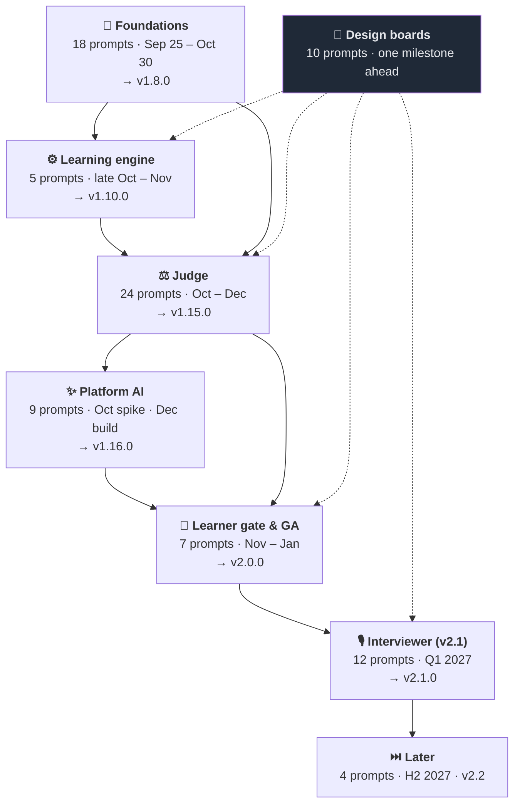
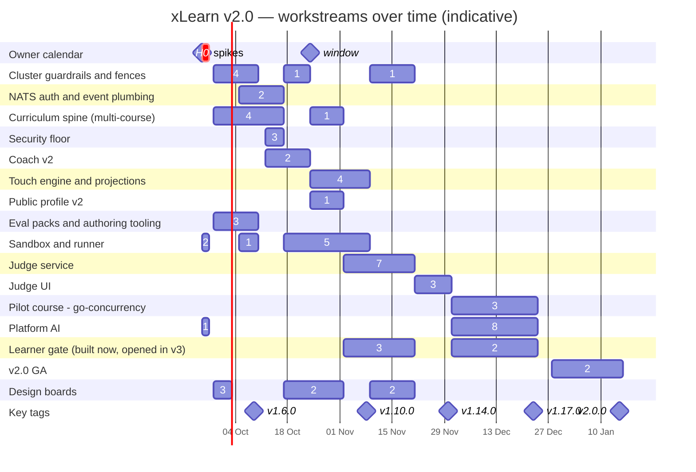
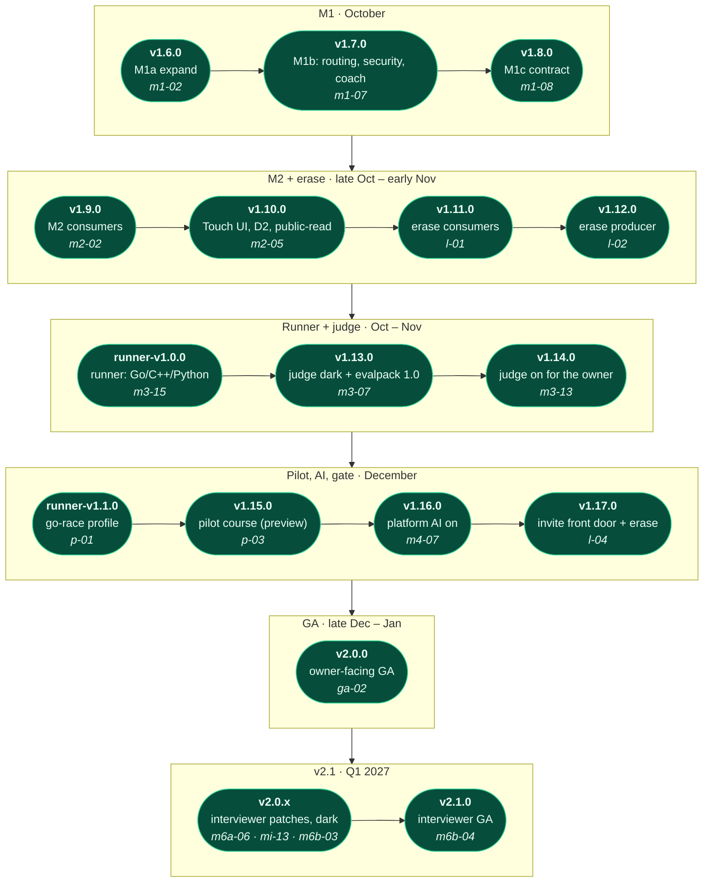
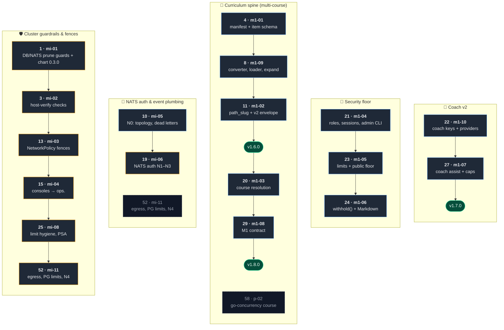
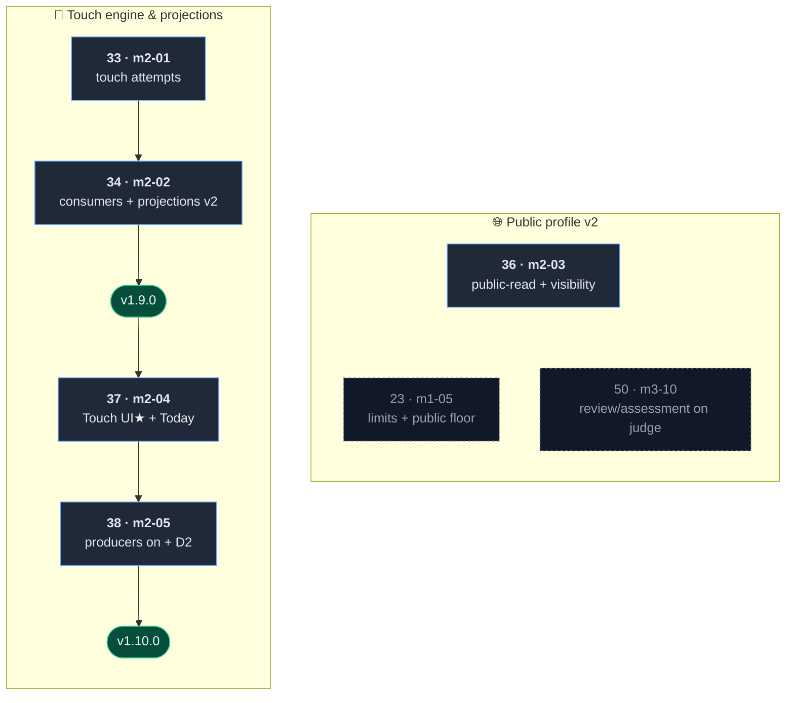
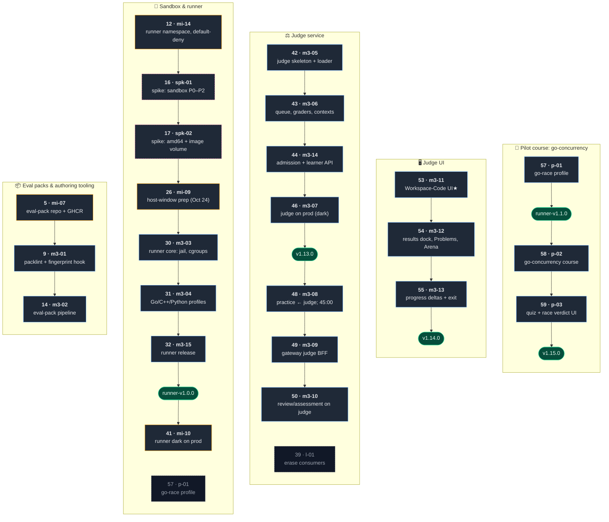
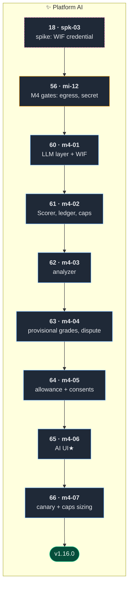
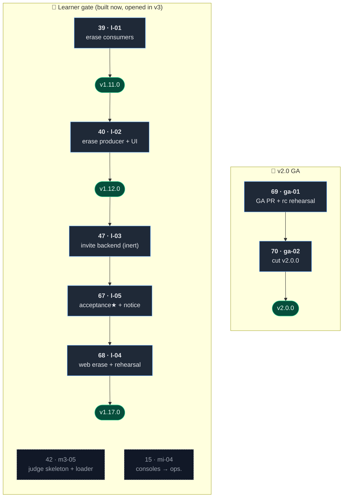
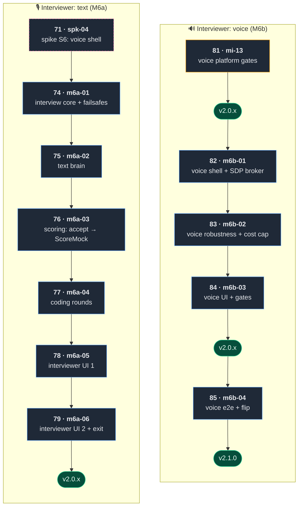
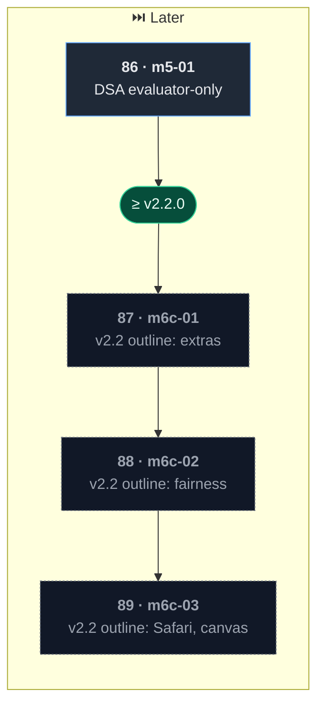

# xLearn v2 — prompt execution order

> **One page to see what runs when, and what each prompt brings.** The 89 sprint prompts are clubbed into
> **19 workstreams** in **7 families**, so work that is split across several prompts reads as one thing.
> Order numbers match [build-plan.md](build-plan.md) (the static plan); live state is in [status.md](status.md);
> each prompt is self-contained in [`prompts/`](prompts/). Dates are **indicative** (BP4 calendar, 2026-09-25).

**How to read it**

- **D41: the four spikes run first** (W0, Sep 25–26), before prompt 1, so every design yes/no is answered before
  the build starts; their order numbers are unchanged.
- **Run prompts in numbered order.** Inside a week, prompts in different **lanes** (infra · product · design ·
  content/spike) can run as parallel sessions (up to about three), as long as their entry gates pass. Check
  peers' open PRs first; parallel prompts in the same service collide on migrations.
- **Every prompt ends shipped** (D40): land-and-sync, owner approval pre-granted. A **tag** prompt deploys; a
  merge-only prompt ships dark in the next tag. Owner-only steps are listed under each prompt's
  `## Before you launch (owner)`.
- **Legend** (diagrams): blue = build · amber = infra · violet = design boards · pink dashed = spike (throwaway)
  · green pill = a release tag · grey dashed = shared with another workstream / v2.2 outline.

## 1. The big picture

Seven families of work, in the order they land. Arrows are the hand-offs that matter; design boards feed every
family that has screens, always one milestone ahead.

Families overlap in time (the judge's runner and eval packs start in October, next to the foundations): see the
timeline in §2. The workstreams inside each family:

| Family | Workstream | Prompts (in order) | What it brings |
|---|---|---|---|
| Foundations | 🛡️ **Cluster guardrails & fences** | [`mi-01`](prompts/prompt-mi-01.md) [`mi-02`](prompts/prompt-mi-02.md) [`mi-03`](prompts/prompt-mi-03.md) [`mi-04`](prompts/prompt-mi-04.md) [`mi-08`](prompts/prompt-mi-08.md) [`mi-11`](prompts/prompt-mi-11.md) | Data-loss guards, chart knobs, NetworkPolicy fences, consoles off xLearn's origin, limit hygiene |
| Foundations | 📨 **NATS auth & event plumbing** | [`mi-05`](prompts/prompt-mi-05.md) [`mi-06`](prompts/prompt-mi-06.md) | Per-service nkeys + ACLs, dead letters, identity on NATS — precondition for erase and the judge · shares `mi-11` |
| Foundations | 🧭 **Curriculum spine (multi-course)** | [`m1-01`](prompts/prompt-m1-01.md) [`m1-09`](prompts/prompt-m1-09.md) [`m1-02`](prompts/prompt-m1-02.md) [`m1-03`](prompts/prompt-m1-03.md) [`m1-08`](prompts/prompt-m1-08.md) | Course manifest, frozen item schema, path_slug everywhere, course routing — no behaviour change · shares `p-02` |
| Foundations | 🔐 **Security floor** | [`m1-04`](prompts/prompt-m1-04.md) [`m1-05`](prompts/prompt-m1-05.md) [`m1-06`](prompts/prompt-m1-06.md) | Roles in the DB, admin CLI, revocable sessions, typed limits, withhold(), safe Markdown |
| Foundations | 💬 **Coach v2** | [`m1-10`](prompts/prompt-m1-10.md) [`m1-07`](prompts/prompt-m1-07.md) | Per-feature keys, provider hygiene, assist capture, BYO caps |
| Learning engine | 🔁 **Touch engine & projections** | [`m2-01`](prompts/prompt-m2-01.md) [`m2-02`](prompts/prompt-m2-02.md) [`m2-04`](prompts/prompt-m2-04.md) [`m2-05`](prompts/prompt-m2-05.md) | Revision touches become real timed attempts, projections v2, the D2 ladder rule, Today in minutes |
| Learning engine | 🌐 **Public profile v2** | [`m2-03`](prompts/prompt-m2-03.md) | public-read authority, visibility toggles, count-only mocks, judge-checked % · shares `m1-05`, `m3-10` |
| Judge | 📦 **Eval packs & authoring tooling** | [`mi-07`](prompts/prompt-mi-07.md) [`m3-01`](prompts/prompt-m3-01.md) [`m3-02`](prompts/prompt-m3-02.md) | Private eval-pack repo, packlint + pre-push fingerprint hook, the pack pipeline |
| Judge | 🧪 **Sandbox & runner** | [`mi-14`](prompts/prompt-mi-14.md) [`spk-01`](prompts/prompt-spk-01.md) [`spk-02`](prompts/prompt-spk-02.md) [`mi-09`](prompts/prompt-mi-09.md) [`m3-03`](prompts/prompt-m3-03.md) [`m3-04`](prompts/prompt-m3-04.md) [`m3-15`](prompts/prompt-m3-15.md) [`mi-10`](prompts/prompt-mi-10.md) | Spike-proven jail, host sandbox block, Go/C++/Python runner, runner-v1.0.0 dark on prod · shares `p-01` |
| Judge | ⚖️ **Judge service** | [`m3-05`](prompts/prompt-m3-05.md) [`m3-06`](prompts/prompt-m3-06.md) [`m3-14`](prompts/prompt-m3-14.md) [`m3-07`](prompts/prompt-m3-07.md) [`m3-08`](prompts/prompt-m3-08.md) [`m3-09`](prompts/prompt-m3-09.md) [`m3-10`](prompts/prompt-m3-10.md) | The 8th service: queue, graders, admission, learner API; practice/review/assessment consume its evidence · shares `l-01` |
| Judge | 🖥️ **Judge UI** | [`m3-11`](prompts/prompt-m3-11.md) [`m3-12`](prompts/prompt-m3-12.md) [`m3-13`](prompts/prompt-m3-13.md) | Workspace-Code ★, results dock, Problems/Arena, degradation badges — judge on for the owner |
| Judge | 🧵 **Pilot course: go-concurrency** | [`p-01`](prompts/prompt-p-01.md) [`p-02`](prompts/prompt-p-02.md) [`p-03`](prompts/prompt-p-03.md) | go-race profile, the 2nd course as manifest + content, quiz + race verdict |
| Platform AI | ✨ **Platform AI** | [`spk-03`](prompts/prompt-spk-03.md) [`mi-12`](prompts/prompt-mi-12.md) [`m4-01`](prompts/prompt-m4-01.md) [`m4-02`](prompts/prompt-m4-02.md) [`m4-03`](prompts/prompt-m4-03.md) [`m4-04`](prompts/prompt-m4-04.md) [`m4-05`](prompts/prompt-m4-05.md) [`m4-06`](prompts/prompt-m4-06.md) [`m4-07`](prompts/prompt-m4-07.md) | WIF credential, shared LLM layer, Scorer + ledger, analyzer, provisional grades, consents |
| Learner gate & GA | 🚪 **Learner gate (built now, opened in v3)** | [`l-01`](prompts/prompt-l-01.md) [`l-02`](prompts/prompt-l-02.md) [`l-03`](prompts/prompt-l-03.md) [`l-05`](prompts/prompt-l-05.md) [`l-04`](prompts/prompt-l-04.md) | Erase end to end, invite-only admission, acceptance step + notice, production rehearsal · shares `m3-05`, `mi-04` |
| Learner gate & GA | 🏁 **v2.0 GA** | [`ga-01`](prompts/prompt-ga-01.md) [`ga-02`](prompts/prompt-ga-02.md) | The owner-facing default flip: judge + platform AI on, pilot active → v2.0.0 |
| Interviewer (v2.1) | 🎙️ **Interviewer: text (M6a)** | [`spk-04`](prompts/prompt-spk-04.md) [`m6a-01`](prompts/prompt-m6a-01.md) [`m6a-02`](prompts/prompt-m6a-02.md) [`m6a-03`](prompts/prompt-m6a-03.md) [`m6a-04`](prompts/prompt-m6a-04.md) [`m6a-05`](prompts/prompt-m6a-05.md) [`m6a-06`](prompts/prompt-m6a-06.md) | Interview core with failsafes, text brain, one honest mock score, coding rounds, UI |
| Interviewer (v2.1) | 🔊 **Interviewer: voice (M6b)** | [`mi-13`](prompts/prompt-mi-13.md) [`m6b-01`](prompts/prompt-m6b-01.md) [`m6b-02`](prompts/prompt-m6b-02.md) [`m6b-03`](prompts/prompt-m6b-03.md) [`m6b-04`](prompts/prompt-m6b-04.md) | Voice shell with no media on the node, robustness + cost cap, voice UI → v2.1.0 |
| Cross-cutting | 🎨 **Design boards** | [`ds-m1-01`](prompts/prompt-ds-m1-01.md) [`ds-m2-01`](prompts/prompt-ds-m2-01.md) [`ds-l-01`](prompts/prompt-ds-l-01.md) [`ds-m3-01`](prompts/prompt-ds-m3-01.md) [`ds-m3-02`](prompts/prompt-ds-m3-02.md) [`ds-p-01`](prompts/prompt-ds-p-01.md) [`ds-m4-01`](prompts/prompt-ds-m4-01.md) [`ds-m6a-01`](prompts/prompt-ds-m6a-01.md) [`ds-m6a-02`](prompts/prompt-ds-m6a-02.md) [`ds-m6b-01`](prompts/prompt-ds-m6b-01.md) | Agent-drafted artboards, one milestone ahead; the merge is the freeze (D40) |
| Later | ⏭️ **Later** | [`m5-01`](prompts/prompt-m5-01.md) [`m6c-01`](sprints/sprint-m6c-01.md) [`m6c-02`](sprints/sprint-m6c-02.md) [`m6c-03`](sprints/sprint-m6c-03.md) | DSA evaluator-only (M5) once every item is packed; v2.2 interviewer extras |

## 2. When: the v2.0 timeline

One row per workstream, **Sep 25 → mid-Jan (v2.0)**. A bar is a run of consecutive weeks with that workstream's
prompts in flight; the number on it is how many prompts. Diamonds are owner calendar dates and key tags. v2.1
(Q1 2027) is the interviewer: text, then voice, after GA.

## 3. The release train

Only a tag deploys (1.x minors until GA; ADR-0034). Every prompt between two tags merges dark and ships with the
next one; infra-only prompts deploy through their own GitOps PRs. Each pill shows the tag, what it carries and
the prompt that cuts it.

## 4. What each workstream brings, prompt by prompt

One diagram per family: each column is a workstream, its prompts top to bottom in run order (`#` = order
number). A green pill is the tag the prompt above it cuts. A grey dashed box at the bottom of a column belongs
to another workstream but carries part of this one's work.

### Foundations · Sep 25 – Oct 30

**🛡️ Cluster guardrails & fences** — Data-loss guards, chart knobs, NetworkPolicy fences, consoles off xLearn's origin, limit hygiene

| # | Prompt | Brings | Ships |
|---|---|---|---|
| 1 | [`mi-01`](prompts/prompt-mi-01.md) | Data-loss guards on DB + NATS, chart 0.3.0 knobs (no pod rolls) | infra PRs |
| 3 | [`mi-02`](prompts/prompt-mi-02.md) | host-verify --cluster: on-demand cluster checks (the only ops tool) | infra PRs |
| 13 | [`mi-03`](prompts/prompt-mi-03.md) | NetworkPolicy fences: databases, messaging, xlearn ingress | infra PRs |
| 15 | [`mi-04`](prompts/prompt-mi-04.md) | Admin consoles move to ops.sujaykumar.dev | infra PRs |
| 25 | [`mi-08`](prompts/prompt-mi-08.md) | Limit hygiene (≈ −3 GiB), PSA labels, SA tokens off | infra PRs |
| 52 | [`mi-11`](prompts/prompt-mi-11.md) | Track B finish: egress, PG connection limits, Renovate, N4 | infra PRs |

**📨 NATS auth & event plumbing** — Per-service nkeys + ACLs, dead letters, identity on NATS — precondition for erase and the judge

| # | Prompt | Brings | Ships |
|---|---|---|---|
| 10 | [`mi-05`](prompts/prompt-mi-05.md) | N0 (dark): NATS topology, dead letters, identity on NATS | merge (dark until next tag) |
| 19 | [`mi-06`](prompts/prompt-mi-06.md) | NATS auth live: nkey users + ACLs, legacy closed (N1–N3) | infra PRs |
| — | also [`mi-11`](prompts/prompt-mi-11.md) | this prompt carries part of this workstream | — |

**🧭 Curriculum spine (multi-course)** — Course manifest, frozen item schema, path_slug everywhere, course routing — no behaviour change

| # | Prompt | Brings | Ships |
|---|---|---|---|
| 4 | [`m1-01`](prompts/prompt-m1-01.md) | Prod-parity compose, course manifest + golden, frozen item schema | merge (dark until next tag) |
| 8 | [`m1-09`](prompts/prompt-m1-09.md) | Curriculum converter, loader + guards, expand migration, content CI | merge (dark until next tag) |
| 11 | [`m1-02`](prompts/prompt-m1-02.md) | path_slug everywhere + v2 envelope consumers | **tag v1.6.0** |
| 20 | [`m1-03`](prompts/prompt-m1-03.md) | Course resolution end to end; DSA stays pixel-identical | merge (dark until next tag) |
| 29 | [`m1-08`](prompts/prompt-m1-08.md) | M1 contract: drop the v1 columns (snapshot first) | **tag v1.8.0** |
| — | also [`p-02`](prompts/prompt-p-02.md) | this prompt carries part of this workstream | — |

**🔐 Security floor** — Roles in the DB, admin CLI, revocable sessions, typed limits, withhold(), safe Markdown

| # | Prompt | Brings | Ships |
|---|---|---|---|
| 21 | [`m1-04`](prompts/prompt-m1-04.md) | Roles in DB, revocable sessions, admin CLI, CSP, DEV_AUTH guard | merge (dark until next tag) |
| 23 | [`m1-05`](prompts/prompt-m1-05.md) | Typed 429/413 limits + public-profile floor (count-only mocks) | merge (dark until next tag) |
| 24 | [`m1-06`](prompts/prompt-m1-06.md) | withhold() on every route, safe Markdown, revision v2 | merge (dark until next tag) |

**💬 Coach v2** — Per-feature keys, provider hygiene, assist capture, BYO caps

| # | Prompt | Brings | Ships |
|---|---|---|---|
| 22 | [`m1-10`](prompts/prompt-m1-10.md) | Coach keys: per-feature defaults, catalog, AEAD keyring, typed errors | merge (dark until next tag) |
| 27 | [`m1-07`](prompts/prompt-m1-07.md) | Coach assist capture, mode gate, BYO caps | **tag v1.7.0** |

### Learning engine · late Oct – Nov

**🔁 Touch engine & projections** — Revision touches become real timed attempts, projections v2, the D2 ladder rule, Today in minutes

| # | Prompt | Brings | Ships |
|---|---|---|---|
| 33 | [`m2-01`](prompts/prompt-m2-01.md) | Touches become real attempts + review consumer | merge (dark until next tag) |
| 34 | [`m2-02`](prompts/prompt-m2-02.md) | M2 consumers + projections v2 (producers idle) | **tag v1.9.0** |
| 37 | [`m2-04`](prompts/prompt-m2-04.md) | Touch UI ★ + cross-course Today/agenda in minutes | merge (dark until next tag) |
| 38 | [`m2-05`](prompts/prompt-m2-05.md) | Producers on, backfill, replay, D2 ladder rule | **tag v1.10.0** |

**🌐 Public profile v2** — public-read authority, visibility toggles, count-only mocks, judge-checked %

| # | Prompt | Brings | Ships |
|---|---|---|---|
| 36 | [`m2-03`](prompts/prompt-m2-03.md) | public-read, /public/stats, visibility toggles, profile v2 | merge (dark until next tag) |
| — | also [`m1-05`](prompts/prompt-m1-05.md), [`m3-10`](prompts/prompt-m3-10.md) | these prompts carry part of this workstream | — |

### Judge · Oct – Dec

**📦 Eval packs & authoring tooling** — Private eval-pack repo, packlint + pre-push fingerprint hook, the pack pipeline

| # | Prompt | Brings | Ships |
|---|---|---|---|
| 5 | [`mi-07`](prompts/prompt-mi-07.md) | Private eval-pack repo, machine user, GHCR, pull secret | infra PRs |
| 9 | [`m3-01`](prompts/prompt-m3-01.md) | Authoring tooling: packlint, contract_hash, pre-push fingerprint hook | merge (dark until next tag) |
| 14 | [`m3-02`](prompts/prompt-m3-02.md) | Eval-pack pipeline: validation gates, data image, fixture pack | merge (dark until next tag) |

**🧪 Sandbox & runner** — Spike-proven jail, host sandbox block, Go/C++/Python runner, runner-v1.0.0 dark on prod

| # | Prompt | Brings | Ships |
|---|---|---|---|
| 12 | [`mi-14`](prompts/prompt-mi-14.md) | Empty default-deny xlearn-runner namespace + admission policy | infra PRs |
| 16 | [`spk-01`](prompts/prompt-spk-01.md) | Spike: sandbox mechanism P0–P2 (throwaway) | results docs only |
| 17 | [`spk-02`](prompts/prompt-spk-02.md) | Spike: amd64 replay + eval-pack image volume (throwaway) | results docs only |
| 26 | [`mi-09`](prompts/prompt-mi-09.md) | Host-window prep: sandbox host block, kubelet reservation (Sat Oct 24) | infra PRs |
| 30 | [`m3-03`](prompts/prompt-m3-03.md) | Runner core: supervisor, jail, per-case cgroups, job API | merge (dark until next tag) |
| 31 | [`m3-04`](prompts/prompt-m3-04.md) | Runner profiles Go/C++/Python + harness codecs | merge (dark until next tag) |
| 32 | [`m3-15`](prompts/prompt-m3-15.md) | Reproducible runner image + acceptance suite | **tag runner-v1.0.0** |
| 41 | [`mi-10`](prompts/prompt-mi-10.md) | runner-v1.0.0 dark on production + acceptance suite | infra PRs |
| — | also [`p-01`](prompts/prompt-p-01.md) | this prompt carries part of this workstream | — |

**⚖️ Judge service** — The 8th service: queue, graders, admission, learner API; practice/review/assessment consume its evidence

| # | Prompt | Brings | Ships |
|---|---|---|---|
| 42 | [`m3-05`](prompts/prompt-m3-05.md) | judge service: skeleton, schema, pack loader, erase consumer | merge (dark until next tag) |
| 43 | [`m3-06`](prompts/prompt-m3-06.md) | judge core: queue, runner lane, graders, contexts | merge (dark until next tag) |
| 44 | [`m3-14`](prompts/prompt-m3-14.md) | judge admission control, learner API, drafts, arena history | merge (dark until next tag) |
| 46 | [`m3-07`](prompts/prompt-m3-07.md) | judge on prod (dark): evalpack v1.0.0, ACL, HelmRelease | **tag v1.13.0** |
| 48 | [`m3-08`](prompts/prompt-m3-08.md) | practice consumes judge evidence; the 45:00 method | merge (dark until next tag) |
| 49 | [`m3-09`](prompts/prompt-m3-09.md) | Gateway judge BFF, DTO deny-list, typed limits | merge (dark until next tag) |
| 50 | [`m3-10`](prompts/prompt-m3-10.md) | review + assessment on judge signals (pre-fill, judge-checked %) | merge (dark until next tag) |
| — | also [`l-01`](prompts/prompt-l-01.md) | this prompt carries part of this workstream | — |

**🖥️ Judge UI** — Workspace-Code ★, results dock, Problems/Arena, degradation badges — judge on for the owner

| # | Prompt | Brings | Ships |
|---|---|---|---|
| 53 | [`m3-11`](prompts/prompt-m3-11.md) | Workspace-Code UI ★ + lazy CodeMirror | merge (dark until next tag) |
| 54 | [`m3-12`](prompts/prompt-m3-12.md) | Results dock, Problems, Arena, degradation badges | merge (dark until next tag) |
| 55 | [`m3-13`](prompts/prompt-m3-13.md) | Progress deltas + M3 exit tests; judge on for the owner | **tag v1.14.0** |

**🧵 Pilot course: go-concurrency** — go-race profile, the 2nd course as manifest + content, quiz + race verdict

| # | Prompt | Brings | Ships |
|---|---|---|---|
| 57 | [`p-01`](prompts/prompt-p-01.md) | go-race runner profile | **tag runner-v1.1.0** |
| 58 | [`p-02`](prompts/prompt-p-02.md) | go-concurrency course as manifest (preview) + multi-course nav | merge (dark until next tag) |
| 59 | [`p-03`](prompts/prompt-p-03.md) | Quiz + race verdict UI | **tag v1.15.0** |

### Platform AI · Oct spike · Dec build

**✨ Platform AI** — WIF credential, shared LLM layer, Scorer + ledger, analyzer, provisional grades, consents

| # | Prompt | Brings | Ships |
|---|---|---|---|
| 18 | [`spk-03`](prompts/prompt-spk-03.md) | Spike: WIF credential for platform AI (throwaway) | results docs only |
| 56 | [`mi-12`](prompts/prompt-mi-12.md) | M4 gates: judge 443 egress, LLM secret, provider runbook | infra PRs |
| 60 | [`m4-01`](prompts/prompt-m4-01.md) | Shared LLM layer + WIF auth + retention policy | merge (dark until next tag) |
| 61 | [`m4-02`](prompts/prompt-m4-02.md) | judge AI engine: Scorer, ledger, llm lane, caps | merge (dark until next tag) |
| 62 | [`m4-03`](prompts/prompt-m4-03.md) | Analyzer on concluded attempts + acceptance-set harness | merge (dark until next tag) |
| 63 | [`m4-04`](prompts/prompt-m4-04.md) | Provisional grades, dispute, re-grade, honor claims | merge (dark until next tag) |
| 64 | [`m4-05`](prompts/prompt-m4-05.md) | AI allowance + consents | merge (dark until next tag) |
| 65 | [`m4-06`](prompts/prompt-m4-06.md) | AI UI ★: suggestion/dispute, pointer notes, allowance | merge (dark until next tag) |
| 66 | [`m4-07`](prompts/prompt-m4-07.md) | Canary + caps sizing; platform AI on for the owner | **tag v1.16.0** |

### Learner gate & GA · Nov – Jan

**🚪 Learner gate (built now, opened in v3)** — Erase end to end, invite-only admission, acceptance step + notice, production rehearsal

| # | Prompt | Brings | Ships |
|---|---|---|---|
| 39 | [`l-01`](prompts/prompt-l-01.md) | Erase consumers in every service | **tag v1.11.0** |
| 40 | [`l-02`](prompts/prompt-l-02.md) | Erase producer + DELETE /api/me (testers only) | **tag v1.12.0** |
| 47 | [`l-03`](prompts/prompt-l-03.md) | Invite admission backend (inert while signup is closed) | merge (dark until next tag) |
| 67 | [`l-05`](prompts/prompt-l-05.md) | Invite front door: acceptance step ★, privacy notice, AI consents | merge (dark until next tag) |
| 68 | [`l-04`](prompts/prompt-l-04.md) | Web erase for non-owners + invite rehearsal on prod | **tag v1.17.0** |
| — | also [`m3-05`](prompts/prompt-m3-05.md), [`mi-04`](prompts/prompt-mi-04.md) | these prompts carry part of this workstream | — |

**🏁 v2.0 GA** — The owner-facing default flip: judge + platform AI on, pilot active → v2.0.0

| # | Prompt | Brings | Ships |
|---|---|---|---|
| 69 | [`ga-01`](prompts/prompt-ga-01.md) | GA PR: .release-line = 2, default flips, rc rehearsal | merge (dark until next tag) |
| 70 | [`ga-02`](prompts/prompt-ga-02.md) | Widen ranges, snapshot, tag, verify | **tag v2.0.0** |

### Interviewer (v2.1) · Q1 2027

**🎙️ Interviewer: text (M6a)** — Interview core with failsafes, text brain, one honest mock score, coding rounds, UI

| # | Prompt | Brings | Ships |
|---|---|---|---|
| 71 | [`spk-04`](prompts/prompt-spk-04.md) | Spike S6: voice-shell bake-off (owner present) | results docs only |
| 74 | [`m6a-01`](prompts/prompt-m6a-01.md) | Interview core: state machine, failsafes, caps | merge (dark until next tag) |
| 75 | [`m6a-02`](prompts/prompt-m6a-02.md) | Text brain on the learner's key + replay tests | merge (dark until next tag) |
| 76 | [`m6a-03`](prompts/prompt-m6a-03.md) | Mock scoring: proposal → accept → ScoreMock once | merge (dark until next tag) |
| 77 | [`m6a-04`](prompts/prompt-m6a-04.md) | Coding rounds via judge mock + editor interview mode | merge (dark until next tag) |
| 78 | [`m6a-05`](prompts/prompt-m6a-05.md) | Interviewer UI part 1: setup, consent, text HUD | merge (dark until next tag) |
| 79 | [`m6a-06`](prompts/prompt-m6a-06.md) | Interviewer UI part 2 + M6a exit (dark) | **tag v2.0.x** |

**🔊 Interviewer: voice (M6b)** — Voice shell with no media on the node, robustness + cost cap, voice UI → v2.1.0

| # | Prompt | Brings | Ships |
|---|---|---|---|
| 81 | [`mi-13`](prompts/prompt-mi-13.md) | Voice platform gates: Permissions-Policy, SDP route, egress | **tag v2.0.x** |
| 82 | [`m6b-01`](prompts/prompt-m6b-01.md) | Voice shell + SDP broker + sideband (no media on the node) | merge (dark until next tag) |
| 83 | [`m6b-02`](prompts/prompt-m6b-02.md) | Voice robustness: lease, drain, cost cap, push-to-talk | merge (dark until next tag) |
| 84 | [`m6b-03`](prompts/prompt-m6b-03.md) | Voice UI + browser/EU gates (dark) | **tag v2.0.x** |
| 85 | [`m6b-04`](prompts/prompt-m6b-04.md) | Fake-media e2e + interviewer flip | **tag v2.1.0** |

### Cross-cutting · all along

Boards are drafted one milestone ahead and frozen by their own merge (D40). They are the only prompts that
produce no product code; each row names the prompts that build those screens.

| # | Design prompt | Boards | Week | Built by |
|---|---|---|---|---|
| 2 | [`ds-m1-01`](prompts/prompt-ds-m1-01.md) | Boards AB01–AB03: coach states, course nav, revision v2 | W1 | [`m1-03`](prompts/prompt-m1-03.md), [`m1-06`](prompts/prompt-m1-06.md), [`m1-10`](prompts/prompt-m1-10.md), [`m1-07`](prompts/prompt-m1-07.md) |
| 6 | [`ds-m2-01`](prompts/prompt-ds-m2-01.md) | Boards AB04★ Touch, AB05 catalog/agenda, AB06 profile, AB22 | W1 | [`m2-01`](prompts/prompt-m2-01.md), [`m2-03`](prompts/prompt-m2-03.md), [`m2-04`](prompts/prompt-m2-04.md) |
| 7 | [`ds-l-01`](prompts/prompt-ds-l-01.md) | Boards AB19★ invite acceptance, AB20 notice, AB21 erase | W1 | [`l-02`](prompts/prompt-l-02.md), [`l-05`](prompts/prompt-l-05.md) |
| 28 | [`ds-m3-01`](prompts/prompt-ds-m3-01.md) | Boards AB07★ workspace, AB08 results dock, AB11 badges | W4 | [`m3-11`](prompts/prompt-m3-11.md), [`m3-12`](prompts/prompt-m3-12.md), [`m5-01`](prompts/prompt-m5-01.md) |
| 35 | [`ds-m3-02`](prompts/prompt-ds-m3-02.md) | Boards AB09 Problems, AB10 Arena, AB12 progress deltas | W5 | [`m3-12`](prompts/prompt-m3-12.md), [`m3-13`](prompts/prompt-m3-13.md) |
| 45 | [`ds-p-01`](prompts/prompt-ds-p-01.md) | Boards AB14 quiz, AB15 race view; AB02/AB05 full fidelity | W7 | [`p-02`](prompts/prompt-p-02.md), [`p-03`](prompts/prompt-p-03.md) |
| 51 | [`ds-m4-01`](prompts/prompt-ds-m4-01.md) | Boards AB16★ AI suggestion/dispute, AB17, AB18 | W7 | [`m4-06`](prompts/prompt-m4-06.md) |
| 72 | [`ds-m6a-01`](prompts/prompt-ds-m6a-01.md) | Accept ADR-0032 + boards AB13, AB24, AB25 | W11 | [`m6a-05`](prompts/prompt-m6a-05.md) |
| 73 | [`ds-m6a-02`](prompts/prompt-ds-m6a-02.md) | Boards AB26 grace/pause, AB27 debrief, AB28 a11y | W11 | [`m6a-06`](prompts/prompt-m6a-06.md) |
| 80 | [`ds-m6b-01`](prompts/prompt-ds-m6b-01.md) | Boards AB29 voice pre-flight, AB30★ voice HUD | W11 | [`m6b-03`](prompts/prompt-m6b-03.md) |

### Later · H2 2027 · v2.2

**⏭️ Later** — DSA evaluator-only (M5) once every item is packed; v2.2 interviewer extras

| # | Prompt | Brings | Ships |
|---|---|---|---|
| 86 | [`m5-01`](prompts/prompt-m5-01.md) | DSA evaluator-only flip (once every item is packed) | **tag ≥ v2.2.0** |
| 87 | [`m6c-01`](sprints/sprint-m6c-01.md) | v2.2 outline: show-your-work photo, read-aloud, local download | outline only |
| 88 | [`m6c-02`](sprints/sprint-m6c-02.md) | v2.2 outline: fairness check → AI voice Communication | outline only |
| 89 | [`m6c-03`](sprints/sprint-m6c-03.md) | v2.2 outline: Safari, voice-lite, canvas board (SD course) | outline only |

## 5. The run list, week by week

The numbered order to launch prompts. Lanes in the same week can run side by side; the 🚩 column is the tag a
prompt cuts.

### W0 · Spike weekend (D41: spikes first) (Sep 25 – 26)

Lanes — **spike**: `spk-01`, `spk-02`, `spk-03`, `spk-04`

| # | Prompt | Workstream | Brings | 🚩 |
|---|---|---|---|---|
| 16 | [`spk-01`](prompts/prompt-spk-01.md) | 🧪 Sandbox & runner | Spike: sandbox mechanism P0–P2 (throwaway) |  |
| 17 | [`spk-02`](prompts/prompt-spk-02.md) | 🧪 Sandbox & runner | Spike: amd64 replay + eval-pack image volume (throwaway) |  |
| 18 | [`spk-03`](prompts/prompt-spk-03.md) | ✨ Platform AI | Spike: WIF credential for platform AI (throwaway) |  |
| 71 | [`spk-04`](prompts/prompt-spk-04.md) | 🎙️ Interviewer: text (M6a) | Spike S6: voice-shell bake-off (owner present) |  |

### W1 · Week 1 (Sep 28 – Oct 2)

Lanes — **infra**: `mi-01`, `mi-02`, `mi-07` · **design**: `ds-m1-01`, `ds-m2-01`, `ds-l-01` · **product**: `m1-01`

| # | Prompt | Workstream | Brings | 🚩 |
|---|---|---|---|---|
| 1 | [`mi-01`](prompts/prompt-mi-01.md) | 🛡️ Cluster guardrails & fences | Data-loss guards on DB + NATS, chart 0.3.0 knobs (no pod rolls) |  |
| 2 | [`ds-m1-01`](prompts/prompt-ds-m1-01.md) | 🎨 Design boards | Boards AB01–AB03: coach states, course nav, revision v2 |  |
| 3 | [`mi-02`](prompts/prompt-mi-02.md) | 🛡️ Cluster guardrails & fences | host-verify --cluster: on-demand cluster checks (the only ops tool) |  |
| 4 | [`m1-01`](prompts/prompt-m1-01.md) | 🧭 Curriculum spine (multi-course) | Prod-parity compose, course manifest + golden, frozen item schema |  |
| 5 | [`mi-07`](prompts/prompt-mi-07.md) | 📦 Eval packs & authoring tooling | Private eval-pack repo, machine user, GHCR, pull secret |  |
| 6 | [`ds-m2-01`](prompts/prompt-ds-m2-01.md) | 🎨 Design boards | Boards AB04★ Touch, AB05 catalog/agenda, AB06 profile, AB22 |  |
| 7 | [`ds-l-01`](prompts/prompt-ds-l-01.md) | 🎨 Design boards | Boards AB19★ invite acceptance, AB20 notice, AB21 erase |  |

### W2 · Week 2 (Oct 5 – 9)

Lanes — **product**: `m1-09`, `mi-05`, `m1-02` · **content**: `m3-01`, `m3-02` · **infra**: `mi-14`, `mi-03`, `mi-04`

| # | Prompt | Workstream | Brings | 🚩 |
|---|---|---|---|---|
| 8 | [`m1-09`](prompts/prompt-m1-09.md) | 🧭 Curriculum spine (multi-course) | Curriculum converter, loader + guards, expand migration, content CI |  |
| 9 | [`m3-01`](prompts/prompt-m3-01.md) | 📦 Eval packs & authoring tooling | Authoring tooling: packlint, contract_hash, pre-push fingerprint hook |  |
| 10 | [`mi-05`](prompts/prompt-mi-05.md) | 📨 NATS auth & event plumbing | N0 (dark): NATS topology, dead letters, identity on NATS |  |
| 11 | [`m1-02`](prompts/prompt-m1-02.md) | 🧭 Curriculum spine (multi-course) | path_slug everywhere + v2 envelope consumers | v1.6.0 |
| 12 | [`mi-14`](prompts/prompt-mi-14.md) | 🧪 Sandbox & runner | Empty default-deny xlearn-runner namespace + admission policy |  |
| 13 | [`mi-03`](prompts/prompt-mi-03.md) | 🛡️ Cluster guardrails & fences | NetworkPolicy fences: databases, messaging, xlearn ingress |  |
| 14 | [`m3-02`](prompts/prompt-m3-02.md) | 📦 Eval packs & authoring tooling | Eval-pack pipeline: validation gates, data image, fixture pack |  |
| 15 | [`mi-04`](prompts/prompt-mi-04.md) | 🛡️ Cluster guardrails & fences | Admin consoles move to ops.sujaykumar.dev |  |

### W3 · Week 3 · spike week (Oct 12 – 16)

Lanes — **infra**: `mi-06` · **product**: `m1-03`, `m1-04`, `m1-10`, `m1-05`, `m1-06`

| # | Prompt | Workstream | Brings | 🚩 |
|---|---|---|---|---|
| 19 | [`mi-06`](prompts/prompt-mi-06.md) | 📨 NATS auth & event plumbing | NATS auth live: nkey users + ACLs, legacy closed (N1–N3) |  |
| 20 | [`m1-03`](prompts/prompt-m1-03.md) | 🧭 Curriculum spine (multi-course) | Course resolution end to end; DSA stays pixel-identical |  |
| 21 | [`m1-04`](prompts/prompt-m1-04.md) | 🔐 Security floor | Roles in DB, revocable sessions, admin CLI, CSP, DEV_AUTH guard |  |
| 22 | [`m1-10`](prompts/prompt-m1-10.md) | 💬 Coach v2 | Coach keys: per-feature defaults, catalog, AEAD keyring, typed errors |  |
| 23 | [`m1-05`](prompts/prompt-m1-05.md) | 🔐 Security floor | Typed 429/413 limits + public-profile floor (count-only mocks) |  |
| 24 | [`m1-06`](prompts/prompt-m1-06.md) | 🔐 Security floor | withhold() on every route, safe Markdown, revision v2 |  |

### W4 · Week 4 (Oct 17 – 23)

Lanes — **infra**: `mi-08`, `mi-09` · **product**: `m1-07` · **design**: `ds-m3-01`

| # | Prompt | Workstream | Brings | 🚩 |
|---|---|---|---|---|
| 25 | [`mi-08`](prompts/prompt-mi-08.md) | 🛡️ Cluster guardrails & fences | Limit hygiene (≈ −3 GiB), PSA labels, SA tokens off |  |
| 26 | [`mi-09`](prompts/prompt-mi-09.md) | 🧪 Sandbox & runner | Host-window prep: sandbox host block, kubelet reservation (Sat Oct 24) |  |
| 27 | [`m1-07`](prompts/prompt-m1-07.md) | 💬 Coach v2 | Coach assist capture, mode gate, BYO caps | v1.7.0 |
| 28 | [`ds-m3-01`](prompts/prompt-ds-m3-01.md) | 🎨 Design boards | Boards AB07★ workspace, AB08 results dock, AB11 badges |  |

### W5 · Late Oct · host window Sat Oct 24 (Oct 24 – Nov 1)

Lanes — **product**: `m1-08`, `m3-03`, `m3-04`, `m3-15`, `m2-01`, `m2-02`, `m2-03`, `m2-04` · **design**: `ds-m3-02`

| # | Prompt | Workstream | Brings | 🚩 |
|---|---|---|---|---|
| 29 | [`m1-08`](prompts/prompt-m1-08.md) | 🧭 Curriculum spine (multi-course) | M1 contract: drop the v1 columns (snapshot first) | v1.8.0 |
| 30 | [`m3-03`](prompts/prompt-m3-03.md) | 🧪 Sandbox & runner | Runner core: supervisor, jail, per-case cgroups, job API |  |
| 31 | [`m3-04`](prompts/prompt-m3-04.md) | 🧪 Sandbox & runner | Runner profiles Go/C++/Python + harness codecs |  |
| 32 | [`m3-15`](prompts/prompt-m3-15.md) | 🧪 Sandbox & runner | Reproducible runner image + acceptance suite | runner-v1.0.0 |
| 33 | [`m2-01`](prompts/prompt-m2-01.md) | 🔁 Touch engine & projections | Touches become real attempts + review consumer |  |
| 34 | [`m2-02`](prompts/prompt-m2-02.md) | 🔁 Touch engine & projections | M2 consumers + projections v2 (producers idle) | v1.9.0 |
| 35 | [`ds-m3-02`](prompts/prompt-ds-m3-02.md) | 🎨 Design boards | Boards AB09 Problems, AB10 Arena, AB12 progress deltas |  |
| 36 | [`m2-03`](prompts/prompt-m2-03.md) | 🌐 Public profile v2 | public-read, /public/stats, visibility toggles, profile v2 |  |
| 37 | [`m2-04`](prompts/prompt-m2-04.md) | 🔁 Touch engine & projections | Touch UI ★ + cross-course Today/agenda in minutes |  |

### W6 · Early Nov (Nov 2 – 8)

Lanes — **product**: `m2-05`, `l-01`, `l-02`, `m3-05`, `m3-06` · **infra**: `mi-10`

| # | Prompt | Workstream | Brings | 🚩 |
|---|---|---|---|---|
| 38 | [`m2-05`](prompts/prompt-m2-05.md) | 🔁 Touch engine & projections | Producers on, backfill, replay, D2 ladder rule | v1.10.0 |
| 39 | [`l-01`](prompts/prompt-l-01.md) | 🚪 Learner gate (built now, opened in v3) | Erase consumers in every service | v1.11.0 |
| 40 | [`l-02`](prompts/prompt-l-02.md) | 🚪 Learner gate (built now, opened in v3) | Erase producer + DELETE /api/me (testers only) | v1.12.0 |
| 41 | [`mi-10`](prompts/prompt-mi-10.md) | 🧪 Sandbox & runner | runner-v1.0.0 dark on production + acceptance suite |  |
| 42 | [`m3-05`](prompts/prompt-m3-05.md) | ⚖️ Judge service | judge service: skeleton, schema, pack loader, erase consumer |  |
| 43 | [`m3-06`](prompts/prompt-m3-06.md) | ⚖️ Judge service | judge core: queue, runner lane, graders, contexts |  |

### W7 · Mid Nov (Nov 9 – 20)

Lanes — **product**: `m3-14`, `m3-07`, `l-03`, `m3-08`, `m3-09`, `m3-10` · **design**: `ds-p-01`, `ds-m4-01` · **infra**: `mi-11`

| # | Prompt | Workstream | Brings | 🚩 |
|---|---|---|---|---|
| 44 | [`m3-14`](prompts/prompt-m3-14.md) | ⚖️ Judge service | judge admission control, learner API, drafts, arena history |  |
| 45 | [`ds-p-01`](prompts/prompt-ds-p-01.md) | 🎨 Design boards | Boards AB14 quiz, AB15 race view; AB02/AB05 full fidelity |  |
| 46 | [`m3-07`](prompts/prompt-m3-07.md) | ⚖️ Judge service | judge on prod (dark): evalpack v1.0.0, ACL, HelmRelease | v1.13.0 |
| 47 | [`l-03`](prompts/prompt-l-03.md) | 🚪 Learner gate (built now, opened in v3) | Invite admission backend (inert while signup is closed) |  |
| 48 | [`m3-08`](prompts/prompt-m3-08.md) | ⚖️ Judge service | practice consumes judge evidence; the 45:00 method |  |
| 49 | [`m3-09`](prompts/prompt-m3-09.md) | ⚖️ Judge service | Gateway judge BFF, DTO deny-list, typed limits |  |
| 50 | [`m3-10`](prompts/prompt-m3-10.md) | ⚖️ Judge service | review + assessment on judge signals (pre-fill, judge-checked %) |  |
| 51 | [`ds-m4-01`](prompts/prompt-ds-m4-01.md) | 🎨 Design boards | Boards AB16★ AI suggestion/dispute, AB17, AB18 |  |
| 52 | [`mi-11`](prompts/prompt-mi-11.md) | 🛡️ Cluster guardrails & fences | Track B finish: egress, PG connection limits, Renovate, N4 |  |

### W8 · Late Nov (Nov 21 – 30)

Lanes — **product**: `m3-11`, `m3-12`, `m3-13`

| # | Prompt | Workstream | Brings | 🚩 |
|---|---|---|---|---|
| 53 | [`m3-11`](prompts/prompt-m3-11.md) | 🖥️ Judge UI | Workspace-Code UI ★ + lazy CodeMirror |  |
| 54 | [`m3-12`](prompts/prompt-m3-12.md) | 🖥️ Judge UI | Results dock, Problems, Arena, degradation badges |  |
| 55 | [`m3-13`](prompts/prompt-m3-13.md) | 🖥️ Judge UI | Progress deltas + M3 exit tests; judge on for the owner | v1.14.0 |

### W9 · December (Dec 1 – 23)

Lanes — **infra**: `mi-12` · **product**: `p-01`, `p-02`, `p-03`, `m4-01`, `m4-02`, `m4-03`, `m4-04`, `m4-05`, `m4-06`, `m4-07`, `l-05`, `l-04`

| # | Prompt | Workstream | Brings | 🚩 |
|---|---|---|---|---|
| 56 | [`mi-12`](prompts/prompt-mi-12.md) | ✨ Platform AI | M4 gates: judge 443 egress, LLM secret, provider runbook |  |
| 57 | [`p-01`](prompts/prompt-p-01.md) | 🧵 Pilot course: go-concurrency | go-race runner profile | runner-v1.1.0 |
| 58 | [`p-02`](prompts/prompt-p-02.md) | 🧵 Pilot course: go-concurrency | go-concurrency course as manifest (preview) + multi-course nav |  |
| 59 | [`p-03`](prompts/prompt-p-03.md) | 🧵 Pilot course: go-concurrency | Quiz + race verdict UI | v1.15.0 |
| 60 | [`m4-01`](prompts/prompt-m4-01.md) | ✨ Platform AI | Shared LLM layer + WIF auth + retention policy |  |
| 61 | [`m4-02`](prompts/prompt-m4-02.md) | ✨ Platform AI | judge AI engine: Scorer, ledger, llm lane, caps |  |
| 62 | [`m4-03`](prompts/prompt-m4-03.md) | ✨ Platform AI | Analyzer on concluded attempts + acceptance-set harness |  |
| 63 | [`m4-04`](prompts/prompt-m4-04.md) | ✨ Platform AI | Provisional grades, dispute, re-grade, honor claims |  |
| 64 | [`m4-05`](prompts/prompt-m4-05.md) | ✨ Platform AI | AI allowance + consents |  |
| 65 | [`m4-06`](prompts/prompt-m4-06.md) | ✨ Platform AI | AI UI ★: suggestion/dispute, pointer notes, allowance |  |
| 66 | [`m4-07`](prompts/prompt-m4-07.md) | ✨ Platform AI | Canary + caps sizing; platform AI on for the owner | v1.16.0 |
| 67 | [`l-05`](prompts/prompt-l-05.md) | 🚪 Learner gate (built now, opened in v3) | Invite front door: acceptance step ★, privacy notice, AI consents |  |
| 68 | [`l-04`](prompts/prompt-l-04.md) | 🚪 Learner gate (built now, opened in v3) | Web erase for non-owners + invite rehearsal on prod | v1.17.0 |

### W10 · GA (late Dec – Jan)

Lanes — **product**: `ga-01`, `ga-02`

| # | Prompt | Workstream | Brings | 🚩 |
|---|---|---|---|---|
| 69 | [`ga-01`](prompts/prompt-ga-01.md) | 🏁 v2.0 GA | GA PR: .release-line = 2, default flips, rc rehearsal |  |
| 70 | [`ga-02`](prompts/prompt-ga-02.md) | 🏁 v2.0 GA | Widen ranges, snapshot, tag, verify | v2.0.0 |

### W11 · v2.1 (Q1 2027)

Lanes — **design**: `ds-m6a-01`, `ds-m6a-02`, `ds-m6b-01` · **product**: `m6a-01`, `m6a-02`, `m6a-03`, `m6a-04`, `m6a-05`, `m6a-06`, `m6b-01`, `m6b-02`, `m6b-03`, `m6b-04` · **infra**: `mi-13`

| # | Prompt | Workstream | Brings | 🚩 |
|---|---|---|---|---|
| 72 | [`ds-m6a-01`](prompts/prompt-ds-m6a-01.md) | 🎨 Design boards | Accept ADR-0032 + boards AB13, AB24, AB25 |  |
| 73 | [`ds-m6a-02`](prompts/prompt-ds-m6a-02.md) | 🎨 Design boards | Boards AB26 grace/pause, AB27 debrief, AB28 a11y |  |
| 74 | [`m6a-01`](prompts/prompt-m6a-01.md) | 🎙️ Interviewer: text (M6a) | Interview core: state machine, failsafes, caps |  |
| 75 | [`m6a-02`](prompts/prompt-m6a-02.md) | 🎙️ Interviewer: text (M6a) | Text brain on the learner's key + replay tests |  |
| 76 | [`m6a-03`](prompts/prompt-m6a-03.md) | 🎙️ Interviewer: text (M6a) | Mock scoring: proposal → accept → ScoreMock once |  |
| 77 | [`m6a-04`](prompts/prompt-m6a-04.md) | 🎙️ Interviewer: text (M6a) | Coding rounds via judge mock + editor interview mode |  |
| 78 | [`m6a-05`](prompts/prompt-m6a-05.md) | 🎙️ Interviewer: text (M6a) | Interviewer UI part 1: setup, consent, text HUD |  |
| 79 | [`m6a-06`](prompts/prompt-m6a-06.md) | 🎙️ Interviewer: text (M6a) | Interviewer UI part 2 + M6a exit (dark) | v2.0.x |
| 80 | [`ds-m6b-01`](prompts/prompt-ds-m6b-01.md) | 🎨 Design boards | Boards AB29 voice pre-flight, AB30★ voice HUD |  |
| 81 | [`mi-13`](prompts/prompt-mi-13.md) | 🔊 Interviewer: voice (M6b) | Voice platform gates: Permissions-Policy, SDP route, egress | v2.0.x |
| 82 | [`m6b-01`](prompts/prompt-m6b-01.md) | 🔊 Interviewer: voice (M6b) | Voice shell + SDP broker + sideband (no media on the node) |  |
| 83 | [`m6b-02`](prompts/prompt-m6b-02.md) | 🔊 Interviewer: voice (M6b) | Voice robustness: lease, drain, cost cap, push-to-talk |  |
| 84 | [`m6b-03`](prompts/prompt-m6b-03.md) | 🔊 Interviewer: voice (M6b) | Voice UI + browser/EU gates (dark) | v2.0.x |
| 85 | [`m6b-04`](prompts/prompt-m6b-04.md) | 🔊 Interviewer: voice (M6b) | Fake-media e2e + interviewer flip | v2.1.0 |

### W12 · Later (H2 2027 · v2.2)

Lanes — **product**: `m5-01` · **outline**: `m6c-01`, `m6c-02`, `m6c-03`

| # | Prompt | Workstream | Brings | 🚩 |
|---|---|---|---|---|
| 86 | [`m5-01`](prompts/prompt-m5-01.md) | ⏭️ Later | DSA evaluator-only flip (once every item is packed) | ≥ v2.2.0 |
| 87 | [`m6c-01`](sprints/sprint-m6c-01.md) | ⏭️ Later | v2.2 outline: show-your-work photo, read-aloud, local download |  |
| 88 | [`m6c-02`](sprints/sprint-m6c-02.md) | ⏭️ Later | v2.2 outline: fairness check → AI voice Communication |  |
| 89 | [`m6c-03`](sprints/sprint-m6c-03.md) | ⏭️ Later | v2.2 outline: Safari, voice-lite, canvas board (SD course) |  |

---

_Generated by [`tools/gen_execution_order.py`](tools/gen_execution_order.py) from
[`tools/execution_order_data.py`](tools/execution_order_data.py). If a sprint is added, split or re-ordered,
update [build-plan.md](build-plan.md) first, then the data file, then re-run the generator._
