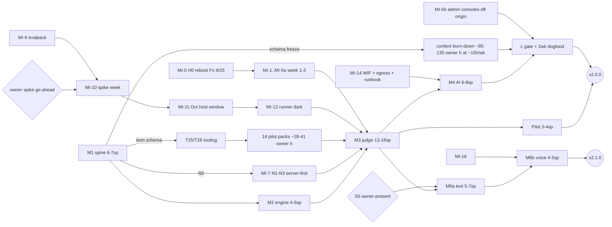

> **T7 research appendix.** Method: four parallel research slices were synthesized into one draft:
> - **ops:** pipeline, NATS auth, observability, limits and capacity;
> - **authz:** authz deltas, invite-only signup and the public dashboard;
> - **release:** labelling, gating and rollback;
> - **map:** the MI track, milestones and artboards.
>
> The draft then faced one adversarial critique (7/10: 6 majors, 13 minors). This is the revised final, with all 19 findings applied (see "Critique fixes applied" at the end). Decided in [ADR-0033](../../adr/0033-invite-only-admission-and-owner-admin.md), [ADR-0034](../../adr/0034-v2-release-labelling-gating-and-rollback.md) and [ADR-0035](../../adr/0035-v2-operations-nats-auth-limits-capacity.md) (all three Accepted 2026-09-24). **The authoritative plan is [`docs/v2/rollout-plan.md`](../rollout-plan.md)**; this appendix is its evidence. Summary: [feasibility § T7](../feasibility.md#t7--cross-cutting-and-infra-first-rollout).
>
> **Status:** settled with the owner 2026-09-24 (**D32–D35**, §11). §11 overrides the body where they conflict:
> - **D32, release labels:** as recommended (§5.2). 1.x minors until GA, `v2.0.0` = v2.0 GA, `v2.1.0` = interviewer GA. The guard (MI-2a) shipped on 2026-09-24: xlearn#53 (`.release-line`) and infra#29 (ranges `<2.0.0`).
> - **D33, admission:** as recommended (§2.2–§2.4): invite links plus the `identity admin` CLI, no web admin, no waitlist. The v1.5.x stopgap shipped in v1.5.2 (2026-09-24) in two parts: the GitHub auto-link fix, xlearn#51 (it amends ADR-0023 §3 and leaves signup unchanged), and `SIGNUP_MODE=closed` (MI-2c), xlearn#52 with infra#30; signup has been closed in production since then. v1.5.2 honours `open` without `DEV_AUTH`; ADR-0033 §3's guard is M1b work.
> - **D34, no alerting in v2.** The healthchecks.io, host-check timer, opscheck, Flux Alert and metrics design in §3 is **kept as the ready option for the opening, not adopted**. The same goes for the opscheck checks and pings the body relies on in §0, §1, §2.3, §4, §6, §7.2 and §12: MI-1 has no healthchecks.io project, **MI-1a is dropped**, and **MI-8 becomes the on-demand `host-verify --cluster` extension**. The owner monitors with landscape and kubescope, plus `host-verify --cluster` after host changes. The MI track is **6–8 sprints**.
> - **D35, owner-only v2; the invite flow is still built.** The learner gate L (admission, acceptance, notice, 18+, region, erase, the `tester` role) ships and is exercised by the owner and testers. Inviting real learners (the opening) is the owner's call, planned for **v3**. So §7's learner opening at GA, the Q4 options, the 2-week dogfood gate and the GA dates driven by learner content are superseded: **v2.0 GA = MI + M1–M4 + pilot + L, complete for the owner; ≈ 41–52 sprints; `v2.0.0` ≈ Dec 2026–Jan 2027** (rollout plan). D6's content is the scope of the v2.x line, delivered in waves after GA.
>
> **Where the body differs from ADR-0033/0034/0035 or [`rollout-plan.md`](../rollout-plan.md), those win.** Known cases: §2.3's schema milestones, the MI-5b timing in §0 item 4 and §2.5 row 15, §6's MI-5 selectors, the §6.2/m1 narrowing order, §5.6's R-d order and limits, and all of §12, which rollout-plan §12 supersedes.

# T7: cross-cutting, infra-first rollout and the v2 milestone map

Research and design only, 2026-09-24. Nothing in `xlearn` or `../infra` was changed, and nothing was tagged, applied or restarted. Evidence comes from code at `2681862` (v1.5.0 plus docs; the live tag v1.5.1, `fff530e`, adds only F010's coach and onboarding fixes, so the identity, gateway and events citations hold, with `store.go` lines shifted by +2), `../infra` at `d16895f` (`origin/main` is `37c4fe6`, infra#28, which adds the `hack/host-*` scripts), read-only `ssh vps` (get/describe/top, `/varz`, `/jsz`, `sar`), and the web. The four slice reports and the critique are working papers and are not committed. The body cites them in plain text ("ops slice", "critique MAJ-2").

**Notation**
- Paths: `X/` = this repo (`sujaykumarsuman/xlearn`), `I/` = the sibling `../infra` repo (`sujaykumarsuman/infra`).
- `tN:line` = a line of the TN research appendix in this folder, as of 2026-09-24 (for example, `t1:525` is line 525 of `t1-content-data-model.md`).
- "Where" codes: **I** infra (GitOps), **X** xlearn, **H** host scripts (applied by hand), **E** `xlearn-evalpack`, **O** owner or external.
- "(inferred)" marks estimates, not measurements.
- **★** marks a recommendation that resolves a conflict between slices (§0.1).
- **(m1)–(m13)** mark the critique's minor fixes, applied in this final.

---

## 0. Executive summary

1. **v2 needs no new platform component.** JetStream plus the outbox plus judge's Postgres `SKIP LOCKED` queue carry about 4,000 events a day at 100 learners, with at least 20× headroom on the relay (ops slice). Five small code changes close the gaps:
   - a stream/consumer **topology table**;
   - a **dead-letter hook** (poison events vanish silently today, `X/internal/platform/events/consumer.go:30-40,176-192`);
   - **identity publishing to NATS**;
   - nkey client options;
   - pinned `pgxpool` sizes.
2. **NATS auth uses nkey users in `$G`**, with **fine ACLs rendered from the topology table**.
   - It rolls out **server first**, bridged by a `no_auth_user`. That corrects T3 A5's "clients first", which cannot work, and costs **one** NATS restart.
   - `messaging` still needs **no SOPS decryption**.
3. **Signup is open to the internet today** on both create paths, and the GitHub auto-link has a pre-account-hijack hole (`X/internal/identity/store/store.go:194-207`). **Recommended now:** a v1.5.x stopgap that sets `SIGNUP_MODE=closed` and stops auto-linking into password accounts.
4. **Admission in v2:**
   - owner-minted **single-use invite links** (128-bit code, stored as sha256, 7-day TTL, carried in the URL fragment), redeemed inside the account-create transaction;
   - **`SEAT_CAP` = 15**, bound by the AI budget;
   - an `identity admin` CLI run through `kubectl exec`;
   - the owner role, plus a CLI-minted **`tester`** role for dogfooding non-owner paths, lives in the database and **never in the JWT**, and there is **no web admin**;
   - the **existing admin consoles (kubescope with cluster-admin and exec, Longhorn, landscape) leave the xLearn origin for `ops.sujaykumar.dev` before the first invite (MI-5b)**.
5. **There is no alerting of any kind today** (no Flux Alerts, CronJobs or metrics stack). The floor:
   - **healthchecks.io** ($0, 20 checks) as the dead-man and alert router;
   - an hourly host timer;
   - **opscheck** hourly plus a daily digest, about 25 checks;
   - a Flux Alert to a generic webhook;
   - **no metrics stack in v2.0**; §3.5 lists the adoption triggers.
6. **Nothing is rate-limited today.** Every API call does a synchronous identity round trip to a 250m pod that also runs bcrypt, and **the kubelet has no memory eviction**. The fixes:
   - a 24-control limits inventory (§3.6), with the gateway and identity controls at **M1b**;
   - kubelet `system-reserved` plus `eviction-hard` in the October host window.
7. **Capacity:**
   - **platform AI binds first** (13–17 seats at `medium`); CPU and memory don't bind below about 95 learners active in the same hour;
   - **the worst-case memory margin after v2 is ≈ 0, and negative during a fleet rollout.** Σ limits (12.6 GiB) leaves out 23 limitless containers (≈ 1.16 GiB measured) and the one-commit rollout surge (≈ +1.1 GiB). **MI-11a trims the Flux limits** (6 × 1 GiB → 512 Mi) before the runner (§4);
   - **steal is elevated and noisy** (9-day p95 5.2%, today 7.1%; the daily p95 is not monotonic, m11).
   - Response order: R0 tune → R1 KVM 8 → R2 a dedicated runner VPS on its own k3s → R3, which is out of scope.
8. **Release labels:** build as **1.x minors**; **`v2.0.0` is the v2.0 GA** and **`v2.1.0` the interviewer GA**; M5 is a later 2.x minor. **Guard now:** a `v2.0.0` tag today would deploy the whole fleet within about 4 minutes and freeze 1.x forever, so bound the ImagePolicies to `<2.0.0` and add a `.release-line` check to CI.
9. **Gating and rollback:**
   - **Gating has three tiers:** build-time manifest defaults, env kill switches, and an owner cohort through `account.role`. No flag service.
   - **The documented rollback doesn't work**, because image automation rewrites the pinned tag within about a minute (`X/docs/git-strategy.md:73-75`).
   - **Rollback order:** kill switch → narrow the ImagePolicy → revert plus a patch tag → Hostinger snapshot.
   - **The snapshot restore only works after git is pinned back.** Otherwise Flux re-deploys the bad tag from `infra/main` on boot. It also loses every write since the snapshot (§5.6).
10. **The infra-first MI track** interleaves with product work. Week 1 is zero-risk: the prune guard, the range bound, the host dead-man, chart 0.3.0, and a runner namespace **born default-deny**. **H0 reboots Fri 2026-09-25**; the pre-reboot gate was GO, 45/45 pass.
11. **Milestones:** MI ∥ M1 → M2 → M3 → M4 → L → **v2.0 GA**.
    - That is about 42–53 sprints, roughly 2 weeks of sessions at v1's pace. The earliest GA is **late Jan–Feb 2027** (inferred).
    - **v2.1** is M6a plus M6b. **M5** rolls in after authoring.
    - **Owner hours set the date, not sprints.** GA = max(content burn-down to L, M3 → M4 → dogfood), and both land around Dec–Jan.
      - **Content:** L needs ≈ 85–130 owner hours at ~10 h/week from the M1a schema freeze.
      - **Engineering:** M3 → M4 → dogfood is gated by the spike go-ahead → the October window → the runner, and by 14 pilot packs.
    - **GA narrows D6's content scope.** It ships the week 1–6 self tier and the week 1–4 packs. The rest of the 151 self-tier items arrive as waves, complete about Mar–May 2027. The owner confirms this in Q4.
12. **About 30 new or reworked artboards** are needed, 5 of them heroes. **Four owner questions** (§11): release labels, admission, the alert channel, and the v2.0 cut line with the learner opening.

### 0.1 Conflicts between slices, resolved

| # | Conflict | Resolution | Why |
|---|---|---|---|
| C1 | **nkey order:** "clients first" (T3 A5; the map slice's MI-6→MI-7; the release slice) vs "server first" (ops slice) | ★ **Server first, with a `no_auth_user: legacy` bridge**. Seeds are never mounted before the server knows the nkeys. | nats.go v1.54.0 returns `ErrNkeysNotSupported` when the server's INFO has no nonce (`nats.go:3065-3067`, module cache). The server sends a nonce only once nkeys are configured (`nats-server/v2 server/nkey.go:36-37`), and `always_enable_nonce` is not a config-file key. |
| C2 | **ACL granularity:** coarse at MI-7 with fine in Track B (T3, map slice) vs fine at MI-7 (ops slice) | ★ **Fine, rendered from `topology.go`, in the same step** | Coarse `$JS.API.>` lets any service read *and UPDATE/purge* any stream ([nats-server#3202](https://github.com/nats-io/nats-server/issues/3202)). Once rendered, fine costs about the same as coarse. |
| C3 | NATS restarts: two (ops slice) | ★ **One restart (N1).** N4 removes the `legacy` user and `no_auth_user` **together as a reload** | nats-server `reload.go` (v2.10.22) refuses to add `no_auth_user` but allows removing it once the referenced user is gone. **Re-verify on 2.14.6**, and fall back to a restart in the monthly window. |
| C4 | `messaging` needs SOPS decryption (the feasibility matrix row) vs it doesn't (T3 amendment, ops slice) | ★ **No SOPS in `messaging`.** Public keys go in plaintext values; seeds live in `apps/secrets` | Fix the matrix row. |
| C5 | NATS client support ships in M1c (ops and release slices) | ★ **N0 rides the next M1 tag that is ready.** It's all optional env, a no-op until used | Decouples NATS auth from M1c's contract migration. |
| C6 | `xlearn` namespace ingress NetworkPolicy: gated on learners (map slice) vs before M3 (authz slice) | ★ **Before M3 (MI-5a)** | T4 requires the practice→judge internal reads to be fenced, and `/sessions/*` and `/internal/*` are unauthenticated today (`X/internal/identity/service.go:70-84`). |
| C7 | `public-read` and `/public/stats` at M1b (map slice) vs M2b (T1, authz slice) | ★ **M2b.** M1b ships only the `RequireRole` middleware, the public-shape allowlist test, D31 and the public rate limit | They depend on `proj_activity` and the visibility columns (t1:412). |
| C8 | First invites after E+M2b (authz slice) vs one opening at GA (map and release slices) | **Owner Q4.** Recommend a single opening at GA | One notice and consent version, honest semver, and `SEAT_CAP` sized for M4 from the first invite. Any earlier opening also pulls forward L-A, notice v1, MI-5a, MI-5b and erase for invitees (Q4 b/c). |
| C9 | Cut `v2.0.0` "knowing it auto-deploys" under `>=1.0.0` (map slice) vs bound the ranges now (release slice) | ★ **Bound now (MI-2a)**, and flip to `<3.0.0` just before the GA tag | Parallel sessions share tags (memory note). One stray tag would freeze 1.x. |
| C10 | T3 says "the runner is the first kubelet-eviction victim" vs the kubelet having no memory eviction (ops slice) | ★ **Set `system-reserved` 1 GiB and `memory.available<500Mi` in MI-11** (the same k3s restart), **plus MI-11a limit hygiene before MI-12**. Until then the only guard is the corrected memory sum (§4), which already has no margin | Measured with `configz` (ops slice); limitless containers from `get pods -o json` + `top` (critique MAJ-1). |
| C11 | opscheck runs daily (feasibility, map slice) vs hourly plus daily (ops slice) | ★ **Two cadences** | A daily-only dead-man means up to 24 h of blindness, and the hourly run costs seconds of CPU. |
| C12 | Push channel "ntfy/email" (feasibility matrix) vs healthchecks.io (T2, ops slice) | **Owner Q3.** Recommend healthchecks.io | Neither ntfy nor email can report its own node down. The free tier was verified: [healthchecks.io/pricing](https://healthchecks.io/pricing/), 20 checks and 100 log entries each (fetched 2026-09-24). |
| C13 | identity invite schema at M1a (authz slice) vs the L track (map slice) | ★ **M1a:** the `role`, `status`, `admitted_via`, `accepted_at` and `region` columns. **L track:** the `invite` table, the flow, the acceptance step and the notice | `account.role` must exist by M3-1 for owner-cohort gating (release slice). |
| C14 | M5's label: "2.1.0 if ready, else 2.2.0" (release slice) vs "v2.1 if packs are complete" (map slice) | Consistent: **2.1.0 = the interviewer GA (D28)**, and M5 rides whichever 2.x minor follows the last stamped pack | — |

---

## 1. Pipeline and messaging

### 1.1 Findings

| Fact | Evidence |
|---|---|
| **NATS server**<ul><li>v2.14.6, one server, `$G` account, **no auth**</li><li>`max_file_store` 5 Gi</li><li>7 connections, from practice, review and assessment only</li></ul> | `/varz`, `/connz` (VPS); `I/infrastructure/messaging/release.yaml:9-10,25,43` |
| **Streams:** 3 streams, 4 consumers, 20 messages, about 423 B per event. Stream config is hard-coded with no limits. | `/jsz`; `X/internal/platform/events/nats.go:78-83` |
| **Poison events:** `MaxDeliver` 100 with backoff means about 8 h of retries. **After that the message is skipped with no record, log line or counter.** | `X/internal/platform/events/consumer.go:30-40,176-192` |
| **identity** publishes to a `LogPublisher`, not NATS, so `XLEARN_IDENTITY` doesn't exist yet. Erase needs it. | `X/internal/identity/service.go:101-105` |
| **Unknown subjects are acked silently** (review), so a subject published before its consumer code is live is **lost** to that consumer. | `X/internal/review/consumers.go:58-61` |
| **Config changes:** a ConfigMap change is a SIGHUP **reload**, not a restart. The `messaging` Kustomization has no SOPS decryption, and the chart already passes `extraVolumes` through. | `I/clusters/vps/messaging.yaml:12-22`; `I/charts/project/values.yaml:143-144` |
| **Relay throughput:** a 5 s tick of 100 rows, so at most 20 events/s per producer (100/s at T4's 1 s interval). | `X/internal/platform/events/relay.go:40` |

### 1.2 No new component

| Candidate | Verdict | Reason |
|---|---|---|
| Workflow engine (Temporal, Restate) | Reject | A judge job is a one-table state machine, erase is an idempotent fan-out, and the interview is coach's FSM. Temporal would cost about 1–2 GiB (inferred). |
| Kafka or Redpanda | Reject | Volume is about 4 orders of magnitude below the point where they'd help. |
| Redis (rate-limit counters) | Reject for v2.0 | The single gateway replica holds in-process buckets, and durable daily quotas are Postgres counts in the owning service. Revisit at gateway scale-out. |
| A DLQ stream | Reject; **adopt a dead-letter hook** instead | A row in `<svc>.event_dead_letter` plus `Term()` plus an ERROR log. It stores ids only, so it's erase-safe, and opscheck counts the rows. |

### 1.3 The five code changes (N0: ship dark in the next M1 tag)

1. **`internal/platform/events/topology.go`** is the single source of truth for streams (owner, subjects, `MaxBytes`/`MaxAge`/`Discard`) and durable consumers. CI tests cover:
   - the Σ `MaxBytes` budget (≤ 3.75 GiB, which is 75% of `max_file_store`, t1:525);
   - that every publisher and `Subscribe` call has a table entry;
   - a **golden rendered NATS `authorization` block**, pasted into `I/infrastructure/messaging/release.yaml`.
2. **Dead-letter hook.** On the last delivery: insert a row with `event_id, subject, durable, err_class, at`, call `Term()`, and log at ERROR.
3. **identity publishes `XLEARN_IDENTITY`** for real. This is a precondition for erase.
4. **Client options**, all optional env, so each is a no-op against today's server:
   - `NATS_NKEY_SEED_FILE`;
   - `NATS_INBOX_PREFIX=_INBOX_<svc>`;
   - an `ErrorHandler` that logs permission violations;
   - a relay envelope cap of 16 KiB.
5. **Pin `pgxpool` `MaxConns`**: 4 per service, 8 for judge, so Σ ≤ ~40 of 100. The default is max(4, NumCPU), which would double on a KVM 8.

Also in M1: a **subject-registry test**. Every subject a producer can emit must appear in each subscriber's switch, or in an explicit "ignored by X" list.

### 1.4 v2 topology (drives the ACLs; T1 budgets)

| Stream (owner) | Budget / discard | Durable consumers |
|---|---|---|
| XLEARN_PRACTICE (practice) | 1 GiB · New | review, assessment, judge (analyzer), identity |
| XLEARN_REVIEW (review) | 1.5 GiB · New | review/notifications, assessment, identity |
| XLEARN_ASSESSMENT (assessment) | 128 MiB · New | identity |
| XLEARN_JUDGE (judge) | 512 MiB · 14 d · Old | practice (`evaluation_completed`), review (`evaluation_analyzed`), identity |
| XLEARN_IDENTITY (identity) | 128 MiB · New | practice, review, assessment, judge, coach |
| **XLEARN_COACH (coach)**, recommended over an HTTP ack for coach's erase acknowledgement | 128 MiB · New | identity |

The budgets sum to **3.375 of the 3.75 GiB ceiling**.

### 1.5 NATS auth rollout (replaces T3 §8.5 A5 and the map slice's MI-6/MI-7)

- **Model:** nkey users in `$G`.
  - Public keys go as plaintext in the `messaging` values; seeds are SOPS files in `I/apps/secrets/xlearn-nats-<svc>.enc.yaml`, mounted at `/var/run/secrets/nats/seed`.
  - **Rotation:** add the new public key → roll the seed with a `podAnnotations` bump → remove the old key. All three steps are reloads.
- **ACL per service (rendered):**
  - publish on `xlearn.<svc>.>`;
  - its own stream's CREATE/UPDATE/INFO;
  - per consumed (stream, durable): `CONSUMER.CREATE/INFO/MSG.NEXT` (with a `.>` tail, because a filtered create is `CONSUMER.CREATE.<stream>.<durable>.<filter>`; m4) and `$JS.ACK.<stream>.<durable>.>`;
  - subscribe only on `_INBOX_<svc>.>`.
- **Other identities:**
  - **ops** (all of `$JS.API.>`): the seed is kept **offline** with the age-key copies.
    - **Break-glass only** (m5): an `ssh vps` port-forward plus the `nats` CLI on the owner's machine with the offline seed, recorded in status.md.
    - It is the only sanctioned manual path. A Job carrying the seed would be a by-hand apply, and D12 has no restore runbook.
  - **opscheck** has **no NATS identity**. It reads `:8222`, fenced by a NetworkPolicy.

| Step | Where | Change | NATS | Verify | Revert |
|---|---|---|---|---|---|
| N0 | X (M1 tag) | §1.3 items 1–5 ship dark | — | unit, golden and budget tests, **plus a compose integration test** with NATS running the rendered `authorization` block: per service, `ensureStream`, a filtered consumer create, fetch, ack and nak. It must pass before N2 (m4) | revert |
| **N1** | I | Add every nkey user with fine ACLs, plus a `legacy` user (allow `>`, random unused password) and top-level `no_auth_user: legacy`. Restart with a pod-template annotation bump. | **restart** (~30–60 s; the outbox buffers) | `/connz?auth=true`: all connections are `legacy` | revert and restart |
| N2 | I | Per service: mount the seed and set `NATS_NKEY_SEED_FILE` and `NATS_INBOX_PREFIX` (practice, review, assessment now; identity, judge and coach as they connect) | none | each connection shows its nkey; no permission violations; outbox unsent = 0 | revert that release |
| **N3** | I | Set `legacy` permissions to `deny ">"` | reload | 24 h with zero legacy connections (opscheck E5) | revert |
| N4 | I | Remove the `legacy` user and `no_auth_user` **together** | reload (C3; restart in the monthly window if 2.14.6 refuses) | `/varz` shows `auth_required: true` | revert |

**Gates:** M3 and erase (L-E) need **N3 plus MI-5**. N4 is hygiene.

**Standing rule:** a new stream or consumer needs its **infra ACL PR merged before the service tag ships**, or the service gets permission-denied. opscheck E5 compares live connections with the golden file.

---

## 2. Authz deltas, invite-only signup (D13), owner role

### 2.1 Findings

| Area | Today | Evidence |
|---|---|---|
| Signup | **Open.** `POST /api/auth/signup` and the GitHub first sign-in both create accounts; no invite, no email verification | `X/internal/identity/authemail.go:14-51`, `handlers.go:124-134` |
| **Pre-account hijack** | `FindOrCreateAccount` links GitHub into *any* account whose email matches, but password accounts are never verified. An attacker pre-registers `victim@x`; the victim later "continues with GitHub" and lands in the attacker's account ([USENIX Sec '22](https://arxiv.org/abs/2205.10174)) | `store.go:194-207`; ADR-0023:57-59 |
| Enumeration | Signup returns `409 email_taken`; login skips bcrypt for unknown identifiers (a timing oracle) | `authemail.go:42-44,66-67` |
| Sessions | 30-day TTL; no status check; no revoke-all | `identity/session.go:21-48` |
| Roles | Every mint is `["learner"]` and **nothing reads `Roles`** | `gateway/bff.go:703,841`; `platform/auth/auth.go:37-38` |
| Internal HTTP | `/sessions/*` and `/internal/*` are unauthenticated and rely on a NetworkPolicy **that doesn't exist** in `xlearn`, `databases` or `messaging` | `identity/service.go:70-84`; `kubectl get networkpolicy -A` |
| Rate limits | **None** in the app or Traefik. bcrypt runs under a 250m CPU limit, so a login flood stalls `/sessions/validate`, which every API call needs (inferred: ~4–8 logins/s) | `kubectl get middleware -A`; `I/apps/xlearn-identity.yaml:70-71` |
| Shared origin | `projects.sujaykumar.dev` also serves **kubescope (cluster-admin, exec)**, the read-write Longhorn UI and 3 other apps. kubescope's cookie is scoped only by **path** (`/kubescope/`), which gives no isolation within one origin. **One XSS in xLearn, while the owner is signed in to kubescope, is cluster-admin**, and from there `sops-age` decrypts every secret (no backups, D12). v2 adds learner- and AI-rendered content to this origin. **MI-5b fixes this** (critique MAJ-2). | `I/README.md:104-113,159-162` |
| Client IP | Traefik uses `externalTrafficPolicy: Local` and no CDN, so the gateway can key limits on `X-Real-Ip` | live Service |

### 2.2 Stopgap now (v1.5.x, a separate task; about 40 lines)

- `SIGNUP_MODE=closed` on both create paths (identity plus the HelmRelease env). Login keeps working.
- **Auto-link only into accounts with no password hash.** Otherwise: "sign in with your password, then Connect GitHub". This amends ADR-0023 §3.
- Optionally D31 (drop the public mock best and average) in the same tag. It's a privacy reduction.
- Recount accounts at deploy: v1 signup is open until this ships.
  - **At the stopgap there's no lever short of by-hand SQL** (m8): `status` and `admitted_via` arrive with M1a, and the suspend verb and revoke-all with M1b.
  - Until then a stranger keeps a v1-only account, which can't run code before M3. M1a/M1b then marks it `grandfathered` or suspends it.

### 2.3 Admission design (identity owns it)

- **Modes.** `SIGNUP_MODE ∈ {closed, invite, open}` and `SEAT_CAP` are HelmRelease env vars.
  - `open` is only for local and dev.
  - **Production at `open` is D21's "open signup" trigger.** CI and opscheck (P2) assert that it never happens while the runner is on the production node.
- **Schema.**
  - M1a, expand: `account.role ('learner'|'tester'|'owner')`, `status ('active'|'suspended')`, `admitted_via ('grandfathered'|'invite'|'dev')`, `invite_id`, `accepted_at`, `region`.
  - L track: `invite(id, code_sha256 UNIQUE, expires_at, note≤120, intended_email?, tier, region?, redeemed_at, redeemed_account_id ON DELETE SET NULL, revoked_at)` and `admin_audit(at, verb, target, detail)`.
  - M4: `account_consent(account_id, kind, version, granted_at, withdrawn_at)`.
- **Mint.**
  - Run `ssh vps 'k3s kubectl exec -n xlearn deploy/xlearn-identity -- identity admin invite create --ttl 7d [--tier standard] [--email x] [--region IN] --note "…"'`.
  - It prints `https://projects.sujaykumar.dev/xlearn/auth#invite=<22 chars>` plus the seats (e.g. `5/15`).
  - The owner sends the link over his own channel; **xLearn sends no email**.
  - The code sits in the **fragment**: it never reaches access logs or the Referer header, and it adds no new top-level SPA segment.
  - The SPA reads the code, then calls `history.replaceState` so it doesn't linger in `location.hash` (m13).
- **Redeem, email path.**
  - The invite is checked **before** the email, so an uninvited caller can't use signup as an email oracle.
  - One transaction: `pg_advisory_xact_lock('identity.seats')` → a conditional `UPDATE invite … RETURNING tier, intended_email, region` → create the account → outbox `account_created{tier}`.
  - Invalid, expired and used invites all get the same `invite_invalid`.
- **Redeem, GitHub path.** The form's hidden `invite` field is carried in the existing HttpOnly `oauthTx` cookie (10 min).
  - A **new** account redeems inside the create transaction, and `intended_email` must equal the GitHub-verified email.
  - An existing account just logs in.
  - With no invite, the user goes to `/auth?error=invite_required`.
- **Accept (onboarding step 0).** 18+ attestation, the privacy-notice version, region (pre-filled from the invite), and, from M4, the two unticked AI consents.
  - The gateway returns `403 acceptance_required` on other APIs until acceptance.
  - Session-validate returns `accepted`, `status` and `created_at` (the last one for the erase fresh-auth check).
- **Abuse controls:**
  - single use and a revocable 7-day TTL (30-day maximum);
  - lookup by sha256, plus per-IP limits (§3.6 L1–L2);
  - the advisory lock on mint and redeem;
  - a dummy bcrypt for unknown identifiers;
  - on suspend: revoke every session, 404 the public profile, free the seat;
  - on reactivate: take the seat lock and check the cap, so `reactivate` can't exceed `SEAT_CAP` (m13);
  - on erase: free the seat, null the redeemer, and **clear `note`**.
- **CLI verbs** (identity, M1b/L):
  - `invite create|list|revoke`;
  - `seats`;
  - `account list [--dormant 30d]|suspend|reactivate|set-role|revoke-sessions|erase`.

  Each verb writes `admin_audit`. judge adds `breaker`, `ai-disable`, `llm-limit`, `review-flags` and `disputes export` in M3/M4.
- **Seat cap:** `SEAT_CAP = floor((AI_APP_CAP − OWNER_LIMIT) / (1.2 × P90 learner-month))`, which gives **15** (DSA `medium` $3.17 → 17; with SD at 10% → 13). Re-size it after the M4 dogfood. **Raising it above 40 needs R2** (§4; a T7 threshold, not a D21 trigger, m7).

### 2.4 Owner and admin role

- `identity admin account set-role <user> owner` is run once.
- The owner is **excluded from `SEAT_CAP`**, keeps T5's owner AI limit, and **can't be erased from the web** (CLI only), so an XSS can't wipe the owner.
- **`tester` role** (critique MAJ-3).
  - **Minting:** the owner creates testers through the CLI (`identity admin account create --role tester`, or `set-role <user> tester`).
  - **Seats:** they're excluded from `SEAT_CAP`, like the owner.
  - **Cohort:** they're in the T-3 dogfood cohort alongside the owner.
  - **Erase:** unlike the owner, they **can be erased from the web**.
  - This is how non-owner paths (erase, acceptance, the invite round-trip) get exercised on production before GA, without exposing the owner account.
- **No `owner` or `tester` role in JWTs in v2.0.** judge keys its overrides by account id, and the gateway reads `role` from session-validate for cohort gating (§5.4).
- **No web admin.** Any XSS in the 5 same-origin apps could drive it with the owner's session. Revisit only on a separate host (`ops.sujaykumar.dev`).
- **The consoles that already exist move instead (MI-5b).** "No web admin" doesn't remove the existing path: an XSS can drive kubescope to `exec` the `identity admin` CLI. So kubescope, landscape and the Longhorn UI leave the xLearn origin **before the first non-owner invite**.

### 2.5 Authz deltas across v2

| # | Surface | v2 change | Milestone |
|---|---|---|---|
| 1 | Account creation | closed → invite + `SEAT_CAP` + acceptance | stopgap → M1a (columns) → L (flow) |
| 2 | Login | per-IP and per-identifier limits; dummy hash; bcrypt semaphore | M1b |
| 3 | GitHub auto-link | only into password-less accounts | stopgap |
| 4 | Sessions | `status` join; revoke-all on suspend, password change and erase; validate returns `accepted`, `status`, `created_at` | M1b |
| 5 | JWT roles | shared `auth.RequireRole`: user routes need `learner`, `/public/stats` needs **only** `public-read`; no `owner` role in JWTs | middleware M1b; `public-read` M2b |
| 6 | Owner/admin | `account.role`; `identity admin` CLI; `judge admin` CLI; `admin_audit` | M1b / L / M3 / M4 |
| 7 | Internal HTTP | **the NetworkPolicy is the fence** (MI-5a): the gateway admits only Traefik, internal routes only the `xlearn` namespace, and the runner is denied. Still no service tokens. | **before M3** |
| 8 | Enrollment | validate the slug against active and `preview` (owner and tester cohort) paths | M1b |
| 9 | judge, learner-facing | `aud=judge` JWT; every read scoped to `sub` (IDOR tests); per-account idempotency; quotas; DTO allowlist | M3 |
| 10 | judge, internal | practice→judge `/internal/*` behind the NetworkPolicy; regrade only after practice authorizes | M3/M4 |
| 11 | Runner / eval pack | bearer token (SOPS), ingress only from judge; the pack never goes through the BFF (denylist test) | M3 |
| 12 | Erase | `DELETE /api/me`: typed confirmation plus **a session under 5 minutes old**; **the owner is always refused on the web** (CLI only); enabled for `role=tester` at L-E and for every non-owner account at the L exit; consumers re-verify through `/internal/erasures/{id}`; identity's expected-ack set comes from `topology.go` of the running version (judge joins at M3-1) | L-E (after N3) → L exit |
| 13 | Platform AI | judge reads `tier`, `status`, consents and `ai_disabled` from identity (5-minute cache) | M4 |
| 14 | Interviewer | `aud=coach`; 1 non-terminal interview; ≤ 2 starts a day; EU/EEA voice gate from `account.region` | M6 |
| 15 | Same origin | **Admin consoles to `ops.sujaykumar.dev` (MI-5b)**; xLearn CSP; `Sec-Fetch-Site` plus a JSON content-type check on mutating calls (SameSite=Lax still admits sibling `*.sujaykumar.dev` hosts) | **MI-5b before L**, M1b (CSP), M6b (Permissions-Policy) |

---

## 3. Observability, opscheck, push channel, limits

### 3.1 Today

| Layer | Today |
|---|---|
| Metrics | metrics-server only (`kubectl top`), plus the landscape, kubescope and Longhorn UIs. These are views, not alerts. |
| Alerting | **None.** `kubectl get providers,alerts,receivers,cronjobs -A` returns nothing. |
| Host history | **sysstat has 9 days** of 10-minute CPU, steal and memory, and it survives reboots. journald keeps 1 GiB for 7 days. |
| Logs | JSON `slog` with a request id. **Logs are lost on every rollout** (kubelet keeps 10 Mi × 5 per container). |

**Rule:** anything needed after the next rollout is a **Postgres row** (ledger, telemetry, dead letters, erase requests) or a line in the digest.

### 3.2 Push channel (recommended; owner Q3)

**healthchecks.io** is the dead-man and the router. Its own email and Telegram integrations do the notifying, so the cluster holds **only ping URLs** (in SOPS). No bot token lives in the cluster.

| Check | Pinged by | Period / grace |
|---|---|---|
| `host` | an **hourly host systemd timer `host-check`** (in `hack/host-bootstrap.sh`, asserted by `host-verify`). The body carries the `host-verify --quiet` summary, 24 h steal p95, disk %, the age of `reboot-required`, and running vs installed kernel. | 1 h / 1 h |
| `opscheck-hourly` | CronJob `17 * * * *` (alerts only; `/fail` with the breaching checks) | 1 h / 30 m |
| `opscheck-daily` | CronJob `30 3 * * *` UTC (09:00 IST): a digest of counts and ids only | 1 d / 2 h |
| `flux` | Flux `Provider` type `generic` → the `/fail` URL; an `Alert` (severity error) on every Kustomization and HelmRelease | fail-only; re-armed by opscheck |
| `judge-runner`, `judge-ai` | judge, **on state change only** (lane down > 10 min; breaker open; 401; workspace mismatch; global spend ≥ 90%). **At M3 judge has no 443 egress** (MI-13), and a NetworkPolicy can't allow an FQDN, so `judge-runner` goes through opscheck's J checks until M4 opens 443 (m3) | fail-only |
| Later: `pgstore-*` backup checks | when backups land | — |

That is 8 of the 20 free checks. The API limit is 5 pings per minute per check, and bodies are ≤ 100 kB.

### 3.3 opscheck runtime

- **Runtime:**
  - an `opscheck` subcommand in the gateway image, run as CronJobs through chart 0.3.0's `workload: cronjob`;
  - `concurrencyPolicy: Forbid`, `activeDeadlineSeconds: 120`, `backoffLimit: 0`;
  - requests 10m / 32 Mi, limits 100m / 64 Mi.
- **Access, all read-only:**
  - **PG:** a role `xlearn_opscheck` (ADR-0005 4-step) with `SELECT` on per-service **`ops_*` views** that each service owns in its migrations.
  - **NATS:** `:8222` `/jsz` and `/connz?auth=true`.
  - **k8s:** namespaced Roles (pods and events) in `xlearn`, `messaging` and `databases`, plus a ClusterRole on `nodes` and `metrics.k8s.io`.
  - **Egress:** 443 to `hc-ping.com` and `ghcr.io`.

### 3.4 Consolidated checks

| Group | Checks (→ alert when) | Cadence | Milestone |
|---|---|---|---|
| **H** host | H1 missed `host` ping · H2 `host-verify` drift · H3 steal 24 h p95 > 10%, or any 1 h average > 25% · H4 disk ≥ 70%, `reboot-required` > 7 d, running kernel ≠ newest installed for > 35 d | 1 h | MI-1a |
| **K** cluster | K1 a Flux object not Ready · K2 OOMKilled, or > 3 restarts in 24 h (xlearn, messaging, databases), or CNPG unhealthy · K3 **memory sum** (Σ limits + Σ p95 working set of limitless containers + the largest rollout surge + 2.3 GiB host) > node capacity − 0.5 GiB, or any new container without a memory limit, or requests > 70% · K4 PG or NATS PVC ≥ 60% | event / 1 h / daily | MI-8 |
| **R** release | deployed tag = ImagePolicy latest for every `xlearn-*`; rollback floor ≤ deployed; live flag count ≤ 6 | daily | MI-8 |
| **E** events | E1 a stream ≥ 70% of `MaxBytes` · E2 outbox oldest unsent > 10 min · E3 consumer pending > 100, or `ack_pending` > 0 for > 30 min · E4 `event_dead_letter` rows > 0 · E5 connections not authenticated as an expected nkey (after N2) | 1 h | MI-8 / MI-7 |
| **J** judge | J1 `spec_mismatch` > 0, or evaluable = 0 · J2 evalpack anonymous GET ≠ 401/403, or PAT expires within 14 d · J3 `error` evaluations > 0 · J4 per-job steal > 10%, quiet re-runs > 5%, SIGSYS or quarantine · J5 counted-submit wait p95 > 10 s, or `queue_full`, or breaker level 2 for > 1 h a week | 1 h / daily | M3 |
| **A** AI | month-to-date vs cap with a forecast; breaker events; `ai_unavailable` and invalid-output rates; `review_flag` list; accounts > 80%; JWKS and fallback-key age; `retire_not_before` ≤ 90 d | daily | M4 |
| **P** people | P1 erase open > 24 h · P2 seats ≥ 90% of `SEAT_CAP`; invites expiring within 48 h; new, suspended and dormant accounts; **`SIGNUP_MODE=open` while the runner is on the production node** | 1 h / daily | L (P2's mode assertion from M1b) |
| **I** interviews | live, paused, incomplete, sweeper lag, stuck `live` | 1 h | M6 |
| **M** meta | a missed `opscheck-*` ping (healthchecks.io) | — | MI-8 |

### 3.5 Metrics and logs stack

**None in v2.0.** The node has sar, opscheck and judge telemetry rows. Adopt VictoriaMetrics single (plus vmagent, node-exporter and kube-state-metrics; about 250–400 MiB, inferred) and VictoriaLogs (about 100–200 MiB) when **any** of these holds:
- a second node or the runner VPS exists;
- two incidents in a quarter couldn't be diagnosed from sar, opscheck and telemetry;
- signup opens.

Adopting them requires L23 plus a limit trim first (§4).

### 3.6 Limits inventory (nothing exists today unless noted)

| # | Limit | Where | Start value | Milestone |
|---|---|---|---|---|
| L1 | Login | gateway (`X-Real-Ip`) | 10/min per IP (burst 5) + 5 failures / 15 min per identifier → 429 `Retry-After` | **M1b** |
| L2 | Signup, GitHub start, invite check | gateway | 5/min per IP | M1b |
| L3 | bcrypt concurrency; dummy hash for unknown identifiers | identity | ≤ 2 in flight → 429 | M1b |
| L4 | Public profile | gateway | 60/min per IP (burst 20); 404s cached negatively for 60 s; ≤ 8 concurrent cold composes | M1b |
| L5 | Per-account API token bucket (inferred values) | gateway | all `/api`: 20 req/s, burst 40; mutating: 5/s, burst 10 | M1b |
| L6 | Body caps with a typed 413 (replacing today's silent `LimitReader`) | gateway + judge | default 1 MiB; canvas 640 KiB; interview snapshot 64 KiB; judge scene 512 KiB, export 32 KiB | M1b (≤ M3) |
| L7 | Account creation | identity | `SIGNUP_MODE` + `SEAT_CAP` 15 | stopgap → L |
| L8 | Erase | gateway + identity | session ≤ 5 min old; typed confirmation; 1 open per account | L-E |
| L9 | Judge daily quotas | judge (PG) | 200 Runs / 100 counted / 100 arena per account | M3 |
| L10 | Lane queue caps | judge | runner 32, llm 8 → 429 `queue_full` | M3 |
| L11 | Per-account pending | judge | ≤ 2 queued Runs, ≤ 4 non-Run; ≥ 2 s between submits; 1 running per lane | M3 |
| L12 | Runner budget | judge | ≤ 10 slot-min/h, ≤ 60/day per account | M3 |
| L13 | Duty-cycle breaker | judge | 40% / 60% of 2 slots over 60 min | M3 |
| L14 | Runner hard caps | runner + `sandbox-guards` | 2 slots; compile ≤ 15 s; tests ≤ 45 s wall; ≤ 8 MiB per case; pod 2 vCPU / 3 GiB; PriorityClass −1000; Quota; LimitRange | MI-4, MI-12 |
| L15 | Kill switch | judge env | 503; the queue drains | M3 |
| L16 | Classic mock | gateway / assessment | ≤ 1 live per course; ≤ 3 started per day | M3 |
| L17 | Platform AI | Anthropic workspace + judge ledger | provider $100; app $80; daily guard 15%; per account $6/month and $1/day; ≤ 20 analyses and ≤ 6 AI finals a day; ≤ 8 calls per evaluation; input > 16 KiB skipped | M4 |
| L18 | BYO coach | coach | 20 msg/min; 2 concurrent streams; 300/day; history 20 turns / 32 KiB | M1 |
| L19 | Interviewer | coach (+ judge) | 1 non-terminal per account; ≤ 3 live voice platform-wide; ≤ 2 starts/day; mandatory $ cap; ≤ 1 snapshot / 2 s; mock Run ≤ 1 / 10 s | M6 |
| L20 | NATS | code topology + NATS | per-stream `MaxBytes` (Σ 3.375 GiB); `max_payload` 1 MiB; envelope ≤ 16 KiB; per-service ACLs | M1 (N0), MI-7 |
| L21 | PG pools | `cmd/*/main.go`, later CNPG | `MaxConns` 4 per service, judge 8; later role `connectionLimit` 20 | M1 (pin), MI-15 |
| L22 | CNPG memory | infra | 1 Gi (today); 2 Gi only on TR-MEM | trigger |
| L23 | **Kubelet** | host k3s config (`host-bootstrap.sh`, asserted by `host-verify`) | `system-reserved=cpu=250m,memory=1Gi`; `eviction-hard=memory.available<500Mi,nodefs.available<5%,imagefs.available<5%`; pid limits | **MI-11** |
| L24 | Single gateway replica | doc | the in-process limiter state joins the cache epoch on the scale-out-blocker list | M1b (ADR) |

`X-Real-Ip` is used only because Traefik sets it (externally it can't be spoofed; assert that in an M1b test). The MI-5a NetworkPolicy closes in-cluster spoofing.

---

## 4. Single-node triggers and ordered response

**Headroom** (measured 2026-09-24; ops slice):

| Metric | Value |
|---|---|
| CPU busy | p95 9.2%, max 33% (sar, 9 days) |
| **Steal** | p50 2.0%, p95 5.2%, max 11.1% over 9 days. **Elevated and noisy** (m11): the daily p95 for 9/16–9/23 was 2.0, 6.4, 4.8, 2.7, 2.0, 3.8, 4.4 and 5.9%, not monotonic; 9/24 p95 7.1%; 1-minute p95 10%, max 16% |
| Working set | 4.38 GiB (27%) |
| Limits | 8,850m CPU; **9,354 Mi memory (58%)** |
| Disk | 19 / 193 GB |

**v2 resource model:**

| | CPU req | Mem req | CPU lim | Mem lim |
|---|---|---|---|---|
| Live today | 1,545m | 1,612 Mi | 8,850m | 9,354 Mi |
| + judge / runner / opscheck / coach P1 | +160m | +672 Mi | +2.85 | +3.5 GiB |
| **v2 total** | **1.7 vCPU (43%)** | **2.2 GiB** | 11.7 vCPU | **≈ 12.6 GiB (81% of 15.6)** |
| *Outside Σ limits:* 23 containers with **no memory limit** (Longhorn ×12, Traefik, cert-manager ×3, metrics-server, local-path, svclb, NATS reloader) | — | — | — | **≈ 1.16 GiB working set** (`top`, 2026-09-24) |
| *Transient:* one IUA commit rolls all xlearn Deployments at maxSurge 1 | — | — | — | **+≈ 1.1 GiB** (7 × 128 Mi + judge 256 Mi) |
| MI-11a: Flux controllers 6 × 1 GiB → 6 × 512 Mi (use 70–174 Mi) | — | — | — | **−3 GiB** |

- **Memory sum** (corrected by the critique, MAJ-1). The old guarantee, "Σ limits ≤ ~13 GiB means no OOM", is **false**: it left out the limitless containers and the rollout surge.
  - **Before MI-11a:** 12.6 + 1.16 + 1.8–2.3 host = **15.6–16.1 GiB against 15.62 GiB**. That is a margin of **≈ 0 at steady state and ≈ −1.1 to −1.5 GiB during a fleet rollout**.
  - **Rule:** Σ limits + Σ p95 working set of limitless containers + the largest rollout surge + host ≤ capacity − 0.5 GiB.
  - **After MI-11a:** 9.6 + 1.16 + 1.1 + 2.3 ≈ **14.2 GiB**, ≈ 1.4 GiB under capacity and ≈ 0.9 GiB inside the rule.
  - Any new always-on pod needs L23 plus a trim, or R1. The runner stays `Recreate`: its Quota (limits 3 Gi) would also stall a surge.
- **Which constraint binds first (inferred):**
  - the AI budget, at **13–17 seats** at `medium`;
  - the runner only at about **95 learners active in the same hour** (M/M/2 at ρ 0.4: mean wait about 0.6 s);
  - memory stays flat per learner;
  - PG disk: about 198 learner-years to the 60% mark.

| Trigger | Threshold | Measured by | Response |
|---|---|---|---|
| TR-CPU | user + system 60-minute average > 50% on ≥ 3 of 7 days | sar / H3 | R0 → R1 |
| **TR-STEAL** | 24 h p95 > 10% on ≥ 3 of 7 days; **or** quiet re-runs > 5% a day; **or** any 1 h average > 25% or a Hostinger CPU-limit event ([Hostinger CPU limit](https://www.hostinger.com/support/6899741-what-is-the-cpu-use-limit-for-vps-at-hostinger/)) | sar, J4 | R0 (lower the breaker) → **R2**. R1 doesn't help. |
| TR-MEM | the memory sum (§4 rule) > capacity − 0.5 GiB; **or** an OOMKill outside `xlearn-runner`; **or** peak working set > 75% | K2 / K3 | R0 (trim) → R1 |
| TR-QUEUE | counted-submit wait p95 > 10 s over a day; any counted `queue_full`; breaker level 2 > 1 h a week | J5 | R0 → R2 |
| TR-SEATS | seats ≥ `SEAT_CAP` with the AI forecast < 80% → raise the cap. **`SIGNUP_MODE=open` (D21) or `SEAT_CAP` > 40 (a T7 threshold, m7) ⇒ R2 is mandatory** | P2 / A1 | raise the cap / R2 |
| TR-DISK | a PG or NATS PVC ≥ 60%; node disk ≥ 70% | K4 / H4 | Longhorn expand → R1 |
| TR-D21 | open signup; an unpatched reachable LPE > 7 d; the spike forces R1b; TR-STEAL | owner, H2 / H3 | **R2** |

**Ordered response** (prices from [hostinger.com/vps-hosting](https://www.hostinger.com/vps-hosting), 2026-09-24, 24-month term):

| Response | What | Cost | Effort / notes |
|---|---|---|---|
| **R0** | Tune: breaker thresholds, arena shedding, seat freeze, analyzer effort `low`, trimming non-xlearn limits | $0 | hours |
| **R1** | KVM 4 → **KVM 8** (8 vCPU / 32 GB) | about **+$21/month** at renewal ($49.99 vs $28.99) | ≤ 10 min in hPanel; then re-pin pools and re-calibrate time limits. **Fixes neither steal nor isolation.** |
| **R2** | New **KVM 2** as its **own single-node k3s plus Flux** (`clusters/runner`), with the runner reached over 443 with mTLS plus the existing bearer token, and ufw allowing only the main node | **$8.99 → $14.99/month** | about 2–3 days (inferred). **Not a k3s agent**: flannel is unencrypted vxlan, and an agent would get a production kubelet credential. **Never the backup VPS** (D12/D21). |
| R3 | Off single node (HA, managed PG) | ≥ $50–100/month | out of v2 scope |

**Watch:** steal is elevated and noisy (m11). Re-check sar at the 2026-09-27 collection point. **TR-STEAL could fire before M3 and pull R2 forward.**

---

## 5. Release labelling, feature gating, rollback

### 5.1 Findings

| Fact | Evidence |
|---|---|
| `deploy.yml` fires on any `v*` tag and rebuilds all 7 images | `X/.github/workflows/deploy.yml:13-15` |
| All 7 ImagePolicies are `>=1.0.0` with no upper bound. **A `v2.0.0` tag today deploys the fleet in about 4 minutes, and no 1.x tag can ever deploy again** | `I/apps/image-automation.yaml:86…212` |
| Prerelease tags (`-rc.N`) build images, but **Flux semver ranges skip prereleases** unless the range carries `-0` | [Masterminds/semver](https://github.com/Masterminds/semver/blob/master/README.md); [Flux ImagePolicy](https://fluxcd.io/flux/components/image/imagepolicies/) |
| One ImageUpdateAutomation (1 m) writes every bump in **one commit**, so services upgrade in no set order | `I/apps/image-automation.yaml:240-263` |
| **"Pin the previous tag in infra" doesn't roll back:** the `$imagepolicy` marker gets rewritten within about 1 minute | `X/docs/git-strategy.md:73-75` vs `I/apps/xlearn-gateway.yaml:23` |
| Tag to live takes about 4–6 min; revert plus a patch tag about 6–8 min | `gh run list`; Flux intervals |
| Chart is **0.2.2** with `reconcileStrategy: ChartVersion`. A template change needs a version bump and re-renders **all 11 releases** | `I/charts/project/Chart.yaml:5` |
| Readiness and liveness both use `/healthz`. `/readyz` exists but nothing uses it. A failed pod never takes traffic (maxUnavailable 0) | `I/charts/project/values.yaml:34-35,71-76` |
| Goose v3.28.0 ignores DB versions that are missing from the files, so **image rollback never trips goose, but the old code must tolerate the newer schema** | goose `internal/gooseutil/resolve.go` |
| HTTP API `/api/v1` is independent of the product version (v1.5.1 removed a field in a patch) | ADR-0021:35-43 |
| Hostinger manual snapshot: one at a time, **auto-deleted after 1 day**, whole-VM restore | [Hostinger backups](https://support.hostinger.com/en/articles/1583232-how-to-back-up-or-restore-a-vps) |

### 5.2 Scheme (recommended; owner Q1)

- **Build as `1.x` minors. `v2.0.0` = v2.0 GA. `v2.1.0` = interviewer GA. M5 = the next 2.x minor after the last pack is stamped.**
- **Labels mark GA flips, not code landings.** Code lands dark (T-2/T-3); the labelled tag changes the build-time defaults for invited learners. Semver stays honest: before 2.0.0, only the owner sees breaking behaviour (D15/D16/D18, D2, D27).
- **API:** `/api/v1` for all of 2.x (additive). Keep the DSA alias routes for at least one release after the SPA stops calling them.
- **Guard (MI-2a):**
  - bound all 7 (later 8) ImagePolicies to `>=1.0.0 <2.0.0`;
  - add a `deploy.yml` step that fails any tag whose major ≠ `.release-line` (a 1-line file, `1` until GA).
- **At GA:**
  - in one xlearn PR, set `.release-line = 2` and flip the defaults;
  - merge the infra range `>=1.0.0 <3.0.0` **before** the tag. It's a superset, so nothing stalls;
  - **but the widening deploys any 2.x image that already exists** (m1), for example one built by a stray tag before the guard landed, and a later real `v2.0.0` push would overwrite that GHCR tag without Flux rolling. So first list the GHCR tags of every `xlearn-*` and assert that no non-prerelease `2.*` exists;
  - optionally tag `v2.0.0-rc.N` first (those images never deploy);
  - tag `v2.0.0`.
- **Other streams:**
  - runner `runner-v1.x`: a self-contained workflow (`type=match`), range `>=1.0.0 <2.0.0`;
  - evalpack `v1.x`, range `>=1.0.0 <2.0.0`.

  For both, a major means a **contract** break.
- **Hygiene:**
  - release titles like `v1.9.0 — v2 build · M2a`;
  - `docs/v2/status.md` carries **milestone → tag → rollback floor** plus a flag inventory;
  - check peers' tags before tagging (parallel sessions).

### 5.3 Indicative tag timeline

Take the next free minor at tag time.

| Tag | Content | Rollback floor after |
|---|---|---|
| v1.5.x | stopgap (§2.2) | — |
| v1.6.0 | M1a expand (+ N0 if ready) | none (expand-only) |
| v1.7.0 | M1b: course resolution, `withhold()`, limits, `RequireRole`, admin CLI | 1.6.0 (v2 envelopes in the log) |
| v1.8.0 | M1c contract | **1.7.0, hard** |
| — | infra: N1 → N2 → N3 | client images ≥ the N0 tag |
| v1.9.0 → v1.10.0 | M2a consumer **+ M2b consumers** → M2a producer + M2b producer + M2c (or the M2b `touch_scored` producer ships dark behind a T-2 env; m6) | 1.9.0 |
| v1.11.0 → v1.12.0 | L-E erase consumers (practice, review, assessment, coach) → `DELETE /api/me` (**tester cohort only**; the owner is refused) | 1.11.0 |
| runner-v1.0.0, evalpack v1.0.0 | runner dark, pack | — |
| v1.13.0 → v1.14.0 | M3-1 judge dark, **born with its `XLEARN_IDENTITY` erase consumer** → M3-2 Run/Submit, arena, the D15/16/18 flow (owner and tester cohort) | 1.13.0 |
| v1.15.0 | pilot (`preview`) | consumers ≥ 1.7.0 |
| v1.16.0 | M4 (owner cohort) | — |
| v1.17.0 (+ `v2.0.0-rc.N`) | L remainder; dogfood | — |
| **v2.0.0** | GA default flip | narrow the range to `<2.0.0` to return to the last 1.x |
| **v2.1.0** | M6a + M6b GA | — |
| 2.x | M5 `evaluator_only` | env override |

### 5.4 Gating tiers (no flag service)

| Tier | Mechanism | Change path | Used for |
|---|---|---|---|
| T-1 build-time | course manifest `status: active \| preview \| coming_soon \| retired`; per-course grading `allowed \| evaluator_only`; code defaults | a tag (4–6 min) | GA flips (the labelled release) |
| T-2 runtime env | `JUDGE_BASE_URL` (unset = off), the grading override, `LLM_PLATFORM_ENABLED`, `REVISION_ENTRY_RULE`, `COURSE_STATUS_OVERRIDE`, `SIGNUP_MODE` | an infra PR (1–2 min) | kill switches, dark launch |
| T-3 dogfood cohort | `account.role ∈ {owner, tester}` from session-validate; the gateway gates `preview` features on it | admin CLI, immediate | dogfood before GA, including non-owner paths through testers |

- **Rules:**
  - A capability is **present only if its upstream is configured and its gate passes** (the `DEV_AUTH` precedent).
  - Kill switches are permanent.
  - Keep **≤ 6 live non-kill flags**, each with an owning and a removal milestone in status.md.
- **`preview`** hides a course everywhere for non-owners (catalog, enrollment, public profile, `/public/stats`), tested like the course-slug guard.
- **Lazy chunks:** add a `vite:preloadError` → reload handler with the first lazy import (M3).

### 5.5 Migration rules

- **Expand** releases hold only additive DDL (nullable or constant-default columns, new tables, `CREATE INDEX CONCURRENTLY` under `NO TRANSACTION`).
- **Contract** at least one release after the last reader or writer of the old shape. Mark it with the header `-- xlearn:contract floor=vX.Y.Z` (lint it) and record the floor in status.md.
- **Never run `Down` in production.** Fix forward.
- **Readiness gates cutover:** chart 0.3.0 splits the probes, and each release opts in to readiness on `/readyz`.
- **Rehearse contracts** in compose on seeded data. Take a **Hostinger manual snapshot right before any contract, erase or GA tag** (1-day retention; within D12). **No off-node `pg_dump`**, since that bends D12. A restore follows the R-d order in §5.6: git is pinned back first, or Flux rolls the restore forward again.
- **Consumers before producers:** two consecutive tags, plus the subject-registry test (§1.3). A single tag has **no** ordering (one IUA commit). The substitute is a producer that ships dark behind a T-2 env, as M4 does with `LLM_PLATFORM_ENABLED` (m6).
- **Envelope:** decoders keep v1 and v2 **forever**; the envelope is append-only. The first non-DSA event sets the consumer floor at 1.7.0.

### 5.6 Rollback

**Mechanisms, fastest first:**
- **R-a:** the env kill switch (1–2 min).
- **R-b:** narrow the ImagePolicy, e.g. `>=1.0.0 <2.0.0, !=1.7.0` (2–3 min, no build).
- **R-c:** revert plus a patch tag (6–8 min; preferred for traceability).
- **R-d:** the Hostinger snapshot (whole VM). **This is a procedure, not a button** (critique MAJ-4).
  - **Why:** a restore rewinds the cluster but **not git**. The IUA has already committed the new tags to `infra/main`, so on first boot Flux re-deploys the bad release, and its migration re-runs on the restored DB.
  - **Order** ([ADR-0034](../../adr/0034-v2-release-labelling-gating-and-rollback.md) §4.2 is authoritative):
    1. Do R-b (narrow to the pre-tag version) or R-c, and wait until the IUA has written the old tags to git.
    2. Confirm that git HEAD's tags equal the snapshot's.
    3. List the erases completed since the snapshot (with no erase ledger, D12, the restore brings those accounts back).
    4. Restore.
    5. Run `host-verify --cluster`.
    6. Re-run the listed erases through the CLI, and record the lost-writes window.
  - **Cost:** the restore **discards every write since the snapshot**, including learners' work after GA. It also rewinds the host, so only snapshot after host changes have settled.

**Never** edit the tag line, and never suspend the shared IUA (it also freezes airlift, landscape, hub and kubescope).

| Step | Reversible? | Irreversible residue | Guard |
|---|---|---|---|
| Chart 0.3.0 | revert `Chart.yaml` | none | byte-identical `helm template` for all releases (`hack/chart-diff.sh`) |
| NetworkPolicies | git revert (fail-open) | none | caller list from live pods; smoke-test login, dashboard and coach |
| M1a/b v2 envelope | yes while DSA-only | v2 envelopes stay in the log for good | decoders forever |
| **M1c contract** | **no, below 1.7.0** | dropped columns and CHECKs | floor marker; compose rehearsal; snapshot |
| NATS N1–N3 | server config reverts | none (the outbox buffers) | server-first bridge; E5 |
| M2a new subject | yes | touches acked silently if review is rolled below 1.9.0 | two tags + registry test |
| M2b projections | drop and replay (ADR-0018) | none while the outbox is kept | never trim the outbox |
| **M2c D2 rule** | the toggle stops new anchors | D2-created items stay scheduled | stamp `revision_item.anchor_rule` |
| **L-E erase** | code, yes | **deleted data is gone** (D12) | tester cohort only until the L exit (the owner is never erasable on the web); typed confirmation; snapshot |
| M3 judge | `JUDGE_BASE_URL` unset or the override | evaluations and `graded_by=auto` history | the kill switch is an M3 exit test |
| M4 AI | `LLM_PLATFORM_ENABLED=false` | **money spent** | $100 provider limit / $80 app cap |
| v2.0.0 GA | R-b narrow to `<2.0.0` | invited learners' data | 2.0.0 carries **no contract** migration |

### 5.7 Staging and new release streams

- **No `xlearn-staging` in v2.0.** It would add about 1.3 GiB of limits (breaking the §4 memory-sum rule even after MI-11a) and need a second NATS (subjects are hard-coded), about 25 objects and a second OAuth app, and **it can't host a runner**.
  - **Substitutes:** compose parity (PG 18, NATS 2.14), the k3d rehearsal, `-rc` images, and owner-cohort dark launch.
  - **Revisit** when a second node exists, or when there are more than 10 learners and a contract migration touches their data.
- **judge** is the 8th `deploy.yml` job. **Image before policy:** tag the release that first builds `xlearn-judge`, *then* merge the infra PR (4-step schema and role, HelmRelease, ImagePolicy). A brief crash-loop until the schema exists self-heals, as in v1.
- **evalpack:** ImageRepository `secretRef` + ImagePolicy. Its marker sits on judge's image-volume `reference:`, so the existing IUA bumps it.
- **runner:** the `runner-v*` stream, `clusters/vps/sandbox.yaml` (`sandbox-guards`, then `runner`), and a 2nd IUA with `update.path: ./runner`.

---

## 6. Infra-first rollout (MI track)

- **Placement:** an **interleaved MI track, hard-gated before M3**.
  - A separate infra milestone before M1 would idle product work for weeks: the spike needs a go-ahead, and the host block needs a window.
  - Doing it just in time would bunch the risky changes next to M3.
- **Ids** follow the map slice; the new items carry suffixes.
- **Risk key:** ○ none · ◐ blip.

| Step | What | Where | Risk | Depends on | Unblocks | Target |
|---|---|---|---|---|---|---|
| **MI-0** | **H0 reboot.**<ul><li>Re-run `host-verify --pre-reboot --cluster` (GO on 9/24).</li><li>**Copy `/tmp/xlearn-s0-vmstat.log` off the node**, because the boot wipes `/tmp`.</li><li>Check the date of the last Hostinger weekly image.</li><li>Reboot, then `host-verify --cluster`.</li><li>Optionally restart the sampler into `/var/tmp` until 2026-09-27 07:52Z. sar already has 9 days of steal, so this isn't critical.</li></ul> | H/O | ◐ | — | everything | **Fri 2026-09-25** |
| MI-1 | Owner hygiene: Hostinger 2FA; 2 offline age-key copies; 2FA on GitHub, Anthropic and OpenAI; **healthchecks.io project** with email and Telegram integrations | O | ○ | — | L; MI-1a | week 1 |
| MI-1a | **`host-check` hourly timer** → `host` check; in `host-bootstrap.sh`, asserted by `host-verify`, re-installed by the DR runbook | H | ○ | MI-1 | the node dead-man | week 1 |
| MI-2 | `kustomize.toolkit.fluxcd.io/prune: disabled` on the CNPG Cluster and the `databases` Namespace, plus the NATS PVC's namespace. **Undone today** (map slice); the cheapest data-loss guard | I | ○ | — | — | week 1, **first** |
| MI-2a | **Accidental-major guard:** 7 ImagePolicies `<2.0.0`; `deploy.yml` checks `.release-line` (rides the next tag) | I + X | ○ | — | the first v2 tag | week 1 |
| MI-2b | **v1.5.x signup stopgap** (§2.2) | X + I | ◐ no new signups | owner go-ahead (Q2) | enforces D13 now | week 1 |
| MI-3 | **Chart 0.3.0**: the full knob union (§6.1), all off, empty diff for all 11 releases | I | ○ | — | MI-4…MI-16 | week 1 |
| MI-4 | **`sandbox-guards`**: `xlearn-runner` is **born default-deny** (no DNS), with PSA, VAP, RuntimeClass `xlearn-judge`, PriorityClass −1000, Quota and LimitRange; the namespace stays empty | I | ○ | MI-3 | runner | weeks 1–2 |
| MI-5 | **NetworkPolicies for `databases`** (5432 from the xlearn callers, CNPG :8000) **and `messaging`** (4222 from the NATS callers, 8222 from opscheck).<ul><li>**Forward-declare the selectors** (m2): labels such as `xlearn.dev/pg-client` and `xlearn.dev/nats-client`, or 4222 namespace-wide, since the nkeys give per-service identity.</li><li>Today only practice, review, assessment and identity hold PG sessions, and only the first three carry `NATS_URL`. A literal list would silently block identity (NATS at N0), coach (L-E), opscheck (MI-8) and judge (MI-13).</li><li>Every new caller's PR checklist includes "policy updated".</li></ul> | I | ◐ (short caller list) | — | M3, N3 | week 2 |
| MI-5a | **`xlearn` ingress** (C6): the gateway only from Traefik; internal routes only from the `xlearn` namespace; the runner denied | I | ◐ | MI-3 | **M3** | weeks 2–3 |
| **MI-5b** | **Admin-console isolation** (critique MAJ-2).<ul><li>A DNS record plus a cert for `ops.sujaykumar.dev`.</li><li>Move the IngressRoutes for kubescope (cluster-admin, exec), landscape and the Longhorn UI (read-write), plus airlift's `/api/admin` if it is exposed, off `projects.sujaykumar.dev`.</li><li>**Interim:** an IP allowlist on kubescope and Longhorn, or kubescope exec off.</li></ul>The xLearn origin then carries no admin console, so an XSS in learner-rendered content (M1 Markdown, profiles, AI prose) can't reach cluster-admin → `sops-age`. | I + O | ◐ (owner bookmarks change) | — | **L / first non-owner invite** (ideally before the M1 Markdown renderer) | weeks 2–4 |
| MI-6 | **N0** code (§1.3) + pool pins | X | ○ dark | — | MI-7 | next M1 tag |
| MI-7 | **N1 → N2 → N3** (§1.5) | I | ◐ one restart | MI-6 merged (golden), then tagged (N2) | **M3, L-E** | weeks 2–4 |
| MI-8 | **opscheck v1** (H/K/R/E/P checks), two cadences; `xlearn_opscheck` role (4-step) and `ops_*` views; RBAC; Flux Provider and Alert | X + I | ○ | MI-1, MI-3 | M3 (and it watches v1 at once) | weeks 2–4 |
| MI-9 | **Evalpack plumbing:** machine user, private repo and CI (with the anonymous-GET probe), private GHCR package, PAT → SOPS pull secret (`xlearn` and `flux-system`), ImageRepository and ImagePolicy | E + O + I | ○ | — | M3 | weeks 2–4 |
| MI-10 | **Spike week** (D23, owner go-ahead): P0–P3 on multipass, amd64 replay, TSAN, **plus the image-volume spike** on the same throwaway k3s | scratch | ○ | owner; MI-9 | MI-11, M3 | mid-October |
| MI-11 | **October host window:** host sandbox block + **L23 kubelet args** + pid limits + k3s v1.36.5 (currently `-rc1`, only if GA) + CNPG 18.6 (`18.6-system-trixie` verified). One k3s restart plus one PG restart. | H + I | ◐ | MI-10 GO | runner | late October |
| **MI-11a** | **Limit hygiene** (critique MAJ-1).<ul><li>Patch the 6 Flux controllers' limits from 1 GiB to 512 Mi in `clusters/vps/flux-system` (use is 70–174 Mi).</li><li>Set limits on Traefik, cert-manager and metrics-server through their values.</li><li>Budget Longhorn at measured p95 × 1.5 in K3; don't cap instance-manager blindly, since it serves the PG and NATS volumes.</li><li>K3 computes the §4 memory sum.</li></ul> | I | ◐ controller restarts | MI-3 | **MI-12** (the runner adds 3 GiB of limits) | October (before or with MI-11) |
| MI-12 | **Runner dark:** `runner-v1.0.0`; **`strategy: Recreate`**, grace 70 s (t3:578; its Quota would stall a surge); `runner` Kustomization `dependsOn: sandbox-guards`, **off `apps`' `wait` path**; 2nd IUA; bearer token; acceptance suite; per-language time-limit multipliers | X + I | ○ | MI-4, MI-11, **MI-11a** | M3 | November |
| MI-13 | **judge HelmRelease:** 8087; 4-step schema and role; evalpack volume; kill-switch env; **born with default-deny egress** (DNS, PG, NATS, runner) | X + I | ○ | MI-3, MI-5a, MI-7, MI-9 | M3 | with M3-1 |
| MI-14 | **M4 gates:**<ul><li>WIF spike (≤ ½ day). It is scratch-only, so run it any time before M4, for example in the spike week; only the production JWKS paste needs the cluster (m10);</li><li>judge 443 egress;</li><li>`xlearn-judge-llm` secret;</li><li>provider runbook (workspace, $100 limit with 50%/80% alerts, auto-reload off);</li><li>judge → healthchecks.io `judge-ai`</li></ul> | scratch + I + O + X | ○ | MI-13 | **M4** | December |
| MI-15 | **Track B, spread out:**<ul><li>PSA labels (xlearn, databases, messaging);</li><li>SA tokens off on v1 releases;</li><li>`xlearn` egress;</li><li>PG `connectionLimit`;</li><li>Renovate;</li><li>**N4**</li></ul> | I | ◐ each | MI-3 | hygiene | October–December |
| MI-16 | **M6b gates:**<ul><li>CSP and Permissions-Policy in the gateway;</li><li>camera and mic deny middleware on sibling apps;</li><li>coach 500m / 256 Mi, grace 60 s, `rollingUpdate` 1/0;</li><li>20 s SDP route;</li><li>coach WSS egress</li></ul> | X + I | ◐ | MI-3 | **M6b** | before M6b (2027) |

### 6.1 Chart 0.3.0 knob list (one PR, the union of every topic's asks)

- `automountServiceAccountToken`;
- `runtimeClassName`, `priorityClassName`, `hostUsers`;
- `dnsPolicy`/`dnsConfig`, `terminationGracePeriodSeconds`;
- **split readiness and liveness paths**;
- `image.digest`;
- **`workload: cronjob`**;
- `initContainers`;
- **NetworkPolicy with multi-source ingress, a same-namespace source, and an egress template**;
- **`strategy.rollingUpdate`**.

`imagePullSecrets`, `extraVolumes`, `podAnnotations` and `strategy.type` already exist. **No later milestone reopens the chart for a knob listed here.**

### 6.2 Operating rules for every MI step

- Consumers ship before producers.
- **Server before clients** for nkeys (C1).
- **A new or narrowed ImagePolicy range: tag first. A superset widening (the GA `<3.0.0`): merge first**, after the GHCR check for stray non-prerelease 2.x tags (m1, §5.2).
- The image exists before its HelmRelease or policy.
- `host-verify --cluster` runs after every reboot, k3s upgrade or rebuild.
- Check the date of the last Hostinger image before any restart-inducing step.
- Never `kubectl apply` by hand.
- Infra PRs are their own tasks and are never folded into a tag.

---

## 7. v2 milestone map

A sprint is one focused session, calibrated on v1: S01–S12 took two calendar days. **So engineering is rarely the long pole. Owner go-aheads, spikes, host windows and content hours are.**

### 7.1 Table

| MS | Goal | Key entry gates | Exit criteria | Sprints | Earliest (inferred) |
|---|---|---|---|---|---|
| **M0** ✅ | Namespace rule | — | live (v1.5.0/1.5.1) | done | done |
| **MI** | Cluster safe for untrusted code | H0 | Track A green; runner acceptance suite passes dark | 7–9 | Sep 25 → Nov |
| **M1** | Spine, no behaviour change, plus the security floor | MI-2, MI-2a | golden = v1; all v1 e2e green; events replay; the only visible changes are the D27 confirm, D31 and 429s | **6–7** | early–mid October |
| **M2** | Attempt engine, projections, D2, public-read | M1 shipped | replay equal; below-clean items get a ladder; the public route is `public-read`-only | **4–5** | mid–late October |
| **M3** | Judge plus code grader (Go, C++, Python) | **hard checklist below** | packed items execution-graded with provenance; kill switch tested; denylist test green | 13–16 | November |
| **P** | Second course (pilot) | M3; P3 result | ships as manifest plus content, with widget/profile code only | 3–4 | December |
| **M4** | Platform AI | WIF; MI-14; acceptance set | pre-fill within caps; exhaustion → manual; ledger ±5% of the Console | 6–8 | December |
| **L** | Learner gate | MI-7 (erase); MI-5a; **MI-5b (admin consoles off the origin)**; MI-1; M4 (under Q4-a); content | an invited learner signs up, accepts, solves, is graded, and can erase (rehearsed first with a `tester` account) | 3–4 (∥ M3/M4) | January 2027 |
| **v2.0 GA** | `v2.0.0` | L + 2 weeks dogfood; snapshot | invites open to `SEAT_CAP` | — | **late Jan–Feb 2027** |
| **M6a** | Text interviewer plus failsafes | S6 before the design freeze; M3 `mock` context; twin fairness gate | a 45-min text mock survives pause and resume and scores once | 5–7 | Feb–Mar 2027 |
| **M6b** | Voice (one shell) | S6 result; MI-16; invite `region` | a voice mock on the learner's key, with no media on the node | 4–5 | **v2.1.0** |
| **M5** | DSA evaluator-only | every live DSA item packed | no self path left in DSA | 1 | H2 2027 (2.x) |
| M6c | Interviewer extras | M6b | — | 3+ | v2.2 |

**v2.0 ≈ 42–53 sprints** (MI 7–9, M1 6–7, M2 4–5, M3 13–16, P 3–4, M4 6–8, L 3–4). **v2.1 ≈ 9–12.**

### 7.2 Per-milestone detail

**M1: spine (M1a expand → M1b → M1c contract)**
- **Scope, T0:**
  - the `course` package and `dsa/course.json` with a golden test;
  - the glob loader; the id guard and retire;
  - the course-slug guard;
  - `path_slug` everywhere, plus the v2 envelope;
  - `total`/`max_total`;
  - gateway course resolution with DSA aliases; `/:course/*`; `useCourse()`; manifest nav;
  - M1c drops the CHECKs and `total_35`.
- **Scope, T1/T5:**
  - `withhold()` on every surface, with a route-enumeration test;
  - the Markdown renderer; the 2 Example-1s rewritten;
  - compose parity;
  - D27 assist capture; the BYO caps (L18); the `interview` key and catalog; AEAD/keyring; `store:false`; `ErrModelAccess`.
- **Scope, T7:**
  - identity columns (M1a);
  - limits L1–L6 and L3;
  - `RequireRole`; the session status join and revoke-all;
  - `identity admin account` verbs;
  - enrollment slug validation;
  - public allowlist test (P10), D31 (P1), enrolled∩visible (P2), public rate limit (P4);
  - N0 plus pool pins; the subject-registry test; the `.release-line` guard.
- **Services:** all 7. **Infra:** MI-6/MI-7 alongside. **Artboards:** AB01–AB03. **Content:** the item schema is frozen, which unblocks authoring.

**M2: attempt engine and projections**
- **Scope:**
  - M2a: `purpose=touch`, a server-timed touch start, and `touch_concluded` (consumer tag, then producer tag);
  - M2b: `touch_scored` plus backfill, `proj_activity`, drop and replay, **`public-read` + `/public/stats` + visibility toggles + header totals from visible courses** (P3, P5, P6, P9);
  - M2c, in the same release as M2b: DSA anchors the ladder on every conclusion (D2), with `anchor_rule` stamped;
  - Today in minutes (D4).
- **Services:** practice, review, assessment, gateway, identity, web. **Artboards:** AB04★, AB05, AB06, AB22.

**M3: judge plus code grader** (T4's minimum cut, t4:1085-1091)
- **Scope:**
  - judge with the `code` and `key` graders; one runner lane; `verdict_timer@1`, `weighted_gate@1`, `self@1`;
  - practice's first consumer plus the pull reconciler;
  - the sync close and give-up; drafts;
  - arena submits;
  - strong-rule hints;
  - the DTO allowlist and denylist;
  - `MaxBytesReader`;
  - the **D15/D16/D18 flow** (45:00, hint at 15, no re-implement, reveal = Miss);
  - CodeMirror (lazy, with the preload-error reload);
  - admission control L9–L16;
  - degradation badges;
  - opscheck J checks;
  - `judge admin`.
- **Hard entry checklist** (a red item blocks the M3 UI sprint):
  - [ ] P0–P3 spike **GO** and the image-volume spike **GO**
  - [ ] MI-4, MI-5, **MI-5a**, **MI-7 (N3)**, MI-8, MI-9, MI-11, **MI-11a**, MI-12, MI-13
  - [ ] T25/T26 tooling (pre-push fingerprint hook, packlint, `contract_hash`)
  - [ ] **14 pilot packs stamped** (Go, C++ and Python refs; about 28–41 owner hours)
  - [ ] `account.role` live, so the owner cohort gates judge features
  - [ ] TR-STEAL not firing, or R2 planned
- **Services:** **judge, runner (new)**, practice, gateway, web, review, assessment. **Artboards:** AB07★ to AB12.

**P: pilot course**
- **Recommendation: go-concurrency.** It reuses the Go toolchain, the code widget and the quiz, and it is honor-grade. It needs P3's TSAN result.
- SQL is the fallback: cheapest to *check*, but the heaviest runner profile.
- Confirm at P entry. It changes nothing before M3.
- **Scope:** about 10 items; the go-race profile (`runner-v1.1.0`); the quiz widget; the multi-course catalog, agenda and nav. The manifest ships as `preview`, then `active` at GA.
- **Artboards:** AB14, AB15, plus AB02 and AB05 at full fidelity.

**M4: platform AI**
- **Scope:**
  - `platform/llm`; `internal/judge/ai` Scorer plus ledger;
  - the llm lane;
  - the analyzer (on passes too: D16/D26);
  - provisional, dispute and claims; pointer notes;
  - `/api/me/ai-allowance`; the consent toggles (`account_consent`);
  - the A digest; the canary test.
- **Owner cohort until the GA flip.**
- **Artboards:** AB16★, AB17, AB18.

**L: learner gate** (runs in parallel with M3/M4)
- **L-E erase:** tombstones, `DELETE /api/me` and the UI. Needs N3.
  - **Consumers:** **4 at L-E** (practice, review, assessment, coach). **judge is born with its erase consumer at M3-1** (DeliverAll, idempotent).
  - **Acks:** identity waits only for the services in `topology.go` of the running version, so P1 doesn't fire for an undeployed judge.
  - **Who can erase:** the **tester cohort** until the L exit, then every non-owner account. The owner is CLI-only.
- **L-A admission:** the `invite` table and flow, the acceptance step, the privacy notice (names Anthropic, 30-day retention, toggles), 18+, region.
- **L-C:** consents (with M4).
- **P11:** suspended or erased accounts return 404 immediately.
- **Exit:** a real invite round-trip on production; opscheck P1/P2 green; `SIGNUP_MODE=invite`.
- **Content:** weeks 1–4 fully packed (~35); the self tier through at least week 6.
- **Artboards:** AB19★, AB20, AB21.

**GA:**
- 2 weeks of owner dogfood with the M4 re-measurement;
- re-size `SEAT_CAP`;
- range `<3.0.0` merged first;
- `.release-line = 2`;
- defaults flip (pilot `active`; judge and AI on for learners);
- the last Hostinger weekly image is ≤ 7 days old, and the privacy notice or terms state D12's data-loss window (up to ~7 days; m12);
- snapshot;
- tag `v2.0.0`.

**M6a/M6b (v2.1):**
- Follows T6.
- The S6 spike, owner present, comes before the M6a design freeze.
- L19 caps.
- MI-16 before M6b.
- **Artboards:** AB13, AB24–AB28 (M6a); AB29, AB30★ (M6b).

### 7.3 Critical path and parallel tracks

- **Critical path** (corrected by the critique, MAJ-5): **GA = max(content burn-down to L, M3 → M4 → 2-week dogfood) → GA**.
  - **Engineering is not the long pole.** At v1's pace (S01–S12 in 2 days) the 42–53 sprints are about 2 weeks of sessions.
  - **Content chain:** L's ≈ 85–130 cumulative owner hours at ~10 h/week from the M1a schema freeze (~Oct 5) land **≈ early Dec to early Jan**.
  - **Engineering chain:** M3 (mid–late Nov) → M4 (Dec) → dogfood lands **≈ early Jan**.
  - **At the upper bound, content binds.**
  - **The same owner hours also carry:** 5 hero artboards plus review of ~25 agent-drafted boards (≈ 15–25 h, inferred), S6, the acceptance set and dogfood usage. Budget those against the 10 h/week, or GA slips ≈ 1.5–2.5 weeks.
- **Two owner-bound branches converge at M3:**
  - spike go-ahead → October window → runner dark. **The window date can slip M3 by a month, so book it the day the spike is booked.**
  - tooling → 14 packs.
- **Parallel tracks:**
  - **Content:** about 10 h/week. It starts after M1a freezes the schema, and the self tier ships in week-sized waves ahead of the frontier. It needs its own status table.
  - **MI** (starts now).
  - **L** (during M3/M4).
  - **Interviewer:** S6 any time with the owner present; M6a after M3, alongside M4.
- **Risk to the path:** TR-STEAL firing early would pull R2 (2–3 days) ahead of M3.

### 7.4 v2.0 vs v2.1 content

| Release | Contains | Excludes |
|---|---|---|
| **v2.0.0** | MI, M1, M2, M3 (DSA judge; Go, C++, Python), pilot, M4, L (invite-only opening), weeks 1–4 full packs, **self tier through week 6** | interviewer, M5, SD course/canvas, backups, open signup, metrics stack, **the rest of D6's 151-item self tier** (it follows in waves) |
| **v2.1.0** | M6a text interviewer plus failsafes; M6b voice (+ M5 if the packs are done) | M6c |
| v2.2+ | M6c; SD course (M4 + canvas AB31 + calibration ≥ 80 per rubric); M5 if not yet; the trigger-based items in §10 | — |

**Content per milestone (owner hours, inferred):**

| Milestone | Content | Owner hours |
|---|---|---|
| M1 | rewrite 2 statements | ~1 |
| M3 | 14 packs | 28–41 |
| M4 | analyzer acceptance set (≥ 70 labelled) | 5–10 |
| P | pilot | 10–20 |
| L | weeks 1–4 packs + self tier through week 6 | cumulative ~85–130 |
| M5 | all 151 packed | +230–340 |

The full v2.0 scope is 215–335 h (D6 + D20). DPDP notice duties start around 2027-05-13, and the notice ships at L, before then.

**D6 reading (needs owner confirmation in Q4; critique MAJ-5).** D6 settles the *v2.0 content scope* as all 151 DSA items at the self-path tier, plus the week 1–4 packs and the pilot. This plan does **not** gate GA on the full scope.

| Reading | What GA needs | GA date (at ~10 h/week from about Oct 5) |
|---|---|---|
| **Recommended: D6 is the scope of the v2.0.x *line*** | the week 1–6 self tier plus the week 1–4 packs; the remaining ~100 self-tier items ship as content waves (v2.0.x / 2.x tags) ahead of the fastest learner's frontier | GA ≈ late Jan–Feb 2027; the full scope lands ≈ Mar–May 2027 |
| D6 as a GA gate | all 215–335 h | GA ≈ Mar–Jun 2027 |

---

## 8. Missing artboards by milestone

v1 has 12 `.dc.html` artboards, and the F-series shipped without new ones. v2 needs **30 new or reworked** (AB23 is dropped under a CLI-only admin).

| Milestone | Artboards (★ = hero) |
|---|---|
| **M1** | AB01 coach states (D27 assist confirm, locked during touches and mocks, 300/day cap, "your key" naming) · AB02 course nav from the manifest, switcher, `coming_soon`, unknown course (DSA parity) · AB03 revision v2 (format badges, withheld pattern) |
| **M2** | **AB04★ A8 Touch** (recall + re-solve, L4–5 mock conditions, pass/fail/abandoned) · AB05 catalog + cross-course agenda, Today in minutes, "grades waiting" · AB06 public profile v2 (per-course rows, provenance, judge-checked %, **mock count only**, private and empty states) · AB22 visibility toggles |
| **M3** | **AB07★ A1 Workspace-Code** (45:00 cover, Run/Submit, language picker, hint at 15 caps Assisted, give-up = Miss, pre-fill, resume, self-path variant, **no re-implement**) · AB08 A2 results dock (queued/running, WA, TLE, CE, inconclusive, `contract_changed`, 413/quota) · AB09 A4 Problems (dual markers) · AB10 A5 Arena (manual timer, history + diff) · AB11 degradation badges · AB12 Week/Mistakes/Progress deltas (provenance, judge-checked %) |
| **P** | AB14 A7 Workspace-Quiz · AB15 go-concurrency multi-file + race verdict (or SQL explorer) · AB02/AB05 at full fidelity |
| **M4** | **AB16★ A3 AI suggestion / dispute** (accept, edit, re-grade, compare, override, honor claim) · AB17 pointer notes + "correct, with improvements" · AB18 AI allowance meter + Settings AI consents |
| **L** | **AB19★ invite acceptance** (18+, notice, region, 2 unticked consents; `invite_required`, `invite_invalid`, no-seats, `acceptance_required`; a `mailto:` "request an invite") · AB20 privacy notice / terms page · AB21 erase account (typed confirmation, "sign in again", what's deleted, cooldown) |
| **M6a** | AB13 A9 Mock-v2 · AB24 setup + consent + pre-flight + $ cap · AB25 live HUD (text) · AB26 grace, paused, resume · AB27 debrief + proposal (explicit accept), `incomplete` · AB28 accessibility settings |
| **M6b** | AB29 voice pre-flight, browser and EU notices · **AB30★ voice live HUD** |
| v2.2+ | AB31 A6 Workspace-Canvas (Excalidraw) |

**Superseded v1 boards:**
- Problem → AB07;
- Revision → AB03/AB04;
- Mock → AB13;
- Dashboard and Week → AB05/AB12;
- Mistakes and Progress → AB12;
- Catalog → AB05;
- Settings → AB18/AB21/AB22;
- Auth → AB19.

**Production (recommendation):** hybrid.
- The owner designs the 5 heroes in Claude Design.
- Agents draft the state and variant boards as static HTML on `theme.css` in `design-system/screens/v2/`, and the owner reviews them.

**Freeze rule:** a milestone's boards are frozen before its first UI sprint.

**Fix before briefing:** t4:912 still lists "Re-implement" and a 15:00 cover. Brief AB07 per D15, D16 and D18.

---

## 9. Public dashboard tasks

| # | Task | Files | Milestone |
|---|---|---|---|
| P1 | **Mock count only (D31):** drop `best` and `average` from the public payload and tile; the authed Progress keeps them | `gateway/public.go:56-60,193-198`; `web/src/lib/profile.ts:26-30`; `UserDashboard.tsx:149-195` | stopgap or M1b |
| P2 | Show only **enrolled ∩ visible ∩ active** courses (today every active path shows); the resolver returns `visible_courses[]` | `public.go:144,250-277`; `identity/usernames.go:78-99` | M1a columns → M1b filter |
| P3 | Enforced `public-read`: a `["public-read"]` mint; `GET /public/stats?paths=`; `/progress/*` and `/mocks/*` reject it; its own cache namespace | `public.go:140-165`; `bff.go:699-709`; assessment | M2b |
| P4 | Rate limit + 60 s negative 404 cache + ≤ 8 concurrent composes | gateway | **M1b** |
| P5 | Visibility toggles (private = the same 404 as unknown; per-course default from the manifest; bumps the cache epoch synchronously) | identity `PATCH /accounts/{id}/visibility`; `Settings.tsx` | M2b |
| P6 | Header totals from visible courses only, via `proj_activity` (fixes first-solve inflation) | assessment projections + replay | M2b |
| P7 | Grade provenance and **"judge-checked %"** (`auto ∧ trust=checked`); honor results labelled | `proj_outcome_mix`; `ProgressViews.tsx` | M2b (self) → M3 (checked) → M4 (AI) |
| P8 | Judge stats: counted submits, first-submit acceptance %, languages | `proj_judge_stats` | M3 |
| P9 | Touch stats: touches completed, Day-7 pass rate | `proj_touch_stats` | M2b |
| P10 | **Public-shape allowlist test:** no item ids, per-item pattern, sub-day timestamps, arena or Run counts, prose, `scored_by` or transcripts | `gateway/public_test.go` | M1b |
| P11 | Suspended or erased → uniform 404 at once; username locked for 60 d | resolver; erase transaction | M1b (suspend) / L-E |
| P12 | v2 public-profile artboard (none exists) | AB06 | before M2b |

---

## 10. Deferred and future

| Item | State | Trigger to revisit |
|---|---|---|
| **TURN** for peer-to-peer video (D29) | Not designed. Needs managed TURN or coturn with UDP (ufw is TCP 22/80/443 only) | a peer-interview milestone is scheduled |
| **Backups to the owner's second VPS** (D12) | Design ready (T2 appendix: Barman Cloud Plugin, post-restore sequence, drills; plugin bug #828 check) | owner go-ahead. Hostinger weekly images plus per-release snapshots until then |
| **Object store** (D11) | Declined; blobs stay inline in PG; `object_key` deferred | judge body bytes > 1 GiB or 25% of the PG volume, or any payload > 1 MiB |
| **Staging namespace** | Declined (§5.7) | a second node, or > 10 learners plus a contract migration on their data |
| Metrics and logs stack | Declined for v2.0 (§3.5) | second node / undiagnosable incidents / open signup |
| **Runner VPS (R2)** | Designed (§4) | TR-D21, TR-STEAL, TR-QUEUE, `SEAT_CAP` > 40 |
| KVM 8 (R1) | Designed | TR-CPU, TR-MEM, TR-DISK |
| Open signup, waitlist form, web admin, a dedicated xLearn subdomain | Declined for v2.0. **The admin consoles move off the shared origin instead (MI-5b, before L)**, which is the cheaper direction. | open signup (needs R2, erase, T5 re-look; subdomain first) |
| Dedicated NATS account, operator/JWT, Redis, workflow engine | Declined | a second NATS tenant / gateway scale-out |

---

## 11. Resolved decisions

The owner answered the four questions and one follow-up on 2026-09-24. **They override the body where they conflict.** ★ = the recommended option, listed first as asked. The owner's free-text answers are quoted verbatim.

| # | Question | Options offered (short) | Owner's answer | Recorded as |
|---|---|---|---|---|
| T7.1 | Release labels | ★ (a) 1.x minors through the build; `v2.0.0` = v2.0 GA; `v2.1.0` = interviewer GA; guard now · (b) `v2.0.0` only at M5 · (c) `v2.0.0` at M1 · (d) product names decoupled from semver, which stays 1.x | (a): "1.x until GA, guard now" (the recommended option) | **D32** → [ADR-0034](../../adr/0034-v2-release-labelling-gating-and-rollback.md) |
| T7.2 | Admission and admin surface | ★ (a) close v1 signup now; invite links, `SEAT_CAP`, the `identity admin` CLI, a `tester` role; no web admin; consoles to `ops.sujaykumar.dev` · (b) (a) plus an owner-only web admin page · (c) (a) plus a waitlist form · (d) leave v1 signup open until L | (a): "Close now + invite links + CLI" (the recommended option) | **D33** → [ADR-0033](../../adr/0033-invite-only-admission-and-owner-admin.md) |
| T7.3 | Alert channel and observability floor | ★ (a) healthchecks.io as dead-man and router, an hourly host timer, opscheck hourly and daily, no metrics stack · (b) (a) plus a Telegram bot · (c) (a) plus VictoriaMetrics and VictoriaLogs now · (d) SMTP email as the channel | "drop alerts for now, monitoring I'm doing with landscape and kubescope" | **D34** → [ADR-0035](../../adr/0035-v2-operations-nats-auth-limits-capacity.md) |
| T7.4 | The v2.0 cut line, and when invited learners first get in | ★ (a) one opening at GA (a′: D6 as a GA gate) · (b) a friends beta of ≤ 5 after M3 · (c) an early wave of ≤ 5 after M2b · (d) hold v2.0 until M5 | "Maybe not until v3, we can consider v2 is still closed only to me" | **D35** → [ADR-0033](../../adr/0033-invite-only-admission-and-owner-admin.md) (audience), [ADR-0034](../../adr/0034-v2-release-labelling-gating-and-rollback.md) (labels) |
| Follow-up | Does the invite flow leave v2 along with real learners? | the owner's clarification after T7.4 | "keep the invite flow in scope please, pushing real users to v3 is just for my purpose" | **D35**: L stays in v2 build scope |

### 11.1 What D32–D35 settle

| # | Decision | What it supersedes in this appendix |
|---|---|---|
| **D32** | **Release labels.** Every v2 milestone ships as a 1.x minor (the next free minor at tag time). `v2.0.0` = v2.0 GA: it flips the v2 defaults (judge and platform AI on, the pilot course `active`) **for the owner** once MI + M1–M4 + pilot + L are complete. `v2.1.0` = interviewer GA (M6a + M6b, as D28). M5 (DSA evaluator-only) is a later 2.x minor after the last DSA pack is stamped. The HTTP API stays `/api/v1` (additive). **Guard now:** bound every `xlearn-*` ImagePolicy to `>=1.0.0 <2.0.0`, and add a `deploy.yml` step that fails when the tag's major ≠ the one-line `.release-line` file (`1` until GA). It shipped on 2026-09-24 as a separate owner task: infra#29 (the range bound) and xlearn#53 (the `deploy.yml` check). **At GA:** set `.release-line` = 2; merge the infra range `>=1.0.0 <3.0.0` **before** tagging (after the m1 GHCR check); optionally tag `v2.0.0-rc.N` first, since prereleases never auto-deploy. **Runner** (`runner-v*` tags, its own workflow) **and evalpack** streams use `>=1.0.0 <2.0.0`; there a major = a contract break. | <ul><li>§5.2's "defaults for invited learners" now means **for the owner** (D35).</li><li>§5.2's "before 2.0.0, only the owner sees breaking behaviour (D15/D16/D18, D2, D27)" is corrected by ADR-0034 §1.1: D2, D27 and D31 ship to every account in their 1.x minors. Only the judge- and AI-dependent method and `preview` courses are cohort-gated before GA.</li><li>§6.2's (and m1's) "a new or narrowed range: tag first" is replaced by ADR-0034 §1.4: a new policy or a raised floor goes tag first; a narrowing is only the R-b rollback.</li><li>§5.3: the v1.5.x row is v1.5.2 (MI-2b, xlearn#51; MI-2c, `SIGNUP_MODE`, xlearn#52), and v1.17.0's "dogfood" is now L-A plus the tester invite rehearsal, then `closed`.</li></ul>Otherwise §5.2–§5.3 stand. |
| **D33** | **Admission and admin.** **Close v1 signup now,** as a v1.5.x stopgap in two parts: GitHub stops auto-linking into any account that has a password (the pre-account-hijack fix, which amends ADR-0023 §3; merged 2026-09-24 as xlearn#51), and `SIGNUP_MODE` (`closed` by default in production) is added (MI-2c). **Both shipped in v1.5.2** (xlearn#51, #52; infra#30 sets `closed`): signup closed in production since 2026-09-24. **v2 builds, owned by identity:**<ul><li>`SIGNUP_MODE ∈ {closed, invite, open}`; `open` is local/dev only, and production at `open` is D21's open-signup trigger;</li><li>**owner-minted single-use invite links**: a 128-bit code stored as sha256, 7-day TTL (30-day max), carried in the URL fragment `/xlearn/auth#invite=…`, redeemed inside the account-create transaction on both the email and GitHub paths, a uniform `invite_invalid`, and the invite checked before the email so signup is not an email oracle;</li><li>**`SEAT_CAP`**, initially 15 and bound by the platform AI budget, re-sized from M4 data before any opening;</li><li>an **acceptance step**: 18+, the privacy-notice version, region, and from M4 the two unticked AI consents;</li><li>`account.role ∈ {learner, tester, owner}` plus `status`, stored in the DB and **never in the JWT**;</li><li>a CLI-minted **`tester`** role (outside `SEAT_CAP`, erasable on the web) to rehearse non-owner paths;</li><li>the **`identity admin` CLI** via `kubectl exec` (`invite create\|list\|revoke`, `seats`, `account list\|suspend\|reactivate\|set-role\|revoke-sessions\|erase`), every verb written to `admin_audit`;</li><li>a `mailto:` "request an invite" link.</li></ul>**No web admin page and no waitlist form.** **The existing admin consoles** (kubescope with cluster-admin and exec; landscape; the read-write Longhorn UI) move off `projects.sujaykumar.dev` to `ops.sujaykumar.dev` (MI-5b) **before the first non-owner account** (a CLI-minted `tester` included), and earlier when convenient. | §2.2–§2.5 stand, except where ADR-0033 differs:<ul><li>§2.2's stopgap is two parts, both live in v1.5.2: MI-2b (xlearn#51) and MI-2c (`SIGNUP_MODE`, xlearn#52 + infra#30).</li><li>§2.3's schema milestones follow ADR-0033 §4: `admin_audit` at M1a, `account_consent` at L-A, and `admitted_via` includes `cli`.</li><li>"Before the first invite" (§0 item 4), "before L" (§2.5 row 15, §10, §12), "L / first non-owner invite" (§6 MI-5b) and "no non-owner invite" (§12) all become **before the first non-owner account, a `tester` included**.</li><li>The opscheck assertion of `SIGNUP_MODE` (P2) becomes identity's runtime guard: `open` is honoured only with `DEV_AUTH` (ADR-0033 §3), not a CI check. It lands at M1b; v1.5.2 honours `open` without it.</li></ul> |
| **D34** | **No alerting in v2.** No push channel, no healthchecks.io, no host-check timer, no opscheck CronJobs, no Flux Alerts, no metrics or logs stack. The owner monitors with **landscape and kubescope**, plus `host-verify --cluster` after host changes. **Accepted risk:** a failure (node down, dead-lettered events, an eval-pack exposure, PAT expiry, a spend anomaly) is seen only when the owner looks. **What remains (not alerts):** CI checks (the evalpack repo's anonymous-GET probe, the NATS ACL golden file, the stream-budget and subject-registry tests), dead-letter rows in Postgres, in-app degradation badges, judge's own spend caps, and the provider consoles' own limits (Anthropic and OpenAI, outside the cluster). **Recommended (not an alert):** extend `host-verify --cluster`, run on demand, with cheap cluster reads: the §4 memory-sum rule, Flux Ready, OOMKills and restarts, PVC usage, NATS `auth_required`, NetworkPolicy presence, and sar steal p95. This is the new MI-8. **Revisit before the first real invite.** §3's healthchecks.io design is kept as the ready option. | <ul><li>§3.2–§3.4: kept as the ready option, not adopted.</li><li>MI-1: no healthchecks.io project (Hostinger 2FA, 2 offline age-key copies and 2FA on GitHub, Anthropic and OpenAI stay).</li><li>**MI-1a dropped; MI-8 replaced** by the `host-verify --cluster` extension (on-demand checks).</li><li>MI-14's judge → healthchecks.io `judge-ai` ping.</li><li>§4's "Measured by" column: the owner measures the triggers on demand.</li><li>N3's "opscheck E5": an on-demand `/connz?auth=true` read.</li><li>§12's opscheck, Flux `Provider`/`Alert` and ping items; the `SIGNUP_MODE=open` gate becomes identity's runtime guard (`open` only with `DEV_AUTH`, ADR-0033 §3).</li><li>Outside this appendix: T1's `xlearn-opscheck` CronJob and push-channel adoption (feasibility dependency matrix), T5's "push channel judge can call", T6's "opscheck interview counters", and ADR-0027's "opscheck alerts 14 days before PAT expiry" (now a manual or CI check).</li></ul> |
| **D35** | **v2 audience: owner-only use; real learners not before v3.** The invite flow and the whole learner gate **L** (admission, acceptance, privacy notice, 18+, region, erase, the `tester` role) **stay in v2 build scope**, ship, and are exercised by the owner and testers. An invite round-trip is rehearsed on production with a tester, and production returns to `SIGNUP_MODE=closed` afterwards. Inviting real users (the opening) is **the owner's own choice, planned for v3**, not a technical limit of v2. **Opening gates (recorded for v3):** MI-5b live; alerting revisited (D34); `SEAT_CAP` re-sized from ≥ 2 weeks of M4 data; privacy notice and erase live; `SIGNUP_MODE=invite`; open signup (D21) or `SEAT_CAP` > 40 (a T7 threshold, m7) requires R2. **v2.0 GA = MI + M1–M4 + pilot + L, complete for the owner.** D6's content (all 151 DSA items at the self tier plus the week 1–4 full packs) is the scope of the **v2.x line**, delivered in waves; `v2.0.0` doesn't wait for it. M3 needs the 14 pilot packs, and P needs the pilot course. | <ul><li>C8 and Q4: no opening in v2.</li><li>§7.1: the GA row ("L + 2 weeks dogfood", "invites open to `SEAT_CAP`", "late Jan–Feb 2027") and the L exit (the real invite round-trip becomes a tester rehearsal, then back to `closed`).</li><li>§7.2: L's content line; the GA list's dogfood fortnight; "judge and AI on for learners" means for the owner.</li><li>§7.3: content no longer binds GA. The owner-hour gates are the 14 pilot packs, the pilot course, the M4 acceptance set and the hero artboards.</li><li>§7.4: the D6 reading table and the v2.0.0 row ("invite-only opening", "self tier through week 6").</li><li>§0 item 11's dates and sprint totals: MI is 6–8 under D34, so v2.0 ≈ 41–52.</li><li>§5.6: "invited learners' data" and "learners' work after GA" read as owner and tester data.</li><li>§5.6 and MI-14's $100 provider limit / $80 app cap: in owner-only v2, D25's dogfood defaults apply ($15 / $12); $100 / $80 come at the v3 opening (rollout plan MI-14, §11).</li><li>§12: the "dogfood fortnight" calendar item is dropped.</li></ul> |

### 11.2 Adopted without a question

These are recommendations, recorded in ADR-0034 and ADR-0035 (Accepted 2026-09-24). The owner may still override any of them.
- **No new pipeline component:** JetStream plus the outbox plus judge's Postgres `SKIP LOCKED` queue (§1.2), with the five code changes of §1.3.
- **NATS auth:** nkey users in `$G`, **server-first** with a `no_auth_user: legacy` bridge (N0–N4, one restart), and **fine ACLs rendered from `topology.go` in the same step**.
  - Public keys go in plaintext `messaging` values; seeds are SOPS secrets in `apps/secrets`; `messaging` needs no SOPS decryption; the ops seed stays offline (m5 break-glass).
  - This corrects ADR-0030 / T3 A5 ("coarse", "clients first").
- **The limits inventory** (§3.6), minus anything opscheck-based.
- **Kubelet** `system-reserved` 1 GiB plus `eviction-hard memory.available<500Mi` (L23), in the October host window.
- **The corrected memory-sum rule and MI-11a** (Flux controllers 6 × 1 GiB → 512 Mi; limits for Traefik, cert-manager and metrics-server) before the runner.
- **Capacity triggers TR-\*** (measured by the owner on demand, no alerts), with the responses:
  - R0 tune;
  - R1 KVM 8 (about +$21/month);
  - R2 a new KVM 2 runner VPS as its own k3s plus Flux ($8.99 → $14.99/month; never the backup VPS, never a k3s agent);
  - R3 out of scope.
- **Gating tiers:** T-1 build-time manifest, T-2 env kill switches, T-3 the `account.role` cohort; ≤ 6 live non-kill flags.
- **Migration rules** (§5.5): expand/contract with a floor marker, never `Down` in production, consumers one tag before producers plus the subject-registry test, and an append-only envelope.
- **Rollback:** R-a kill switch → R-b narrow the ImagePolicy → R-c revert plus a patch tag → R-d the Hostinger snapshot, as an ordered procedure with git pinned back first. A Hostinger manual snapshot right before any contract, erase or GA tag.
- **No staging namespace** (§5.7).
- **The interleaved MI track, hard-gated before M3** (§6), and chart 0.3.0 as **one** PR with the full knob union (§6.1).
- **Pilot course = go-concurrency**, confirmed at P entry. PRD Q5 stays open with this recommendation.
- **Artboards are produced hybrid.** The owner designs the 5 hero boards in their design tool; agents draft the rest as static HTML on `theme.css` under `design-system/screens/v2/` for owner review. A milestone's boards are frozen before its first UI sprint.
- Also: batching the October host window; copying the S0 log off the node before the reboot; one spike week; `SEAT_CAP` 15, with region set at mint and confirmed at acceptance.

### 11.3 Numbers after the decisions

These match [`rollout-plan.md`](../rollout-plan.md), which is authoritative.

| Item | Value |
|---|---|
| Sprints | MI 6–8 · M1 6–7 · M2 4–5 · M3 13–16 · P 3–4 · M4 6–8 · L 3–4 (in parallel with M3/M4) → **v2.0 ≈ 41–52**. v2.1 = M6a 5–7 + M6b 4–5 = **9–12**. M5: 1 (a later 2.x). M6c: 3+ (v2.2). |
| Pace | A sprint ≈ one focused session (v1 ran S01–S12 in two calendar days). Engineering is rarely the long pole; owner go-aheads, spikes, the host window and content hours are. |
| Calendar (inferred) | M1 October; M2 late October; spike week mid-October → October host window (MI-11) → runner dark (MI-12) in November; M3 November; M4 December; **`v2.0.0` ≈ Dec 2026–Jan 2027**; `v2.1.0` ≈ Q1 2027; the opening = v3 (the owner's call). |
| Owner hours gating v2.0 | 14 pilot packs (28–41 h) + pilot course content (10–20 h) + the M4 analyzer acceptance set (5–10 h) + hero artboards and reviews (15–25 h). |
| After GA (D6 waves) | the week 1–4 packs (~35 in total) and the full self tier; M5 needs +230–340 h. |

---

## 12. Downstream constraints for the build-plan session

**Docs and ADRs**
- **New ADRs, taking the next free numbers after checking open PRs and parallel sessions** (0033 is free on 2026-09-24):
  - [ADR-0033](../../adr/0033-invite-only-admission-and-owner-admin.md), "Invite-only admission, account roles and the owner admin CLI". It amends 0023 §3 (no auto-link into password accounts), 0006 (roles enforced, `public-read`, no owner role in the JWT), 0024 (D31, `public-read`, enrolled∩visible) and 0016 (the NetworkPolicy is the fence).
  - [ADR-0034](../../adr/0034-v2-release-labelling-gating-and-rollback.md), "v2 release labelling, feature gating and rollback". It refines 0021 (bounded ranges, `-rc`, the superset flip, `.release-line`, API stays v1).
  - [ADR-0035](../../adr/0035-v2-operations-nats-auth-limits-capacity.md), "v2 operations: NATS auth, limits, capacity triggers (no alerting)" (§3–§4, the NATS auth model; the §3 alerting floor is not adopted, D34).
- **Edit before acceptance** (they are still Proposed):
  - ADR-0030 / t3 §8.5 A5: **server-first** nkeys; fine ACLs in Track A; L23 kubelet;
  - t3:566: the chart is 0.2.2;
  - ADR-0031 / feasibility: the push channel is healthchecks.io.
- **Fix the feasibility matrix rows:**
  - NATS: "no SOPS in `messaging`";
  - opscheck: hourly + daily, healthchecks.io;
  - T7 topic row → settled.
- Fix the PRD §6 rows (T2, T3, T7); the PRD Q5 answer (go-concurrency, confirmed at P entry); t4:912 A1 frames.
- **Rewrite `docs/git-strategy.md`:**
  - rollback = R-a to R-d (drop "pin the tag");
  - the `-rc` convention;
  - the runner and evalpack streams;
  - `.release-line`;
  - "image before HelmRelease/policy";
  - "infra ACL PR before a new consumer".
- Update the S0 memory note: `/tmp` is wiped at boot, and sar has 9 days of steal history.

**Build-plan layout**
- `docs/v2/build-plan.md` holds §7.1 plus the critical path plus the MI table (§6).
- `docs/v2/status.md` holds MI rows, **milestone → tag → rollback floor**, the flag inventory (≤ 6 live, each with owner and removal milestones) and a **content status table** (items stamped per tier per week).
- Sprint plans and prompts follow the v1 layout.
- **Every sprint lists its entry gates as checkboxes** and names the repo each task touches (I, X, H, E, O). The M3 checklist (§7.2) is verbatim.
- **Owner-gated items are calendar events, not sprints:**
  - H0 on 9/25;
  - the spike week;
  - the October window;
  - the WIF spike;
  - S6;
  - the dogfood fortnight;
  - the GA snapshot.
- Infra PRs are their own tasks, never folded into a tag.

**xlearn (X)**
- **M1:**
  - `topology.go` with golden, budget and registry tests;
  - `event_dead_letter` tables and `ops_*` views in every consuming service;
  - identity on NATS;
  - the `XLEARN_COACH` stream for the erase acknowledgement;
  - client options; `MaxConns` pins;
  - limits L1–L6 in the gateway and L3 in identity;
  - `RequireRole`; `withhold()`; the P1/P2/P4/P10 tasks;
  - the `deploy.yml` major guard (superseded: it is MI-2a, launched separately and an M1 entry gate);
  - a contract-header lint.
- **Rules:**
  - the envelope is append-only, and decoders stay forever;
  - `anchor_rule` on `revision_item` (M2c);
  - `preview` is hidden everywhere, including public stats;
  - `vite:preloadError` reload (M3);
  - judge is the 8th `deploy.yml` job;
  - `runner-release.yml` uses `type=match` and a reproducible build;
  - the `opscheck` subcommand ships in the gateway image.
- **The single gateway replica is a scale-out blocker** (cache epoch plus the in-process limiter). Record it.

**infra (I)**
- **Now:**
  - prune guards;
  - bounded ranges;
  - chart 0.3.0 as **one PR** with the full knob union and the `hack/chart-diff.sh` gate;
  - `sandbox-guards` before any runner object.
- **Before L:** MI-5b, the admin consoles on `ops.sujaykumar.dev` (a DNS record and cert, IngressRoutes moved; interim IP allowlist).
- **Before the runner (MI-12):** MI-11a, which trims the Flux controller limits and limits or budgets the limitless containers.
- **NATS:**
  - public keys in plaintext in `messaging`;
  - seeds in `apps/secrets`;
  - **the ACL golden file from X pasted per release, merged before the consuming service's tag**;
  - ops seed kept offline.
- **opscheck:** RBAC as raw manifests in `I/apps`; the Flux `Provider` (generic) plus `Alert`; opscheck 443 egress in the Track B list.
- **Policies:** judge born with default-deny egress; M4 adds only 443. The runner stays off the `apps` `wait` path. Evalpack and runner policies are `>=1.0.0 <2.0.0`. **The GA flip to `<3.0.0` merges before the `v2.0.0` tag**, after the GHCR stray-tag check (m1).

**Host (H)**
- `host-bootstrap.sh` gains the `host-check` timer, the sandbox block and the L23 kubelet args. `host-verify` asserts all three, and the DR runbook re-installs them.

**Operations**
- **Standing gates:**
  - production never runs at `SIGNUP_MODE=open` while the runner is on the production node (CI plus P2);
  - `SEAT_CAP` > 40 needs R2 (a T7 threshold, m7);
  - any new always-on pod needs L23 plus a trim, or R1, checked against the §4 **memory sum**, not Σ limits alone;
  - every new container carries a memory limit (K3);
  - no non-owner invite until MI-5b is live.
- **Release checklist:**
  - check peer tags;
  - snapshot before contract, erase or GA tags; restore only by the R-d order (git pinned back first; the lost-writes window recorded);
  - at GA, the last Hostinger weekly image is ≤ 7 days old and the notice states the data-loss window (m12);
  - verify `/api/v1/healthz` version plus `k3s kubectl get deploy -n xlearn`;
  - record the floor;
  - check for live interviews (M6).
- judge pings healthchecks.io **only on state change** (5 pings/min per check).

## Sources (time-sensitive; fetched 2026-09-24)
- healthchecks.io pricing (Hobbyist $0: 20 checks, 100 log entries): https://healthchecks.io/pricing/ (verified by the synthesizer) · API limits: https://healthchecks.io/docs/http_api/
- nats.go `ErrNkeysNotSupported` when there is no nonce: module cache `nats.go@v1.54.0/nats.go:3065-3067`; server nonce rule: `nats-server/v2@v2.10.22/server/nkey.go:36-37`; `no_auth_user` reload rule: `server/reload.go:1599-1610` (re-verify on 2.14.6)
- NATS config reload: https://docs.nats.io/running-a-nats-service/configuration#configuration-reloading · accounts / `no_auth_user`: https://docs.nats.io/running-a-nats-service/configuration/securing_nats/accounts · JetStream bypasses subscribe permissions: https://github.com/nats-io/nats-server/issues/3202
- Flux ImagePolicy: https://fluxcd.io/flux/components/image/imagepolicies/ · Masterminds semver (prereleases): https://github.com/Masterminds/semver/blob/master/README.md · docker/metadata-action: https://github.com/docker/metadata-action/blob/master/README.md · Flux notification providers: https://fluxcd.io/flux/components/notification/providers/
- Hostinger VPS plans: https://www.hostinger.com/vps-hosting · upgrade: https://www.hostinger.com/support/1583229-how-to-upgrade-a-vps-server-at-hostinger/ · CPU limit: https://www.hostinger.com/support/6899741-what-is-the-cpu-use-limit-for-vps-at-hostinger/ · snapshots: https://support.hostinger.com/en/articles/1583232-how-to-back-up-or-restore-a-vps
- Traefik RateLimit: https://doc.traefik.io/traefik/reference/routing-configuration/http/middlewares/ratelimit/ · Pre-account hijacking (USENIX Sec 2022): https://arxiv.org/abs/2205.10174

---

## Critique fixes applied

Adversarial review 2026-09-24 (the T7 critique, a working paper that is not committed). It scored the draft **7/10**: the strengths were the evidence and cross-references, and it verified C1, C3 and the release guard. It raised 6 majors, applied to the draft before the owner review, and 13 minors, applied in this final and marked (m1)–(m13) in the body.

### Majors (applied before the owner review)

The Q1–Q4 references in this table are to the owner questions as they were asked; §11 now records the answers.

| # | Major | What changed in this draft |
|---|---|---|
| MAJ-1 | **Capacity.** The "Σ limits ≤ 13 GiB ⇒ no OOM" rule left out 23 limitless containers (≈ 1.16 GiB measured) and the one-commit fleet rollout surge (≈ +1.1 GiB). The real margin is ≈ 0, and negative while a fleet rolls. | <ul><li>§0.7 and C10 corrected.</li><li>§4 resource model gains rows for limitless pods, the surge and MI-11a, plus the corrected memory-sum rule.</li><li>K3 and TR-MEM re-based.</li><li>New **MI-11a limit hygiene** (Flux 6 × 1 GiB → 512 Mi, limits or budget for the rest) gates MI-12, which restates `Recreate`.</li><li>M3 checklist, §5.7, Q3(c) and §12 updated.</li></ul> |
| MAJ-2 | **Admin consoles on xLearn's origin.** kubescope (cluster-admin, exec) and the read-write Longhorn UI share `projects.sujaykumar.dev`. The authz slice's "move to `ops.sujaykumar.dev`" item was dropped. | <ul><li>New **MI-5b** (DNS, cert, IngressRoutes moved; interim IP allowlist) as a **hard gate on the first non-owner invite**.</li><li>§0.4, §2.1, §2.4, §2.5 row 15, §7.1 L gates, the mermaid diagram, §10, §12 and Q2(a) updated.</li></ul> |
| MAJ-3 | **Erase couldn't be tested.** It was "owner-only", yet the owner is refused on the web, and the L exit needs a learner erase. "5 consumers" included judge before it exists. | <ul><li>New **`tester` role** (M1a; CLI-minted; outside `SEAT_CAP`; T-3 cohort; erasable on the web).</li><li>Web erase opens to testers at L-E and to every non-owner at the L exit.</li><li>4 consumers at L-E; judge is born with its erase consumer at M3-1; identity's expected-ack set comes from `topology.go`.</li><li>§2.3, §2.4, §2.5 rows 8 and 12, §5.3, §5.4, §5.6 and §7.2 updated.</li></ul> |
| MAJ-4 | **The R-d snapshot restore rolls itself forward.** Flux re-applies the bad tags from `infra/main` on boot, and the restore silently loses every write since the snapshot. | <ul><li>R-d becomes an ordered procedure: pin git back (R-b or R-c) → verify → restore → `host-verify` → record the lost-writes window.</li><li>§0.9, §5.5, §5.6 and the §12 release checklist updated.</li></ul> |
| MAJ-5 | **D6 narrowed without saying so, and the critical path misnamed.** GA ships only the week 1–6 self tier, while D6 sets v2.0 scope as all 151. Owner hours, not sprints, set the date. | <ul><li>Critical path restated as max(content burn-down to L, M3 → M4 → dogfood).</li><li>Mermaid gains the content → L and MI-5b → L edges.</li><li>Owner-hour competition (artboards, S6, dogfood) is noted.</li><li>§7.4 gains the explicit D6 reading table (recommended: the v2.0.x line's scope; alternative: a GA gate, putting GA ≈ Mar–Jun 2027).</li><li>§0.11 and Q4(a) updated.</li></ul> |
| MAJ-6 | **Q4(b) and Q4(c) left out the admission preconditions** (L-A, notice, `SIGNUP_MODE=invite`, MI-5a, MI-5b, erase for invitees). | Q4(b) and (c) now list them with the extra sprints; (c) notes `SEAT_CAP` is fixed before any M4 data. C8 references them. |

### Minors (applied in this final)

| # | Finding | Fix | Where |
|---|---|---|---|
| m1 | §6.2 "tag first, then flip the range" contradicted §5.2 "merge `<3.0.0` before the tag". The widening also deploys any stray 2.x image at once. | A new or narrowed range: tag first. A superset widening: merge first, after a GHCR check that no non-prerelease `2.*` exists. | §5.2, §6.2, §12 |
| m2 | MI-5's literal caller lists would silently block identity (N0), coach (L-E), opscheck and judge. | Forward-declared selectors (`xlearn.dev/pg-client`, `xlearn.dev/nats-client`, or 4222 namespace-wide); "policy updated" on every new caller's PR. | MI-5 |
| m3 | judge can't ping out at M3: it has no 443 egress until M4, and a NetworkPolicy can't allow an FQDN. | `judge-runner` goes through opscheck's J checks until M4. | §3.2 |
| m4 | A golden file proves the render is stable, not that the ACL works; filtered consumer creates need a `.>` tail. | A compose integration test with the rendered `authorization` block, per service, before N2. | §1.5 |
| m5 | A Job carrying the offline ops seed would be a by-hand apply, and D12 has no restore. | Break-glass: a port-forward plus the `nats` CLI from the owner's machine, recorded in status.md. | §1.5 |
| m6 | M2b's `touch_scored` producer and its consumer landed in the same tag. | M2b consumers in v1.9.0, or the producer dark behind a T-2 env. | §5.3, §5.5 |
| m7 | "`SEAT_CAP` > 40 ⇒ R2" was labelled D21, but 40 is T7's own number. | Labelled a T7 threshold. | §2.3, §4, §12 |
| m8 | At the stopgap there's no lever to mark strangers' accounts. | Strangers keep v1-only accounts until M1a/M1b; none can run code before M3. | §2.2 |
| m9 | MI-12 didn't restate `Recreate`; the runner Quota would stall a surge. | Already applied with MAJ-1: `strategy: Recreate`, grace 70 s. | MI-12 |
| m10 | The WIF spike "depends on MI-13", but it's scratch-only. | Run it any time before M4, for example in the spike week. | MI-14 |
| m11 | "Steal is rising", but the daily p95 is noisy, not monotonic. | "Elevated and noisy"; the TR-STEAL rule stands. | §0, §4 |
| m12 | D12's accepted data-loss risk wasn't restated where learners are admitted. | GA checklist: the last Hostinger weekly image ≤ 7 d; the notice states the data-loss window. | §7.2 GA, §12 |
| m13 | The invite code lingers in `location.hash`, and `reactivate` could exceed `SEAT_CAP`. | `history.replaceState` after reading the code; `reactivate` takes the seat lock and checks the cap. | §2.3 |
