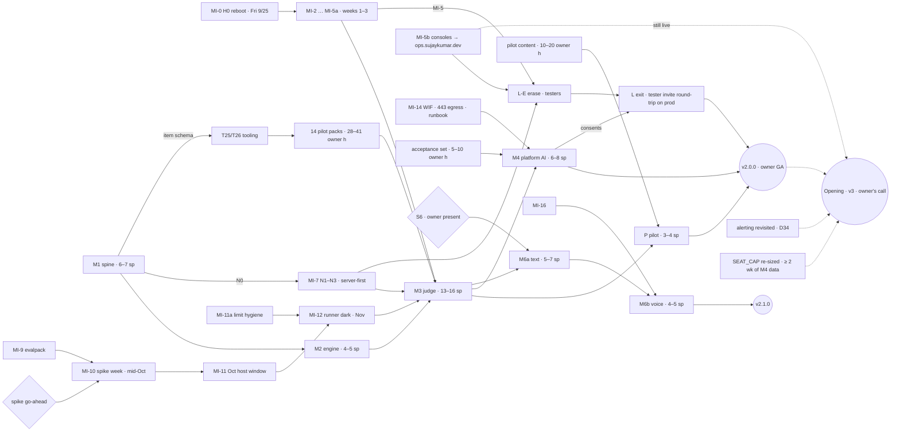

# xLearn v2 — infra-first rollout plan and milestone map

> **Status:** Proposed (from T7, 2026-09-24) · **Owner:** @sujaykumarsuman · **Live release:** v1.5.2
> **What this is:** the authoritative T7 deliverable. A later build-plan session turns it into
> `docs/v2/build-plan.md`, `docs/v2/status.md`, sprints and prompts (mirroring [`../v1/`](../v1/)).
> **Decisions:** D32–D35 in the [feasibility log](feasibility.md#decisions-log-newest-first) and the
> [T7 section](feasibility.md#t7--cross-cutting-and-infra-first-rollout) · ADRs
> [0026](../adr/0026-per-course-extensibility-model.md) ·
> [0027](../adr/0027-content-evalpack-and-user-data-model.md) ·
> [0028](../adr/0028-object-storage-and-backups.md) ·
> [0029](../adr/0029-judge-contract-and-learning-signal.md) ·
> [0030](../adr/0030-runner-technology-and-host-hardening.md) ·
> [0031](../adr/0031-platform-ai-and-two-tier-keys.md) ·
> [0032](../adr/0032-realtime-ai-mock-interviewer.md) ·
> [0033](../adr/0033-invite-only-admission-and-owner-admin.md) (admission) ·
> [0034](../adr/0034-v2-release-labelling-gating-and-rollback.md) (releases) ·
> [0035](../adr/0035-v2-operations-nats-auth-limits-capacity.md) (operations) ·
> [PRD](../prd/xlearn-v2-prd.md) · research: [t7 appendix](research/t7-cross-cutting-and-rollout.md).

**How to use this doc**
- **Decisions live in the ADRs; this doc holds order, gates and sizes.** If the two disagree, the ADR wins and this doc gets fixed.
- **Sizes are sprints.** One sprint ≈ one focused session; v1 ran S01–S12 in two calendar days. Dates marked *(inferred)* are estimates, not commitments.
- **Where codes:** **I** `../infra` (GitOps) · **X** this repo · **H** host scripts (`../infra/hack/`, applied by hand) · **E** `xlearn-evalpack` (new private repo) · **O** owner or external.
- **Risk key:** ○ none · ◐ a blip (restart, short caller list, bookmark change).
- **Gates are checkboxes.** Every sprint plan copies its entry gates from §3/§5 as `[ ]` items.

---

## 1. Frame (D32–D35)

- **v2 is used by the owner only (D35).** v2.0 GA = **MI + M1–M4 + pilot + L, complete for the owner**. Real learners don't get in before **v3**. That's the owner's choice, not a technical limit.
- **The invite flow is built anyway (D33, D35).** The whole learner gate **L** ships in v2: invites, `SEAT_CAP`, acceptance, privacy notice, 18+, region, erase, and the `tester` role. The owner and testers exercise it. One invite round-trip is rehearsed on production with a tester, and then production goes back to `SIGNUP_MODE=closed`.
- **Signup is closed (D33).** Two parts, both **live in v1.5.2** (2026-09-24):
  - **MI-2b:** GitHub no longer auto-links into accounts that have a password (amends ADR-0023 §3). xlearn#51.
  - **MI-2c:** `SIGNUP_MODE ∈ {open, closed}` (`invite` reserved for v2); anything but `open`, unset included, is `closed`. xlearn#52, with infra#30 setting `closed` on identity. **Production signup has been closed since 2026-09-24 (D13 enforced).** v1.5.2 honours `open` without `DEV_AUTH`; that runtime guard is M1b work (§4).
- **The opening is v3 (D35).** Its gates are listed in §11: MI-5b live, alerting revisited, `SEAT_CAP` re-sized from ≥ 2 weeks of M4 data, the privacy notice (reviewed by the owner, moved there by D40) and erase live, and `SIGNUP_MODE=invite`.
- **Release labels (D32).** Every milestone ships as a **1.x minor**:
  - **`v2.0.0`** is the owner-facing GA default flip;
  - **`v2.1.0`** is the interviewer GA (M6a + M6b);
  - **M5** is a later 2.x minor;
  - the API stays `/api/v1`.

  **Guard in place (MI-2a, ✅ 2026-09-24):** the ImagePolicies are bounded to `<2.0.0` (infra#29), and CI checks `.release-line` (xlearn#53).
- **No alerting in v2 (D34).** The owner monitors with **landscape and kubescope**, plus `host-verify --cluster`. **Accepted risk:** a failure is seen only when the owner looks. This is revisited before the first real invite.
- **No new platform component.** JetStream, the outbox and judge's Postgres `SKIP LOCKED` queue carry v2. Five small code changes ship dark in M1 (N0). NATS gets nkeys **server-first**, with fine ACLs rendered from `topology.go`.
- **Infra first, interleaved.** The MI track starts now and is **hard-gated before M3**. Engineering is rarely the long pole. The long poles are owner go-aheads, the spike, the host window and content hours.

---

## 2. MI infra track

**Placement:** interleaved with product work, with a hard gate before M3 (§5).
- A separate infra milestone before M1 would idle product work while the spike waits for a go-ahead and the host block waits for a window.
- Doing it just in time would bunch the risky changes next to M3.

**Size:** 6–8 sprints, mostly small infra PRs, plus spike days.

| Step | What | Where | Risk | Depends on | Unblocks | Target |
|---|---|---|---|---|---|---|
| **MI-0** | **H0 reboot** into kernel 6.8.0-142.<ul><li>Re-run `host-verify --pre-reboot --cluster` (GO on 9/24, 45/45 pass).</li><li>**Copy `/tmp/xlearn-s0-vmstat.log` off the node first**, because tmpfiles empties `/tmp` at boot.</li><li>Check the date of the last Hostinger weekly image.</li><li>Reboot, then run `host-verify --cluster`.</li><li>sar already holds 9 days of steal, so restarting the sampler is optional.</li></ul> | H/O | ◐ CNPG and NATS down for minutes | — | everything | **Fri 2026-09-25** |
| MI-1 | **Owner hygiene:** Hostinger 2FA; 2 offline copies of the age key; 2FA on GitHub, Anthropic and OpenAI. No healthchecks.io project (D34). | O | ○ | — | M4 (provider accounts); the opening | week 1 |
| ~~MI-1a~~ | **Dropped (D34).** No `host-check` timer and no dead-man. | — | — | — | — | — |
| MI-2 | **Prune guard:** `kustomize.toolkit.fluxcd.io/prune: disabled` on the CNPG Cluster, the `databases` Namespace and the NATS PVC's namespace. Not done yet, and with no backups it's the cheapest data-loss guard. | I | ○ | — | — | week 1, **first** |
| MI-2a ✅ | **Accidental-major guard (done):** all 7 `xlearn-*` ImagePolicies are `>=1.0.0 <2.0.0` (infra#29), and a `deploy.yml` step refuses any tag whose major ≠ `.release-line` (`1`) (xlearn#53, `363dee9`). | I + X | ○ | — | every v2-build tag | ✅ 2026-09-24 |
| MI-2b ✅ | **v1.5.x stopgap, part 1 (done):** GitHub auto-links only into accounts without a password (amends ADR-0023 §3). xlearn#51 (`e915479`); it doesn't change signup. | X | ○ | — | the pre-account hijack closed | ✅ live in v1.5.2 |
| MI-2c ✅ | **v1.5.x stopgap, part 2: `SIGNUP_MODE` (done).** xlearn#52 (`1b90d2b`) plus infra#30.<ul><li>`SIGNUP_MODE ∈ {open, closed}` (`invite` reserved for v2); anything but `open`, unset included, is `closed`;</li><li>`POST /auth/signup` → 403 `signup_closed`, checked before the body is read (no email oracle); a new OAuth user → `/xlearn/auth?error=signup_closed`; existing accounts log in as before;</li><li>docker-compose sets `open`; infra#30 sets `closed` on `xlearn-identity`.</li></ul>**Not carried:** `open` is honoured **without** `DEV_AUTH`. The ADR-0033 §3 / L7 runtime guard moves to M1b (§4). Accounts strangers created before v1.5.2 stay v1-only until M1a/M1b can mark or suspend them. Nobody can run code before M3. | X + I | ◐ no new signups | — | D13 enforced | ✅ live in v1.5.2; closed in prod since 2026-09-24 |
| MI-3 | **Chart 0.3.0:** the full knob union (§2.1), all off. A new `hack/chart-diff.sh` (written in this PR) must show a byte-identical `helm template` for all 11 releases. | I | ○ | — | MI-4 … MI-16 | week 1 |
| MI-4 | **`sandbox-guards`:** `xlearn-runner` is **born default-deny** (no DNS).<ul><li>PSA labels, VAP, RuntimeClass `xlearn-judge`, PriorityClass −1000, Quota, LimitRange;</li><li>a judge→runner policy.</li></ul>The namespace stays empty. | I | ○ | MI-3 | MI-12 | weeks 1–2 |
| MI-5 | **NetworkPolicies for `databases` and `messaging`**, selecting on `app.kubernetes.io/instance`:<ul><li>**PG 5432:** the 6 DB-owning services, **not the gateway**;</li><li>**NATS 4222:** practice, review, assessment;</li><li>**CNPG :8000:** `cnpg-system` only;</li><li>**NATS 8222:** no pod; the host reads it node-locally.</li></ul>**Forward-declare later callers now**, because a missing selector blocks its caller silently:<ul><li>NATS: identity (N2), judge (MI-13), coach (the L-E erase consumer);</li><li>PG: judge.</li></ul>Any other new caller updates the policy in its own infra PR, merged before its tag. | I | ◐ short caller list | — | M3; N3; L-E | week 2 |
| MI-5a | **`xlearn` ingress:**<ul><li>the gateway accepts traffic only from Traefik;</li><li>internal routes (`/sessions/*`, `/internal/*`) accept only the `xlearn` namespace;</li><li>the runner is denied.</li></ul> | I | ◐ | MI-3 | **M3**; L | weeks 2–3 |
| **MI-5b** | **Admin-console isolation.**<ul><li>A DNS record and cert for `ops.sujaykumar.dev`.</li><li>Move the IngressRoutes for kubescope (cluster-admin, exec), landscape and the read-write Longhorn UI there, with Longhorn's ForwardAuth, plus airlift's `/api/admin` if it's exposed.</li><li>**Acceptance:** the consoles reject cross-origin requests (an `Origin`/`Sec-Fetch-Site` check on mutating calls and WebSocket upgrades), because a sibling subdomain is still same-site. If they don't, the IP allowlist stays.</li><li>**Interim:** an IP allowlist on kubescope and Longhorn, or kubescope exec off.</li></ul>After this, no admin console shares xLearn's origin. | I + O | ◐ the owner's monitoring URLs change (landscape and kubescope are the D34 monitoring) | — | **Required before the first non-owner account on production, a CLI-minted `tester` included** (ADR-0033 §11). That means **before L-E's first tester**, and it's also an opening gate. Ideally before the M1 Markdown renderer. | weeks 2–4 |
| MI-6 | **N0 code**, shipping dark in the next M1 tag that's ready:<ul><li>`topology.go` with golden-ACL, budget and subject-registry tests;</li><li>the dead-letter hook;</li><li>identity publishing `XLEARN_IDENTITY`;</li><li>nkey client options;</li><li>pinned `pgxpool` `MaxConns`.</li></ul>Also a **compose integration test with NATS 2.14 running the rendered `authorization` block**. Per service it runs `ensureStream`, a filtered consumer, fetch, ack and nak, and it asserts that the service is **denied** publishing on another service's subject, updating another service's stream, and purging. | X | ○ dark | — | MI-7 | next M1 tag |
| MI-7 | **NATS auth, server-first.**<ul><li>**N1:** nkey users with fine ACLs, plus a `legacy` user and `no_auth_user: legacy`. This is the **one restart**.</li><li>**N2:** each service mounts its seed and sets its env.</li><li>**N3:** `legacy` gets `deny ">"` as a reload. Verify that no `legacy` connection exists right after the reload and again ≥ 24 h later (`host-verify --cluster`).</li></ul>N4 is in MI-15. | I | ◐ one restart; the outbox buffers | MI-6 merged (golden file); MI-6 tagged and its integration test green before N2; MI-5 before N3 | **M3; L-E** | weeks 2–4 |
| **MI-8** | **Replaced (D34):** a **`host-verify --cluster` extension** (ADR-0035 §3) of read-only, on-demand checks:<ul><li>the memory-sum rule, including containers with no limit and no budget entry;</li><li>Flux objects not Ready;</li><li>OOMKills, > 3 restarts in 24 h, CNPG health;</li><li>PG or NATS PVC ≥ 60%, node disk ≥ 70%;</li><li>NATS `auth_required`, and any `legacy` connection after N3;</li><li>expected NetworkPolicies present;</li><li>sar steal and CPU (the TR-* thresholds).</li></ul>Not an alert. Run it after host changes and in the release checklist before contract, erase or GA tags. | H | ○ | MI-0 | M3 checklist reads; TR-* measurement | weeks 2–4 |
| MI-9 | **Evalpack plumbing:**<ul><li>machine user; private repo and CI with the anonymous-GET probe;</li><li>private GHCR package;</li><li>PAT → SOPS pull secret in `xlearn` and `flux-system`;</li><li>ImageRepository + ImagePolicy `>=1.0.0 <2.0.0`.</li></ul>The PAT's expiry date goes in status.md as a manual check, not an alert. | E + O + I | ○ | — | M3; the image-volume spike | weeks 2–4 |
| MI-10 | **Spike week** (D23; owner go-ahead): P0–P3 on multipass and the amd64 replay (Go, C++ and Python allowlists; TSAN), **plus the image-volume spike** on the same throwaway k3s. **Optionally the WIF spike too.** | scratch | ○ | owner go-ahead; MI-9 (image volume) | MI-11; M3 | mid-October |
| MI-11 | **October host window:**<ul><li>the host sandbox block;</li><li>**L23 kubelet args** (`system-reserved` 1 GiB, `eviction-hard memory.available<500Mi`) and pid limits;</li><li>k3s v1.36.5 (only if it's GA; `-rc1` today);</li><li>CNPG 18.6 (`18.6-system-trixie` verified).</li></ul>One k3s restart plus one PG restart. Snapshot first. | H + I | ◐ | MI-10 GO | MI-12 | late October |
| **MI-11a** | **Limit hygiene:**<ul><li>the 6 Flux controllers go from 1 GiB to 512 Mi each (use is 70–174 Mi), freeing ≈ 3 GiB of limits;</li><li>limits on Traefik, cert-manager and metrics-server;</li><li>Longhorn budgeted at measured p95 × 1.5. Don't cap instance-manager blindly: it serves the PG and NATS volumes.</li></ul> | I | ◐ controller restarts | MI-3 | **MI-12** (the runner adds 3 GiB of limits) | October, before or with MI-11 |
| MI-12 | **Runner dark:**<ul><li>`runner-v1.0.0` with **`strategy: Recreate`** and a 70 s grace period (its Quota would stall a surge);</li><li>the `runner` Kustomization `dependsOn: sandbox-guards`, **off `apps`' `wait` path**;</li><li>a 2nd IUA (`update.path: ./runner`); the bearer token in SOPS;</li><li>the acceptance suite; per-language time-limit multipliers.</li></ul>The image exists before its policy. | X + I | ○ dark | MI-4, MI-11, MI-11a | M3 | November |
| MI-13 | **judge HelmRelease:**<ul><li>port 8087; the ADR-0005 4-step for schema and role;</li><li>the evalpack image volume; kill-switch env;</li><li>**born with default-deny egress** (DNS, PG, NATS, runner only).</li></ul>Tag the release that first builds `xlearn-judge`, *then* merge the infra PR. | X + I | ○ | MI-3, MI-5a, MI-7, MI-9 | M3 | with M3-1 |
| MI-14 | **M4 gates:**<ul><li>the WIF spike (≤ ½ day, any time before M4);</li><li>judge 443 egress;</li><li>the `xlearn-judge-llm` SOPS secret;</li><li>the provider runbook: workspace `xlearn-platform-prod`, a **$15** hard limit with the app cap at $12 (D25's dogfood defaults; v2 is owner-only, D35), Console spend alerts at 50%/80%, auto-reload off. Raise to $100 / $80 at the v3 opening (§11).</li></ul>No push ping (D34). The provider console's own notices are external to the cluster. | scratch + I + O + X | ○ | MI-13 (egress, secret); the WIF spike needs nothing | **M4** | December (spike earlier) |
| MI-15 | **Track B, spread out:**<ul><li>PSA labels (`xlearn`, `databases`, `messaging`);</li><li>SA tokens off on v1 releases;</li><li>`xlearn` egress;</li><li>PG `connectionLimit` 20;</li><li>Renovate;</li><li>**N4:** remove `legacy` and `no_auth_user` together as a reload, or restart in the monthly window if 2.14.6 refuses.</li></ul> | I | ◐ each | MI-3 | hygiene | October–December |
| MI-16 | **M6b gates:**<ul><li>CSP and Permissions-Policy in the gateway;</li><li>camera and mic deny middleware on sibling apps;</li><li>coach at 500m / 256 Mi, grace 60 s, `rollingUpdate` 1/0;</li><li>a 20 s SDP route;</li><li>coach WSS egress.</li></ul> | X + I | ◐ | MI-3 | **M6b** | before M6b (Q1 2027) |

### 2.1 Chart 0.3.0 knob list

One PR carries the union of every topic's asks, all default-off:
- `automountServiceAccountToken`;
- `runtimeClassName`, `priorityClassName`, `hostUsers`;
- `dnsPolicy`/`dnsConfig`, `terminationGracePeriodSeconds`;
- **split readiness and liveness paths**, with readiness on `/readyz` as a per-release opt-in;
- `image.digest`;
- `initContainers` (the evalpack fallback);
- **NetworkPolicy with multi-source ingress, a same-namespace source, and an egress template**;
- **`strategy.rollingUpdate`** (`maxSurge`/`maxUnavailable`);
- `workload: cronjob`. After D34 it has no v2 user. **Keep it anyway (default-off):** the healthchecks.io/opscheck design kept for the D34 revisit needs it, and adding it later means another bump that re-renders every release.

`imagePullSecrets`, `extraVolumes`, `podAnnotations` and `strategy.type` already exist. **No later milestone reopens the chart for a knob listed here.**

### 2.2 Operating rules (every MI step and every tag)

| Rule | Detail |
|---|---|
| **Consumers before producers** | Two consecutive tags plus the subject-registry test. A single tag has no ordering, because one IUA commit bumps every service. The substitute is shipping the producer dark behind a T-2 env. |
| **Server before clients** for nkeys | A new stream or consumer needs its **infra ACL PR merged before the service tag**. |
| **ImagePolicy range order** (ADR-0034 §1.4) | Ordinary releases never touch a range. Each kind of change has one fixed order:<ul><li>**a new policy or a raised floor:** tag first, then merge (image before policy);</li><li>**a superset widening** (GA; a runner or pack major): merge first, then tag. First run the pre-flip check: no non-prerelease `2.*` git tag and no such GHCR tag on any `xlearn-*`;</li><li>**a narrowing:** R-b rollback only; the merge *is* the rollback.</li></ul> |
| **Image before HelmRelease or policy** | A brief crash-loop until the schema exists self-heals, as in v1. |
| **Verify the host** | Run `host-verify --cluster` (with the MI-8 extension) after every reboot, k3s upgrade, rebuild or restart-inducing infra PR. |
| **Snapshots** | Check the date of the last Hostinger weekly image before any restart-inducing step. Take a **manual snapshot right before any contract, erase or GA tag**, and only once host changes have settled. |
| **No hand-applied changes** | Never `kubectl apply` by hand. The sanctioned manual paths are:<ul><li>the admin CLIs via `kubectl exec` (D33);</li><li>the **NATS ops break-glass**: an `ssh sujaykumar-vps` port-forward plus the `nats` CLI from the owner's machine with the offline ops seed.</li></ul>Each use is logged in status.md. |
| **Infra PRs stand alone** | Infra PRs are their own tasks, **never folded into a tag**. |
| **Flux and tags** | Never edit the tag line. Never suspend the shared IUA: it also freezes airlift, landscape, hub and kubescope. **Never move or re-push a tag:** GHCR is overwritten, and Flux doesn't roll because the tag string is unchanged. |
| **Parallel sessions** | Check peers' tags, PRs and ADR numbers before tagging or numbering. |

---

## 3. Milestone map

| MS | Goal | Entry gates | Exit criteria | Sprints | Earliest (inferred) |
|---|---|---|---|---|---|
| **M0** ✅ | Namespace rule; coach P0 fixes | — | live: v1.5.0 (`/u/` profiles), v1.5.1 (F010 coach fixes) | done | done |
| **MI** | Cluster safe for untrusted code | MI-0 (H0) | Track A green; runner acceptance suite passes dark; `host-verify --cluster` (extended) green | **6–8** | Sep 25 → Nov |
| **M1** | Spine with no behaviour change, plus the security floor | MI-2; MI-2a live (✅); AB01–AB03 frozen before M1b | golden = v1; every v1 e2e green; events replay; the only visible changes are the D27 confirm, D31 and 429s | **6–7** | October |
| **M2** | Attempt engine, projections, D2, `public-read` | M1 shipped; AB04–AB06 and AB22 frozen | replay equal; below-clean items get a ladder; the public route is `public-read`-only | **4–5** | late October |
| **M3** | Judge plus code grader (Go, C++, Python) | **the hard checklist (§5)** | packed items execution-graded with provenance (owner and tester cohort); kill switch tested; denylist test green | **13–16** | November |
| **P** | Pilot course (go-concurrency recommended) | M3; P3 TSAN result; PRD Q5 confirmed; AB14–AB15 frozen | ships as manifest plus content, with widget/profile code only; manifest `preview` | **3–4** | December |
| **M4** | Platform AI (owner cohort) | MI-14; acceptance set labelled; AB16–AB18 frozen | pre-fill within caps; exhaustion → manual; ledger within ±5% of the Console | **6–8** | December |
| **L** | Learner gate, **built and exercised by the owner and testers** | M1a columns and M1b CLI; **MI-5b before the first `tester`**; MI-5 + MI-7 N3 (for L-E); MI-5a; M4 (for L-C consents); AB21 frozen before L-E and AB19–AB20 before L-A | **invite round-trip rehearsed on production with a tester**, then production back to `SIGNUP_MODE=closed` (§4) | **3–4** (∥ M3/M4) | Nov → Dec |
| **v2.0 GA** | `v2.0.0`: the **owner-facing default flip** | MI + M1–M4 + P + L complete; the GA checklist (§4) | judge and platform AI on, pilot `active`, for every account; in v2 that's the owner and testers. `SIGNUP_MODE` stays `closed`. **No dogfood gate** (≥ 2 weeks of M4 data is an *opening* gate) | — | **≈ Dec 2026–Jan 2027** |
| **M6a** | Text interviewer plus failsafes | S6 before the design freeze; M3 `mock` context; twin fairness gate; AB13 and AB24–AB28 frozen | a 45-minute text mock survives pause and resume and scores once | **5–7** | Q1 2027 |
| **M6b** | Voice, one shell | S6 result; MI-16; `account.region`; AB29–AB30 frozen | a voice mock on the learner's key, with no media on the node | **4–5** | **v2.1.0 ≈ Q1 2027** |
| **M5** | DSA evaluator-only | every live DSA item packed | no self path left in DSA | **1** | a later 2.x minor (or v2.1.0 if it's ready by then); ≈ H2 2027 |
| M6c | Interviewer extras | M6b | — | 3+ | v2.2 |
| **Opening (v3)** | Real learners by invite | **§11 checklist**; the owner's call | first real invitee admitted | — | **v3** |

**Totals:** **v2.0 ≈ 41–52 sprints** (MI 6–8, M1 6–7, M2 4–5, M3 13–16, P 3–4, M4 6–8, L 3–4). That's about 2 weeks of sessions at v1's pace. **v2.1 = 9–12** (M6a 5–7 + M6b 4–5). M5 is 1 sprint; M6c is 3+ (v2.2). *The build plan decomposes these into finer one-session sprints plus design (`ds-*`) and spike (`spk-*`) sprints, so its counts run higher; [build-plan.md](build-plan.md) is authoritative for sprint counts.*

---

## 4. Per-milestone detail

### M1: spine (M1a expand → M1b → M1c contract) · 6–7 sprints

| | |
|---|---|
| **Scope, T0** | <ul><li>The `course` package and `dsa/course.json` with a golden test;</li><li>the glob loader; the id guard and retire; the course-slug guard;</li><li>`path_slug` everywhere, plus the v2 envelope; `total`/`max_total`;</li><li>gateway course resolution with DSA aliases; `/:course/*`; `useCourse()`; manifest nav;</li><li>M1c drops the CHECKs and `total_35`.</li></ul> |
| **Scope, T1/T5/T6** | <ul><li>`withhold()` on every surface, with a route-enumeration test;</li><li>the Markdown renderer; the 2 Example-1s rewritten;</li><li>compose parity (PG 18, NATS 2.14);</li><li>D27 assist capture; the BYO cap (L18, 300/day);</li><li>the `interview` key and catalog; AEAD binding and keyring; OpenAI `store:false`; `ErrModelAccess`.</li></ul>The coach P0 fixes already shipped in v1.5.1. |
| **Scope, T7** | <ul><li>**M1a identity columns:** `role ∈ {learner, tester, owner}`, `status`, `admitted_via`, `invite_id`, `accepted_at`, `region`;</li><li>limits L1–L6 in the gateway and L3 in identity; CSP;</li><li>**M1b, the L7 `DEV_AUTH` guard:** identity honours `SIGNUP_MODE=open` only with `DEV_AUTH` set, otherwise runs `closed` and logs at ERROR (ADR-0033 §3; v1.5.2 didn't carry it);</li><li>`RequireRole`; the session status join and revoke-all;</li><li>the `identity admin account` verbs and `seats`, plus `admin_audit`, including `account create --role tester`, which prints an initial password once;</li><li>enrollment slug validation;</li><li>public-dashboard tasks P1 (D31; v1.5.2 didn't carry it), P2, P4 and P10;</li><li>N0 plus the pool pins and the NATS-auth compose test (MI-6); the subject-registry test; the contract-header lint.</li></ul> |
| **Services** | all 7 |
| **Infra** | MI-6/MI-7 alongside |
| **Artboards** | AB01–AB03 |
| **Content** | The item schema freezes, which unblocks authoring. Rewriting 2 statements takes about 1 h. |

### M2: attempt engine and projections · 4–5 sprints

| | |
|---|---|
| **Scope** | <ul><li>**M2a:** `purpose=touch`, a server-timed touch start, and `touch_concluded`.</li><li>**M2b:** `touch_scored` plus backfill; `proj_activity`; drop and replay; **`public-read` + `/public/stats` + visibility toggles + header totals from visible courses** (P3, P5, P6, P9).</li><li>**M2c**, in the same release as M2b: DSA anchors the ladder on every conclusion (D2). `revision_item.anchor_rule` is stamped, and `REVISION_ENTRY_RULE` is the kill switch.</li><li>Today in minutes (D4).</li></ul> |
| **Tag order** | The M2a **and M2b** consumers ship in the first tag. The producers follow in the next tag, or ship dark behind a T-2 env. Unknown subjects are acked silently, so a producer that ships alongside its consumer loses events. |
| **Services** | practice, review, assessment, gateway, identity, web |
| **Artboards** | AB04★, AB05, AB06, AB22 |
| **Content** | none new |

### M3: judge plus code grader · 13–16 sprints (M3-1 judge dark → M3-2 Run/Submit)

| | |
|---|---|
| **Scope** | <ul><li>judge with the `code` and `key` graders; one runner lane; `verdict_timer@1`, `weighted_gate@1`, `self@1`;</li><li>practice's first consumer plus the pull reconciler; the sync close and give-up; drafts;</li><li>arena submits and history; strong-rule hints and mistake pre-fill;</li><li>the DTO allowlist and denylist; `MaxBytesReader` with a typed 413 (L6);</li><li>the **D15/D16/D18 flow** (45:00, hint at 15, no re-implement, reveal = Miss);</li><li>CodeMirror, lazy-loaded with the `vite:preloadError` reload;</li><li>admission control L9–L16; degradation badges;</li><li>the `judge admin` CLI (`breaker`, `review-flags`).</li></ul> |
| **Cohort and erase** | judge is **born with its `XLEARN_IDENTITY` erase consumer** at M3-1. Every judge feature is gated on the owner and tester cohort (T-3). |
| **Ops** | No opscheck J checks (D34). judge telemetry rows, badges and `judge admin` reads replace them. |
| **Services** | **judge and runner (new)**, practice, gateway, web, review, assessment |
| **Infra** | MI-12, MI-13 |
| **Artboards** | AB07★ to AB12 |
| **Content** | The T25/T26 tooling, then **14 pilot packs** with Go, C++ and Python references (28–41 owner h) |

### P: pilot course · 3–4 sprints

| | |
|---|---|
| **Course** | **go-concurrency (recommended; confirmed at P entry; PRD Q5 stays open).** It reuses the Go toolchain, the code widget and the quiz, and it's honor-grade. It needs P3's TSAN result. SQL is the fallback: the cheapest *checked* course, but the heaviest runner profile. The choice changes nothing before M3. |
| **Scope** | <ul><li>about 10 items;</li><li>the go-race profile (`runner-v1.1.0`);</li><li>the quiz widget (A7) with `weighted_gate@1`;</li><li>the multi-course catalog, agenda and nav.</li></ul>The manifest ships as `preview` and flips to `active` at GA. |
| **Services** | curriculum, judge, runner, web, gateway |
| **Artboards** | AB14, AB15, plus AB02 and AB05 at full fidelity |
| **Content** | 10–20 owner h |

### M4: platform AI · 6–8 sprints

| | |
|---|---|
| **Scope** | <ul><li>`platform/llm`; the `internal/judge/ai` Scorer plus ledger; the llm lane;</li><li>the analyzer, which also runs on passes (D16/D26);</li><li>provisional, dispute and claims; pointer notes;</li><li>`/api/me/ai-allowance`; the consent toggles (`account_consent`);</li><li>the canary log test;</li><li>the `judge admin` AI verbs (`ai-disable`, `llm-limit`, `disputes export`). These are the on-demand read that replaces the opscheck AI digest (D34).</li></ul> |
| **Gating** | `LLM_PLATFORM_ENABLED`, owner (and tester) cohort until the GA flip. **M4's first day starts the ≥ 2-week data window** that re-sizes `SEAT_CAP` before the opening. |
| **Services** | judge, practice, review, coach (refactor), gateway, web, identity (consents) |
| **Infra** | MI-14 |
| **Artboards** | AB16★, AB17, AB18 |
| **Content** | The analyzer acceptance set: ≥ 70 labelled (≥ 40 test + 30 dev), 5–10 owner h |

### L: learner gate · 3–4 sprints, in parallel with M3/M4

| Part | Scope |
|---|---|
| **L-E erase** (needs N3 + MI-5) | <ul><li>Tombstones, `DELETE /api/me` and the UI.</li><li>Typed confirmation plus a session under 5 minutes old (L8).</li><li>**Consumers at L-E:** practice, review, assessment and coach. judge joins at M3-1.</li><li>identity waits only for the acks that `topology.go` of the running version expects.</li><li>**Who can erase:** the `tester` cohort at L-E; every non-owner account from the L exit. **The owner is always CLI-only.**</li><li>The first tester needs **MI-5b live**.</li></ul> |
| **L-A admission** | <ul><li>The `invite` table; `identity admin invite create\|list\|revoke` (`seats`, from M1b, gains the invite count); `SEAT_CAP` 15.</li><li>**Redeem** on both the email and GitHub paths, inside the account-create transaction under the `identity.seats` advisory lock.</li><li>The invite is **checked before the email**, and every bad invite gets the same `invite_invalid`.</li><li>The code travels in the URL fragment `#invite=…`. The SPA calls `history.replaceState` after reading it.</li><li>`reactivate` takes the seat lock and checks the cap.</li><li>**The acceptance step:** 18+, the privacy-notice version, region. **Every account passes it once, the owner and testers included.** Other APIs return `403 acceptance_required` until it's done.</li><li>**The privacy notice** names Anthropic, 30-day retention, the toggles, and **the data-loss window** (up to ~7 days, D12).</li><li>A `mailto:` "request an invite".</li><li>**The auth page reads the signup mode** (a small public gateway endpoint, e.g. `GET /api/v1/auth/config` → `{signup: closed\|invite\|open}`) and hides the create-account tab while `closed`. v1.5.2 still shows the tab and relies on the 403 `signup_closed` message.</li></ul> |
| **L-C consents** | The two unticked AI consents at acceptance, with M4. |
| **P11** | Suspended or erased accounts return 404 at once; the username stays locked for 60 days. |
| **Exit** | <ol><li>An infra PR sets `SIGNUP_MODE=invite`.</li><li>The owner mints an invite for each create path.</li><li>In a tester-operated browser, each invite is redeemed, one on the email path and one on the GitHub path. Each account (role `learner`) accepts, solves and is graded on the self path (judge stays cohort-gated before GA), then erases itself on the web. Seats return to 0/15. *Optional:* `identity admin account set-role <user> tester` after redemption rehearses a judge grade and frees the seat.</li><li>An infra PR sets `SIGNUP_MODE=closed` again.</li><li>Record the rehearsal in status.md.</li></ol> |
| **Services** | identity, gateway, web, and every erase consumer |
| **Artboards** | AB19★, AB20, AB21 |
| **Content** | the notice text: agent-drafted, it lands with the L-A front door as drafted (D40). The owner reviews it before the opening (§11), and a revision is a content PR |

### v2.0 GA: the owner-facing default flip

GA checklist, in ADR-0034 §1.4 order (copy into the GA sprint):
- [ ] MI + M1–M4 + P + L complete; the M3 checklist (§5) is still green
- [ ] `identity admin account list` shows **no `active` account with role `learner`**: every stranger from v1's open signup has been suspended or erased (ADR-0033 §2)
- [ ] `2.0.0` carries **no contract migration**
- [ ] **1. GA PR (xlearn):** set **`.release-line = 2`** and flip the T-1 defaults (judge and platform AI on, pilot `active`). The release notes carry the behaviour-change list.
- [ ] **2. Optional rehearsal:** `v2.0.0-rc.N`, run in compose. Prereleases never deploy.
- [ ] **3. Pre-flip check:** no non-prerelease `2.*` git tag, and no such GHCR tag on any `xlearn-*`
- [ ] **4. Widen (infra PR):** every `xlearn-*` range becomes `>=1.0.0 <3.0.0`, **merged before the tag**. It's a superset, so nothing moves.
- [ ] **5. Snapshot:** the last Hostinger weekly image is ≤ 7 days old, the host has settled, and `host-verify --cluster` is green. Then take the **manual snapshot**.
- [ ] **6. Tag `v2.0.0`.**
- [ ] **7. Verify and record** (ADR-0034 §6): the `/xlearn/api/v1/healthz` version, the images in `get deploy -n xlearn`, the ImagePolicies' latest, HelmReleases Ready, and a smoke test; record milestone → tag → floor → snapshot
- [ ] `SIGNUP_MODE` stays `closed`, and no invite is minted (the opening is v3)

### M6a / M6b (v2.1) · 5–7 + 4–5 sprints

| | |
|---|---|
| **Design** | Follows T6 / ADR-0032. |
| **Gates** | <ul><li>The **S6** spike (owner present, $10 hard limit) comes before the M6a design freeze.</li><li>The L19 caps.</li><li>MI-16 before M6b.</li><li>The EU/EEA voice gate reads `account.region`.</li><li>The release runbook checks for live interviews. T6's opscheck interview counters are dropped (D34).</li></ul> |
| **Artboards** | AB13 and AB24–AB28 (M6a); AB29 and AB30★ (M6b) |
| **Services** | coach, assessment, judge (`mock` context), gateway, web |

### M5 (later 2.x) and M6c (v2.2)

| | |
|---|---|
| **M5** | 1 sprint once every live DSA item has a pack. A build-time default flip (T-1) with an env override as the kill switch; an AB07 variant. |
| **M6c** | Interviewer extras and the fairness check, 3+ sprints. |

---

## 5. M3 hard entry checklist

A red item blocks the M3 UI sprint. Copy it verbatim into the M3 sprint plans.

- [ ] Spike P0–P3 **GO** and the image-volume spike **GO** (MI-10)
- [ ] MI-4, MI-5, **MI-5a**, **MI-7 (N3)**, MI-9, MI-11, **MI-11a**, MI-12 and MI-13 done
- [ ] **MI-8: `host-verify --cluster` (extended) green.** The memory sum, *with the runner's 3 GiB counted*, is ≤ capacity − 0.5 GiB; no OOMKills; PVCs < 60%; NATS `auth_required`; the NetworkPolicies are present
- [ ] T25/T26 tooling (pre-push fingerprint hook, packlint, `contract_hash`)
- [ ] **14 pilot packs stamped** (Go, C++ and Python references; about 28–41 owner hours)
- [ ] `account.role` live (M1a), so the owner and tester cohort gates judge features
- [ ] TR-STEAL not firing (sar p95 read by `host-verify`), or R2 planned
- [ ] AB07–AB12 frozen
- [ ] The last Hostinger weekly image is ≤ 7 days old

---

## 6. Critical path, parallel tracks, owner calendar

**Critical path:** GA = max(the engineering chain, the owner-hours chain).

| Chain | Path | Lands (inferred) |
|---|---|---|
| **Engineering** | spike go-ahead → spike week (mid-Oct) → October host window → runner dark (Nov) → M3 (Nov) → M4 (Dec) → GA | ≈ late Dec |
| **Owner hours** | 14 packs (28–41 h) → M3 · pilot content (10–20 h) → P · acceptance set (5–10 h) → M4. **≈ 43–71 h**; at ~10 h/week from the M1a schema freeze (~Oct 5). The board hours are off this chain: agents draft every board (D38), each `ds-*` merge is its freeze, and the owner may review boards afterwards, asynchronously (D40). It was ≈ 58–96 h with "hero artboards and reviews (15–25 h)" | ≈ mid-Nov to mid-Dec |

- **Both chains converge around December**, so GA lands ≈ Dec 2026–Jan 2027.
- **The October window date can slip M3 by a month.** Book it the day the spike week is booked.
- **Risk:** steal is elevated and noisy (9-day p95 5.2%, 7.1% on 9/24). If TR-STEAL fires early, R2 (2–3 days) moves ahead of M3.
- Everything else (MI-2 … MI-9, L, S6) has float. **MI-5b has float only until the first `tester` is minted**, which is L-E, around the M2/M3 boundary.

**Parallel tracks**

| Track | Carries | Starts |
|---|---|---|
| **Content** (owner, ~10 h/week) | 14 pilot packs → pilot course → acceptance set → **D6 waves after GA**: the week 1–4 packs (~35 in total) and the full 151-item self tier | after the M1a schema freeze |
| **MI** (infra) | §2 | now |
| **L** (identity-centred) | L-E after N3 + MI-5; L-A and L-C with M4 | during M3/M4 |
| **Interviewer** | S6 any time the owner is present; M6a after M3, alongside M4 | after M3 |

**Owner calendar events** (calendar events, not sprints). Since D40, an owner-only action is done **before launch**
of the sprint that needs it (listed in that prompt's `## Before you launch (owner)` block), and nothing waits on the
owner mid-session. The build plan's calendar is the detailed list.

| When | Event | Gates |
|---|---|---|
| **Fri 2026-09-25** | **H0 reboot (MI-0).** Copy the S0 log off `/tmp` first; the pre-reboot gate is GO. | everything |
| ✅ 2026-09-24 | **infra#28** (`host-bootstrap` + `host-verify`) merged at 10:03Z; local `../infra` `main` is synced. | MI-0 |
| ✅ 2026-09-24 | **v1.5.2 live** (`1b90d2b`): MI-2b (xlearn#51, auto-link fix) and MI-2c (xlearn#52, `SIGNUP_MODE`; infra#30 sets `closed`), so **signup is closed in production**. **MI-2a done:** xlearn#53 (`.release-line`) + infra#29 (ranges `<2.0.0`) | M1 tags |
| weeks 2–4 | **MI-5b:** a DNS record and cert for `ops.sujaykumar.dev`; update the landscape and kubescope bookmarks | the first `tester` (L-E) |
| mid-October | **Spike week** (P0–P3, image volume, optionally WIF). The owner's go-ahead (D23) is launching the spike prompt (D40). | MI-11, M3 |
| late October | **October host window** (MI-11, with MI-11a). Book it with the spike. | MI-12, M3 |
| before M4 | **WIF spike** (≤ ½ day), if it didn't run in the spike week | M4 |
| before the M6a design freeze | **S6** voice spike (owner present, $10 hard limit) | M6a |
| before launch of each contract, erase or GA tag sprint | **Hostinger manual snapshot** (hPanel; owner-only, D40) | — |
| L exit | **Tester invite round-trip** on production (`invite` → `closed`) | L exit |
| GA day | **GA snapshot** (before launch of the GA cut), then the range PR and the `v2.0.0` tag | v2.0.0 |

---

## 7. Indicative tag timeline

This table is copied from ADR-0034 §1.6 and must stay identical to it. Take the **next free minor** at tag time: v1 fixes and peer sessions may interleave, and semver sorts 1.10 above 1.9. L's tags **stay in v2** (D35). Release titles read like `v1.9.0 — v2 build · M2a`. **From `v2.0.0` on, the minor moves only at a GA flip**; everything else is a patch.

| Tag | Content | Gate state after | Rollback floor after |
|---|---|---|---|
| v1.5.2 | the ADR-0033 §2 stopgap: #51 auto-link fix + #52 `SIGNUP_MODE` closed (infra#30 sets `closed`). `open` isn't yet tied to `DEV_AUTH` (M1b) | signup closed (since 2026-09-24) | — |
| — (infra + CI) | ✅ **§1.3 guard**: every range `<2.0.0` (infra#29); the `.release-line` check (xlearn#53) runs from the next tag | — | — |
| v1.6.0 | M1a expand: identity `role`/`status` columns; consumers accept the v2 envelope; N0 if ready | no behaviour change | none (expand only) |
| v1.7.0 | M1b: producers emit the v2 envelope; course resolution; `withhold()`; limits; `RequireRole`; `identity admin` verbs | golden = v1 (D27 confirm, D31 and 429s aside) | **1.6.0** (v2 envelopes in the log) |
| v1.8.0 | M1c **contract** (snapshot first) | — | **1.7.0, hard** |
| — (infra) | NATS N1 → N2 → N3 (ADR-0035) | — | client images ≥ the N0 tag |
| v1.9.0 | M2a `touch_concluded` consumer **and the M2b consumers**; producers idle | producers off | — |
| v1.10.0 | M2a/M2b producers on; projections v2 replay; M2c D2 rule | D2 on (`REVISION_ENTRY_RULE` = kill switch) | 1.9.0 |
| v1.11.0 → v1.12.0 | L-E erase consumers (practice, review, assessment, coach) → `DELETE /api/me` and its UI (snapshot before 1.12.0) | web erase: **testers only**; owner refused (CLI only) | 1.11.0 |
| runner-v1.0.0 · evalpack v1.0.0 | runner dark (MI-12); first pack | runner reachable only from judge | — |
| v1.13.0 → v1.14.0 | M3-1 judge dark, born with its `XLEARN_IDENTITY` erase consumer (8th image; infra PR **after** the tag) → M3-2 Run/Submit, arena, the D15/D16/D18 flow | `JUDGE_BASE_URL` set; judge features cohort-only | 1.13.0 |
| v1.15.0 (+ runner-v1.1.0) | P: pilot course (go-concurrency) as `preview`; the go-race profile | `preview` = cohort only | consumers ≥ 1.7.0 |
| v1.16.0 | M4 platform AI | `LLM_PLATFORM_ENABLED` + cohort | — |
| v1.17.0 | L-A: invite flow, acceptance, notice, 18+, region, consents; web erase opens to every non-owner account. **An invite round-trip is rehearsed on prod with a tester**, then `SIGNUP_MODE` returns to `closed` | `closed` | — |
| (`v2.0.0-rc.N`) → **v2.0.0** | **GA** (§1.4): the default flip for the owner; no learner opening | kill switches stay | GA has no contract; R-b to `<2.0.0` returns to the last 1.x |
| v2.0.x | D6 content waves (self-tier items are compiled into images; packs ride evalpack `v1.x`); M6a/M6b dark | cohort | — |
| **v2.1.0** | **Interviewer GA** (M6a + M6b) | — | — |
| a later 2.x minor | M5 `evaluator_only` | env override = kill switch | reversible |

(§ references inside the table point to ADR-0034.)

**Rollback, fastest first** (ADR-0034 §4):
1. **R-a:** the env kill switch.
2. **R-b:** narrow the ImagePolicy, never below the rollback floor.
3. **R-c:** revert plus a patch tag. This is the default.
4. **R-d:** the Hostinger snapshot, **as a procedure**:
   1. pin git back (R-b or R-c);
   2. confirm git HEAD's `xlearn-*` tags equal the snapshot's;
   3. list the erases completed since the snapshot;
   4. restore;
   5. run `host-verify --cluster`;
   6. re-run the listed erases through the CLI and record the lost-writes window.

---

## 8. What ships where; content hours; the D6 reading

| Release | Contains | Excludes |
|---|---|---|
| **v2.0.0** (owner GA) | MI, M1, M2, M3 (DSA judge: Go, C++, Python), P, M4, L (built; rehearsed with testers). Content: the 14 pilot packs and the pilot course, plus any D6 waves already stamped. | real learners, the interviewer, M5, the SD course and canvas, backups, open signup, alerting, a metrics/logs stack, staging |
| **v2.1.0** | M6a text interviewer plus failsafes; M6b voice | M6c |
| **v2.x line** | **D6 content in waves**, as `v2.0.x` patches (the packs ride evalpack `v1.x`): the week 1–4 full packs (~35 in total, including the 14) and all 151 DSA items at the self tier. **M5** as a later 2.x minor after the last pack is stamped. | — |
| **v2.2+** | M6c; the SD course (M4 + canvas AB31 + calibration ≥ 80 per rubric) | — |
| **v3** | **The opening:** real invitees, behind the §11 gates | — |

**Trigger-based at any time, not tied to a release:** R2 (D21's triggers, TR-STEAL, TR-QUEUE, `SEAT_CAP` > 40), R1, backups to the second VPS (D12), the object store (D11's triggers) and staging (ADR-0034 §5).

**Owner hours** *(inferred)*

| When | Content | Owner h |
|---|---|---|
| M1 | rewrite 2 statements | ~1 |
| M3 entry | 14 pilot packs (Go/C++/Python refs) | 28–41 |
| P | pilot course (~10 items plus course gates) | 10–20 |
| M4 | analyzer acceptance set (≥ 70 labelled) | 5–10 |
| every UI milestone | ~~5 hero artboards plus reviews of ~25 drafted boards~~: agents draft every board (D38), and each `ds-*` merge is its freeze. The owner may review boards afterwards, asynchronously, off the gating path (D40) | 0 gating (was 15–25) |
| **gating v2.0** | | **≈ 43–71** (was ≈ 58–96) |
| v2.x waves | week 1–4 packs (~35 in total) + the full 151-item self tier | D6 + D20 = 215–335 h in total, including the rows above |
| M5 | all 151 packed | +230–340 |

**The D6 reading (D35).**
- D6 set "v2.0 content scope" as all 151 DSA items at the self tier, the week 1–4 packs and the pilot. D35 reads that as the scope of the **v2.x line**, delivered in waves. **`v2.0.0` doesn't wait for it.** M3 needs only the 14 pilot packs, and P needs only the pilot course.
- There are no real learners in v2, so no learner frontier exists to stay ahead of until the opening. The waves only need to be ahead of the frontier by v3 (§11, recommended).
- The DPDP notice duties start around 2027-05-13. The notice ships with L in v2, well before then.

---

## 9. Artboards by milestone

- v1 has 12 `.dc.html` artboards, and the F-series shipped with no new ones.
- v2 needs **30 new or reworked boards**, 5 of them heroes (★).
- AB23 (the owner admin page) is **dropped**, because the admin surface is CLI-only (D33).

| Milestone | Artboards |
|---|---|
| **M1** | **AB01** coach states (D27 assist confirm, locked during touches and mocks, 300/day cap, "your key" naming) · **AB02** course nav from the manifest, switcher, `coming_soon`, unknown course (DSA parity) · **AB03** revision v2 (format badges, withheld pattern) |
| **M2** | **AB04★ A8 Touch** (recall + re-solve, L4–5 mock conditions, pass/fail/abandoned) · **AB05** catalog + cross-course agenda, Today in minutes, "grades waiting" · **AB06** public profile v2 (per-course rows, provenance, judge-checked %, **mock count only**, private and empty states) · **AB22** visibility toggles |
| **M3** | **AB07★ A1 Workspace-Code** (45:00 cover, Run/Submit, language picker, hint at 15 caps Assisted, give-up = Miss, pre-fill, resume, self-path variant, **no re-implement**) · **AB08** A2 results dock (queued/running, WA, TLE, CE, inconclusive, `contract_changed`, 413/quota) · **AB09** A4 Problems (dual markers) · **AB10** A5 Arena (manual timer, history + diff) · **AB11** degradation badges · **AB12** Week/Mistakes/Progress deltas (provenance, judge-checked %) |
| **P** | **AB14** A7 Workspace-Quiz · **AB15** go-concurrency multi-file + race verdict (or the SQL explorer) · AB02/AB05 at full fidelity |
| **M4** | **AB16★ A3 AI suggestion / dispute** (accept, edit, re-grade, compare, override, honor claim) · **AB17** pointer notes + "correct, with improvements" · **AB18** AI allowance meter + Settings AI consents |
| **L** | **AB19★ invite acceptance** (18+, notice, region, 2 unticked consents; `invite_required`, `invite_invalid`, no seats, `acceptance_required`; the `mailto:` "request an invite") · **AB20** privacy notice / terms page · **AB21** erase account (typed confirmation, "sign in again", what's deleted, cooldown) |
| **M6a** | **AB13** A9 Mock-v2 · **AB24** setup + consent + pre-flight + $ cap · **AB25** live HUD (text) · **AB26** grace, paused, resume · **AB27** debrief + proposal (explicit accept), `incomplete` · **AB28** accessibility settings |
| **M6b** | **AB29** voice pre-flight, browser and EU notices · **AB30★ voice live HUD** |
| v2.2+ | **AB31** A6 Workspace-Canvas (Excalidraw) |

**Superseded v1 boards**

| v1 board | Replaced by |
|---|---|
| Problem | AB07 |
| Revision | AB03, AB04 |
| Mock | AB13 |
| Dashboard, Week | AB05, AB12 |
| Mistakes, Progress | AB12 |
| Catalog | AB05 |
| Settings | AB18, AB21, AB22 |
| Auth | AB19 |

**Production (D38, build-plan session; D40):** agents draft **all** boards, the 5 heroes included, as static HTML on `theme.css` under `design-system/screens/v2/` in design sprints (`ds-*`). Each board PR lands on CI green, and **the merge is the freeze** (D40). The owner may review a board after the fact; D38's review now happens asynchronously, per D40, and a change to a frozen board is a follow-up design PR. See [build-plan.md](build-plan.md).

**Freeze rule.** A milestone's boards are frozen (its `ds-*` PR merged, D40) before its first UI sprint:

| Boards | Frozen before |
|---|---|
| AB01–AB03 | M1b |
| AB04–AB06, AB22 | M2a |
| AB07–AB12 | the M3 UI sprint |
| AB14–AB15 | P |
| AB16–AB18 | the M4 UI sprint |
| **AB21** | **L-E** |
| AB19–AB20 | L-A |
| AB13, AB24–AB28 | M6a |
| AB29–AB30 | M6b |

**Fix before briefing.** [t4 §8](research/t4-judge-contract.md#8-learner-flows-and-v2-artboards-needed) still lists a "Re-implement" frame in A1 and a "Start attempt · 15:00" cover. Brief AB07 per D15, D16 and D18: 45:00, the hint at 15, no re-implement.

---

## 10. Public-dashboard tasks

| # | Task | Where | Milestone |
|---|---|---|---|
| P1 | **Mock count only (D31):** drop `best` and `average` from the public payload and tile. The authed Progress keeps them. | `gateway/public.go`; `web/src/lib/profile.ts`; `UserDashboard.tsx` | M1b (the v1.5.2 stopgap didn't carry D31) |
| P2 | Show only **enrolled ∩ visible ∩ active** courses (today every active path shows). The resolver returns `visible_courses[]`. | `public.go`; `identity/usernames.go` | M1a columns → M1b filter |
| P3 | Enforced `public-read`: a `["public-read"]` mint and `GET /public/stats?paths=`. `/progress/*` and `/mocks/*` reject it, and it gets its own cache namespace. | `public.go`; `bff.go`; assessment | M2b |
| P4 | Rate limit, a 60 s negative 404 cache, and ≤ 8 concurrent composes | gateway | **M1b** |
| P5 | Visibility toggles. Private returns the same 404 as unknown, the per-course default comes from the manifest, and a change bumps the cache epoch synchronously. | identity `PATCH /accounts/{id}/visibility`; `Settings.tsx` | M2b |
| P6 | Header totals from visible courses only, via `proj_activity` (fixes first-solve inflation) | assessment projections + replay | M2b |
| P7 | Grade provenance and **"judge-checked %"** (`auto ∧ trust=checked`); honor results labelled | `proj_outcome_mix`; `ProgressViews.tsx` | M2b (self) → M3 (checked) → M4 (AI) |
| P8 | Judge stats: counted submits, first-submit acceptance %, languages | `proj_judge_stats` | M3 |
| P9 | Touch stats: touches completed, Day-7 pass rate | `proj_touch_stats` | M2b |
| P10 | **Public-shape allowlist test:** no item ids, per-item pattern, sub-day timestamps, arena or Run counts, prose, `scored_by` or transcripts | `gateway/public_test.go` | M1b |
| P11 | Suspended or erased accounts return a uniform 404 at once; the username stays locked for 60 days | resolver; erase transaction | M1b (suspend) / L-E (erase) |
| P12 | v2 public-profile artboard (none exists) | AB06 | before M2b |

---

## 11. Opening gates (v3)

None of these gates v2.0 GA. All of them gate the first real invitee.

- [ ] **The owner decides to open** (the v3 plan).
- [ ] **MI-5b still live:** no admin console on `projects.sujaykumar.dev`, and the consoles reject cross-origin requests. It has been required since the first `tester`.
- [ ] **Alerting revisited (D34).** Adopt the kept healthchecks.io design (dead-man plus opscheck) or an alternative, or re-accept the no-alert risk in writing.
- [ ] **`SEAT_CAP` re-sized** from ≥ 2 weeks of M4 spend data. It starts at 15; platform AI binds first, at 13–17 seats.
- [ ] **The privacy notice is live**, stating Anthropic, 30-day retention, the toggles and the data-loss window. **Web erase is live for non-owners.**
- [ ] **The owner reviews the privacy-notice text** (moved from l-05 by D40). l-05 landed the agent-drafted text; a revision is a content PR.
- [ ] **Platform-AI limits raised** from D25's dogfood defaults ($15 provider / $12 app) to $100 / $80, re-sized with `SEAT_CAP`.
- [ ] **`SIGNUP_MODE=invite`** via an infra PR. Production never runs `open` while the runner is on the production node.
- [ ] **R2 first if needed.** Open signup (a D21 trigger) or `SEAT_CAP` > 40 (a T7 threshold) requires R2, the dedicated runner VPS, before admitting anyone.
- [ ] The last Hostinger weekly image is ≤ 7 days old, and a manual snapshot is taken right before the first invite.
- [ ] *Recommended:* content is ahead of the frontier (the week 1–4 packs; the week 1–6 self tier).
- [ ] *Recommended:* re-read the TR-* triggers (the memory sum and steal) with the extended `host-verify --cluster`.
- [ ] *Recommended:* the DPDP duties (~2027-05-13) are checked against the notice.

---

## 12. Downstream constraints for the build-plan session

**Docs and ADRs**
- ADRs 0033–0035 record T7's amendments to ADR-0006, 0009, 0014, 0016, 0021, 0023 §3, 0024, 0027, 0028, 0030 and 0031, and the feasibility T7 section lists them. **Don't redo them.** Fold the text into the amended ADRs when 0026–0035 move from Proposed to Accepted at sign-off.
- **Fix** (the PRD §6 rows and the Q5 recommendation are already done):
  - the t4 §8 A1 frames (no re-implement; a 45:00 cover);
  - "Chart 0.2.1" in t3 §8.3 (it's 0.2.2).
- **Rewrite `docs/git-strategy.md`:**
  - rollback = R-a → R-d, dropping "pin the previous tag";
  - the `-rc` convention;
  - the runner and evalpack streams;
  - ~~`.release-line`~~ ✅ landed with xlearn#53 (with the bounded ranges and the GA steps);
  - the range-change order (§2.2);
  - "image before HelmRelease or policy";
  - "infra ACL PR before a new consumer".

**Build-plan layout**
- **`docs/v2/build-plan.md`** takes §3 (milestone map), §6 (critical path) and §2 (the MI table) from this doc.
- **`docs/v2/status.md`** carries these tables:
  - MI rows;
  - **milestone → tag → rollback floor**;
  - the snapshot that preceded each risky tag;
  - the **flag inventory**: ≤ 6 live non-kill flags, each with an owning and a removal milestone. The permanent kill switches and operating modes are listed separately (ADR-0034 §2): the grading override, `JUDGE_BASE_URL`, `LLM_PLATFORM_ENABLED`, `REVISION_ENTRY_RULE`, `SIGNUP_MODE`;
  - **content status**: items stamped per tier per week;
  - the evalpack PAT expiry date (a manual check, D34);
  - the NATS break-glass log and the L rehearsal record;
  - the accepted-risk register: D12 (no backups) and D34 (no alerting).
- Sprint plans and prompts follow v1's layout, one prompt per session.
- **Every sprint lists its entry gates as checkboxes** and names the repo each task touches (I, X, H, E, O). The M3 checklist (§5) and the GA checklist (§4) are copied verbatim.
- **Owner-gated items are calendar events, not sprints** (§6).
- **Infra PRs are their own tasks, never folded into a tag.**
- **No opscheck, healthchecks.io, Flux Alert or push-channel task anywhere (D34).** The MI-8 `host-verify` extension is the only ops tooling.

**xlearn (X)**
- **M1:**
  - `topology.go` with the golden, budget and registry tests;
  - `event_dead_letter` tables in every consuming service, read on demand;
  - identity on NATS, and the `XLEARN_COACH` stream for coach's erase ack;
  - the client options and `MaxConns` pins;
  - limits L1–L6 and L3;
  - `RequireRole`, `withhold()`, and P1, P2, P4 and P10;
  - the contract-header lint.
- **Rules:**
  - the envelope is append-only, and decoders stay forever;
  - `preview` is hidden everywhere, including public stats;
  - judge is the 8th `deploy.yml` job;
  - `runner-release.yml` uses `type=match` and builds reproducibly;
  - the single gateway replica (cache epoch plus in-process limiter) is recorded as a scale-out blocker.

**infra (I)**
- **Done (2026-09-24):** the bounded ranges (MI-2a, infra#29); `SIGNUP_MODE: closed` on identity (MI-2c, infra#30).
- **Now:** the prune guards; chart 0.3.0 as **one PR** behind the new `chart-diff.sh`; `sandbox-guards` before any runner object.
- **Before the first `tester`:** MI-5b (target weeks 2–4).
- **Before MI-12:** MI-11a.
- **NATS:**
  - public keys in plaintext in the `messaging` values;
  - seeds in `apps/secrets`;
  - **no SOPS decryption in `messaging`**;
  - the ACL golden file from X is pasted in and merged before the consuming tag;
  - the ops seed stays offline.
- **Policies:**
  - judge is born with default-deny egress, and M4 adds only 443;
  - the runner stays off the `apps` `wait` path;
  - the evalpack and runner ranges are `>=1.0.0 <2.0.0`;
  - the GA widening merges before the tag.
- **No Flux `Provider`/`Alert` and no opscheck RBAC (D34).**

**Host (H)**
- `host-bootstrap.sh` gains the sandbox block and the L23 kubelet args.
- `host-verify` asserts both, and `--cluster` gains the MI-8 reads.
- The DR runbook re-installs all of it.
- **No `host-check` timer.**

**Operations**
- **Standing gates:**
  - production never runs `SIGNUP_MODE=open` while the runner is on the production node;
  - `SEAT_CAP` > 40 needs R2;
  - any new always-on pod is checked against the **memory sum**, not Σ limits alone, and every new container carries a memory limit;
  - no staging namespace: revisit when a second node exists, or after the v3 opening once there are > 10 active learners and a contract migration touches their data (ADR-0034 §5);
  - no non-owner account, `tester` included, until MI-5b is live.
- **Release checklist:** ADR-0034 §6, copied into every tag sprint.
  - **Before the tag:** check peers' tags; the major equals `.release-line`; ACL PRs are merged. For a contract, erase or GA tag: `host-verify --cluster` green, then the snapshot. From M6: no live interviews.
  - **After the tag, by looking (D34):** the healthz version, the images, ImagePolicy latest, and a smoke test.
  - **Record** milestone → tag → floor → snapshot.
  - Restore only in the R-d order.
- **Capacity:** the owner measures the TR-* triggers on demand. The responses are R0 → R1 → R2 → R3 (ADR-0035).

---

## 13. Open owner items

| Item | Needed by | Default / recommendation |
|---|---|---|
| **PRD Q5:** the pilot course | P entry | go-concurrency (SQL fallback) |
| **PRD Q7:** per-problem time budgets | a future research session; not a gate | manifest default of 45 min, hint at 15 (D18) |
| **Artboard production** | before M1b (AB01–AB03) | ✅ decided (D38, D40): agents draft all boards in `ds-*` sprints, and the boards land on CI green. The merge is the freeze. The owner may review after the fact: D38's review happens asynchronously, per D40. |
| **Spike go-aheads:** P0–P3 + image volume (D23); WIF | mid-October; before M4 | one spike week, with WIF included if convenient. Launching spk-01 (spk-03 for WIF) is the go-ahead (D40) **D41:** pulled forward to Fri–Sat 2026-09-25/26, before any build sprint. |
| **October host-window date** | when the spike is booked | late October, batched with MI-11a |
| **S6 scheduling** (approved; owner present) | before the M6a design freeze | any time the owner is present; M6a starts after M3 **D41:** Sat 2026-09-26 with the owner, plus a ≤ 1 h recheck before ds-m6a-01. |
| **infra#28** | before MI-0 | ✅ merged 2026-09-24; local `../infra` `main` synced. |
| **MI-2a / MI-2b / MI-2c** | now | ✅ all done 2026-09-24. MI-2b (xlearn#51) and MI-2c (xlearn#52, infra#30) are live in v1.5.2, so signup is closed in production; MI-2a is xlearn#53 + infra#29. The `DEV_AUTH` guard on `open` moves to M1b (§4) |
| **MI-5b** (DNS, cert, bookmarks) | before the first `tester` (L-E) | weeks 2–4. Testers count as non-owner accounts (ADR-0033 §11). |
| **ADR sign-off** (0026–0035) | the build-plan session | ✅ (D37): 0026–0029 and 0033–0035 Accepted 2026-09-24; 0030, 0031 and 0032 stay Proposed until their spikes (accepted in m3-03, mi-12 and ds-m6a-01). |
| **Alerting revisit** (D34) | before the first real invite (v3) | the kept healthchecks.io design |
| **Privacy-notice text review** | before the first real invite (v3, §11) | moved from l-05 by D40: l-05 lands the agent-drafted text, and a revision is a content PR |
